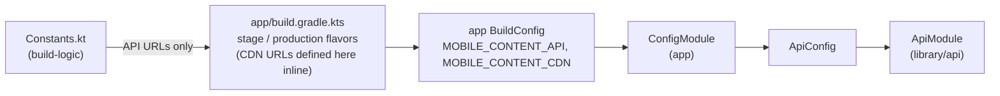
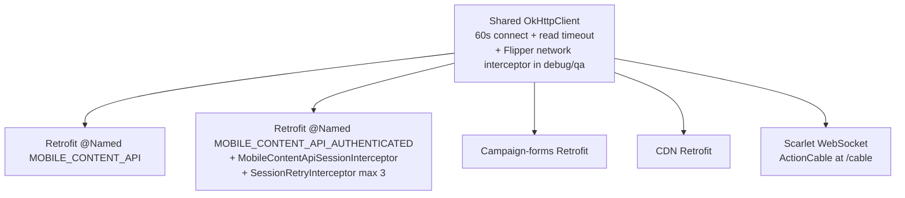
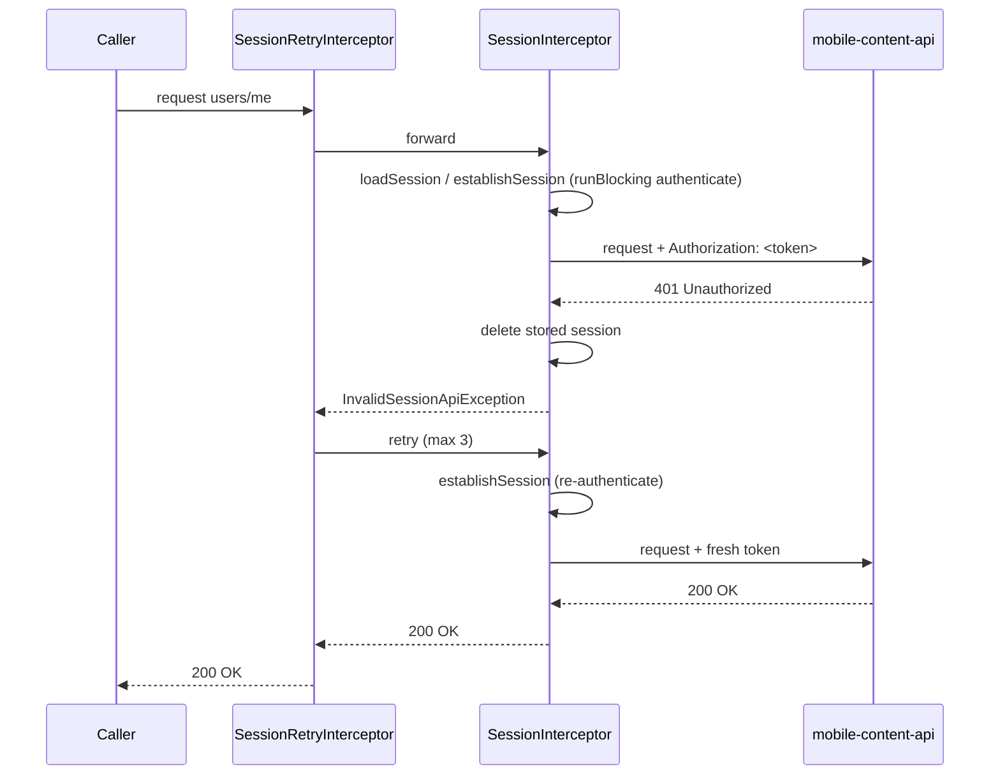
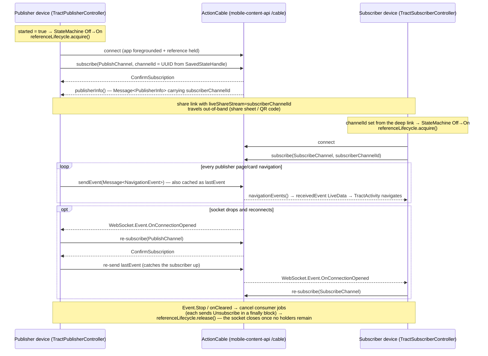

# API Layer

This page is a deep dive into `library/api`, the network layer of GodTools Android. It covers every Retrofit service and endpoint the app talks to, the JSON:API (de)serialization setup, the OkHttp client and interceptor chain, how authentication attaches to requests, the Scarlet WebSocket client used for Tract "live share", per-flavor base URL injection, and error-handling conventions. For the higher-level view of *which external services exist and why*, see [Services & Integrations](Services-and-Integrations.md); for what happens to API responses after they land, see [Data Layer](Data-Layer.md) and [Sync & Downloads](Sync-and-Downloads.md).

## Module at a Glance

`library/api` defines all HTTP/WebSocket client interfaces against three external services and exposes them through a single Hilt module, `ApiModule` (`library/api/src/main/kotlin/org/cru/godtools/api/ApiModule.kt`). It depends on `library/model` (`api(projects.library.model)` in `library/api/build.gradle.kts`) for the shared JSON:API data models, and heavily on Cru's **gto-support** libraries (`org.ccci.gto.android:gto-support-*`, version `gtoSupport = "4.6.0-SNAPSHOT"` in `gradle/libs.versions.toml`) for the JSON:API converter, session interceptor base classes, and Scarlet/ActionCable plumbing.

| External service | Purpose | Base URL (production) | Base URL (stage) |
|---|---|---|---|
| mobile-content-api | Tools, languages, translations, auth, user data (JSON:API) | `https://mobile-content-api.cru.org/` | `https://mobile-content-api-stage.cru.org/` |
| Mobile Content CDN | Published translation files | `https://mobilecontent.cru.org` | `https://mobilecontent-stage.cru.org` |
| Campaign forms | Email-list signup on login | `https://campaign-forms.cru.org/` (all variants) | same |
| ActionCable WebSocket | Tract live share | `${mobileContentApiUrl}cable` | same pattern |

The mobile-content-api URLs are defined once in `build-logic/src/main/kotlin/Constants.kt` (`URI_MOBILE_CONTENT_API_PRODUCTION` / `URI_MOBILE_CONTENT_API_STAGE`); CDN URLs are set per flavor in `app/build.gradle.kts`; the campaign-forms URL and form id are flavor-independent `buildConfigField`s in `library/api/build.gradle.kts` (`CAMPAIGN_FORMS_API`, `CAMPAIGN_FORMS_ID`).

## Base URL Injection per Flavor

`library/api` has **no product flavors**. Environment-specific URLs flow in at runtime through a plain data class:

```kotlin
// library/api/src/main/kotlin/org/cru/godtools/api/ApiConfig.kt
data class ApiConfig(val mobileContentApiUrl: String, val cdnUrl: String)
```

The `:app` module provides the instance from its own per-flavor `BuildConfig` in `app/src/main/kotlin/org/cru/godtools/dagger/ConfigModule.kt`:

```kotlin
val apiConfig = ApiConfig(
    mobileContentApiUrl = BuildConfig.MOBILE_CONTENT_API,
    cdnUrl = BuildConfig.MOBILE_CONTENT_CDN
)
```

`MOBILE_CONTENT_API` and `MOBILE_CONTENT_CDN` are `buildConfigField`s declared in the `stage` and `production` product flavors in `app/build.gradle.kts`.



Things to know:

- **Switching environments means switching the `:app` flavor** (`stage` vs `production` on the `env` dimension). The `stage` flavor is only enabled for the `debug` and `qa` build types — see `configureFlavorDimensions` in `build-logic/src/main/kotlin/AndroidConfiguration.kt`, which sets `it.enable = it.buildType == BUILD_TYPE_DEBUG || it.buildType == BUILD_TYPE_QA`.
- The api module's own `BuildConfig` carries only flavor-independent constants: `CAMPAIGN_FORMS_API`, `CAMPAIGN_FORMS_ID`, and `MOBILE_CONTENT_SYSTEM = "GodTools"`. The last one is baked into the `ToolsApi.list` path at compile time as `filter[system]=GodTools`.
- A second, independent consumer of the same `Constants.kt` URLs exists at *build time*: `library/initial-content/build.gradle.kts` selects stage/production URLs to download the bundled content that ships inside the APK (see [Sync & Downloads](Sync-and-Downloads.md)).

## OkHttp Client and Interceptor Chain

One shared `@Singleton OkHttpClient` is built by `ApiModule.okhttp()`:

- 60-second connect timeout, 60-second read timeout.
- Network interceptors are injected as a Dagger multibound set qualified with `@InterceptorType(NETWORK_INTERCEPTOR)`, provided by gto-support's `OkHttp3Module` (included via `@Module(includes = [OkHttp3Module::class])`).
- The only interceptor contributed in this repo is `FlipperOkhttpInterceptor`, bound in `app/src/debug/kotlin/org/cru/godtools/dagger/FlipperModule.kt` — compiled into both `debug` and `qa` builds, since the `qa` build type reuses the `src/debug` source set (see [Build System & CI](Build-System-and-CI.md)). Only in `release` builds is the set empty.

Every Retrofit instance and the Scarlet WebSocket factory reuse this one client (via `.callFactory(okhttp)` / `okhttp.newWebSocketFactory(...)`), so connection pooling and the Flipper network inspector cover all traffic.



## JSON:API Serialization

mobile-content-api speaks [JSON:API](https://jsonapi.org/). (De)serialization is handled by gto-support's `JsonApiConverter`, built in `ApiModule.jsonApiConverter()` with an **explicit, manual class registry**:

| Registered class | Defined in | JSON:API type |
|---|---|---|
| `Language`, `Tool`, `Attachment`, `Translation`, `Followup`, `GlobalActivityAnalytics`, `User`, `UserCounter` | `library/model` | (see each model class) |
| `AuthToken`, `AuthToken.Request` | `library/api/src/main/kotlin/org/cru/godtools/api/model/AuthToken.kt` | `auth-token`, `auth-token-request` |
| `ToolViews` | `library/api/src/main/kotlin/org/cru/godtools/api/model/ToolViews.kt` | `view` (sends `resource_id` + `quantity` from `tool.pendingShares`) |
| `PublisherInfo` | `library/api/src/main/kotlin/org/cru/godtools/api/model/PublisherInfo.kt` | `publisher-info` |
| `NavigationEvent` | `library/api/src/main/kotlin/org/cru/godtools/api/model/NavigationEvent.kt` | `navigation-event` (random-UUID `@JsonApiId`) |

Value converters registered alongside: `ToolTypeConverter` (from `library/model`), `LocaleTypeConverter`, and `InstantConverter`.

> **Gotcha:** a model class that is not registered in `ApiModule.jsonApiConverter()` cannot be serialized or deserialized at runtime. When you add a new JSON:API model, register it here — the failure otherwise happens at runtime, not compile time.

Converter factories differ per Retrofit stack:

- **mobile-content-api Retrofit:** `LocaleConverterFactory` then `JsonApiConverterFactory(jsonApiConverter)`.
- **Campaign-forms Retrofit:** `JSONObjectConverterFactory` (plain `org.json.JSONObject` responses).
- **CDN Retrofit:** *no* converter factory — only raw `@Streaming ResponseBody` endpoints work there.

## Retrofit Instances

`ApiModule` builds four Retrofit stacks:

| Instance | Base URL | Converters | Auth | Used by |
|---|---|---|---|---|
| `@Named("MOBILE_CONTENT_API")` | `apiConfig.mobileContentApiUrl` | Locale + JSON:API | none | `AnalyticsApi`, `AttachmentsApi`, `AuthApi`, `FollowupApi`, `LanguagesApi`, `ToolsApi`, `TranslationsApi`, `ViewsApi` |
| `@Named("MOBILE_CONTENT_API_AUTHENTICATED")` | same (built via `retrofit.newBuilder()`) | same | session interceptor + retry | `UserApi`, `UserCountersApi`, `UserFavoriteToolsApi` |
| Campaign-forms Retrofit | `BuildConfig.CAMPAIGN_FORMS_API` | `JSONObjectConverterFactory` | none | `CampaignFormsApi` |
| CDN Retrofit | `apiConfig.cdnUrl` | none | none | `CdnApi` |

> **Gotcha:** both mobile-content Retrofits share a base URL, so injecting a `users/me` service from the unauthenticated instance compiles fine — and then 401s on every call. Which interface uses which instance is wired per-interface in `ApiModule`.

## Service Interfaces and Endpoints

All interfaces live in `library/api/src/main/kotlin/org/cru/godtools/api/`. Every endpoint is a `suspend fun` returning `retrofit2.Response<T>`.

### Unauthenticated mobile-content-api

| Interface | Method & path | Notes |
|---|---|---|
| `ToolsApi.kt` | `GET resources?filter[system]=GodTools` | `list` — all tools for the GodTools system; `JsonApiParams` `@QueryMap` |
| | `GET resources?filter[abbreviation]={code}` | `getTool` — single tool by code |
| | `GET resources/featured?filter[lang]&filter[country]` | `getFeaturedTools` |
| | `GET resources/default_order?filter[lang]&filter[country]` | `getToolOrder` |
| `LanguagesApi.kt` | `GET languages` | all published languages |
| `TranslationsApi.kt` | `@Streaming GET translations/{id}` | translation zip download |
| | `@Streaming GET translations/files/{filename}` | individual translation file |
| `AttachmentsApi.kt` | `@Streaming GET attachments/{id}/download` | tool attachments (banners, etc.) |
| `AnalyticsApi.kt` | `GET analytics/global` | returns `GlobalActivityAnalytics` |
| `ViewsApi.kt` | `POST views` | body: `ToolViews` — reports pending tool share counts |
| `FollowupApi.kt` | `POST follow_ups` | body: `Followup` — follow-up subscription |
| `AuthApi.kt` | `POST auth` | body: `AuthToken.Request` (`facebook_access_token`, `google_id_token`, `okta_access_token`, `create_user`) → `AuthToken` (`user-id`, `token`) |

### Authenticated mobile-content-api

The path constant `PATH_USER = "users/me"` is `internal const` in `UserApi.kt` and shared by all three interfaces.

| Interface | Method & path | Notes |
|---|---|---|
| `UserApi.kt` | `GET users/me` | current user |
| | `PATCH users/me` | update user |
| | `DELETE users/me` | account deletion |
| `UserCountersApi.kt` | `GET users/me/counters` | |
| | `PATCH users/me/counters/{counter_id}` | body: `UserCounter` |
| `UserFavoriteToolsApi.kt` | `POST users/me/relationships/favorite-tools` | body: `List<Tool>` sparse-serialized via `@JsonApiFields(Tool.JSONAPI_TYPE)` |
| | `DELETE users/me/relationships/favorite-tools` **with body** | nonstandard HTTP — declared `@HTTP(method = "DELETE", hasBody = true)`; `library/api/src/test/kotlin/org/cru/godtools/api/UserFavoriteToolsApiTest.kt` asserts only tool ids are serialized |

### CDN and campaign-forms

| Interface | Method & path | Notes |
|---|---|---|
| `CdnApi.kt` | `@Streaming GET translations/files/{filename}` | same path shape as `TranslationsApi.downloadFile`, different host — serves *published* files from the CDN |
| `CampaignFormsApi.kt` | `@FormUrlEncoded POST forms` | fields `id`, `email_address`, `first_name`, `last_name`; called from `app/src/main/kotlin/org/cru/godtools/service/AccountListRegistrationService.kt` with `BuildConfig.CAMPAIGN_FORMS_ID` |

## How Auth Attaches to Requests

Authentication is layered: `library/api` defines an *abstract* session interceptor, and `library/account` supplies the concrete implementation via Hilt. The full login story (Google/Facebook providers, token exchange) is covered in [Services & Integrations](Services-and-Integrations.md).

`MobileContentApiSessionInterceptor` (`library/api/src/main/kotlin/org/cru/godtools/api/MobileContentApiSessionInterceptor.kt`) extends gto-support's `SessionInterceptor<UserIdSession>`:

- `attachSession()` adds an `Authorization: <token>` header — the **raw** session token, with **no `Bearer` prefix**.
- `loadSession()` restores a `UserIdSession` from `SharedPreferences`, keyed by the abstract `userId()`.
- `establishSession()` calls the abstract `suspend authenticate()` inside `runBlocking` — authentication happens synchronously on an OkHttp interceptor thread.
- `isSessionInvalid()` returns true on HTTP 401 (`HttpURLConnection.HTTP_UNAUTHORIZED`).

The concrete binding lives in `library/account/src/main/kotlin/org/cru/godtools/account/AccountModule.kt`: an anonymous subclass delegates `userId()` and `authenticate()` to `GodToolsAccountManager`, whose active provider (Google or Facebook) exchanges its social token via `AuthApi.authenticate`.

The authenticated Retrofit wraps the shared OkHttp client with two extra interceptors (`ApiModule.mobileContentApiAuthenticatedRetrofit`):

1. `MobileContentApiSessionInterceptor` as a **network** interceptor — attaches the header.
2. `SessionRetryInterceptor(sessionInterceptor, 3)` as an **application** interceptor — retries the request up to 3 times. The retry interceptor itself does no session handling: on a 401 the *session* interceptor deletes the stored session and throws `InvalidSessionApiException`; the retry interceptor catches it and re-runs the request, and the session interceptor re-authenticates via `establishSession()` on the next pass.



> **Gotcha:** `library/api` compiles without any auth implementation. If no module binds a `MobileContentApiSessionInterceptor`, Hilt cannot construct the authenticated Retrofit — in this app the binding always comes from `library/account`.

## Scarlet WebSocket: Tract Live Share

Tract tools support "live share": a publisher mirrors their page/card navigation to remote subscribers over a Rails ActionCable WebSocket. `ApiModule.actionCableScarlet` builds the Scarlet instance:

- **Transport:** OkHttp WebSocket to `${apiConfig.mobileContentApiUrl}cable` via gto-support's `ActionCableRequestFactory` (the shared OkHttp client's `newWebSocketFactory`).
- **Messages:** `ActionCableMessageAdapterFactory` wrapping `JsonApiMessageAdapterFactory` — ActionCable frames whose payloads are JSON:API documents (`NavigationEvent`, `PublisherInfo`).
- **Streams:** `CoroutinesStreamAdapterFactory` — `@Receive` methods return `ReceiveChannel<...>`.
- **Lifecycle:** `AndroidLifecycle.ofApplicationForeground(app).combineWith(referenceLifecycle)` — the socket connects only while the app is foregrounded **and** at least one consumer holds the `@Singleton ReferenceLifecycle` (also provided in `ApiModule`).

The Scarlet service interface is `TractShareService` (`library/api/src/main/kotlin/org/cru/godtools/api/TractShareService.kt`):

| Member | Direction | Channel | Payload |
|---|---|---|---|
| `subscribe(Subscribe)` / `unsubscribe(Unsubscribe)` | `@Send` | — | ActionCable subscription control |
| `webSocketEvents()` | `@Receive` | — | `WebSocket.Event` stream |
| `subscriptionConfirmation()` | `@Receive` | — | `ConfirmSubscription` |
| `publisherInfo()` | `@Receive` | `PublishChannel` | `Message<PublisherInfo>` — carries `subscriberChannelId` |
| `sendEvent(Message<NavigationEvent>)` | `@Send` | `PublishChannel` | tool/locale/page/card navigation |
| `navigationEvents()` | `@Receive` | `SubscribeChannel` | `Message<NavigationEvent>` |

Channels are parameterized by `channelId` (`TractShareService.PARAM_CHANNEL_ID`). The consumers are two Hilt ViewModels in `ui/tract-renderer/src/main/kotlin/org/cru/godtools/tract/liveshare/`: `TractPublisherController` and `TractSubscriberController`. Both call `referenceLifecycle.acquire(this)` when live share starts and `release(this)` when it stops, and re-`subscribe` on every `WebSocket.Event.OnConnectionOpened` (see [Tool Renderers](Tool-Renderers.md)).

The full two-device flow — each controller drives a Tinder `StateMachine` of `State.Off`/`State.On`; entering `On` acquires the `ReferenceLifecycle` and launches the consumer coroutines, exiting cancels them and releases:



Details verifiable in the controllers: the publisher's `channelId` is a random UUID persisted in `SavedStateHandle`; `sendNavigationEvent` only transmits while the state machine is `On` but always caches `lastEvent`, and the publisher re-sends `lastEvent` on *every* `ConfirmSubscription` — that is what catches a subscriber up after a reconnect. The subscriber consumes `navigationEvents()` on `Dispatchers.Main` into the `receivedEvent` LiveData.

> **Gotcha:** the WebSocket never connects unless something has acquired the `ReferenceLifecycle` — and forgetting `release()` keeps the socket alive as long as the app is foregrounded.

## Error Handling

There is **no centralized error handling** in `library/api`. Every endpoint returns `retrofit2.Response<T>`, so HTTP errors never throw — each caller decides what failure means:

- **Sync tasks** (`library/sync`) treat anything other than success as "sync failed": e.g. `ToolSyncTasks.kt` uses `.takeIf { it.code() == HTTP_OK }?.body() ?: return false` and checks `isSuccessful` when submitting views. See [Sync & Downloads](Sync-and-Downloads.md).
- **`IOException`** (connectivity) is caught at the call/worker level — `library/sync/src/main/kotlin/org/cru/godtools/sync/GodToolsSyncService.kt`, the sync workers, and `app/src/main/kotlin/org/cru/godtools/service/AccountListRegistrationService.kt` all catch, log, and drop.
- **JSON:API error documents:** `AuthToken` defines error codes `user_already_exists` and `user_not_found` (`library/api/src/main/kotlin/org/cru/godtools/api/model/AuthToken.kt`). `library/account/src/main/kotlin/org/cru/godtools/account/provider/AccountProvider.kt` parses `errors` out of both success and error bodies and maps them to typed `AuthenticationException`s.
- The only HTTP-code-driven behavior inside `library/api` itself is the 401 → invalidate-session-and-retry loop described above.

## Testing

`library/api` is unflavored, so its unit tests run under the plain `test` task (see [Testing](Testing.md)):

```bash
./gradlew :library:api:test
```

Existing tests use OkHttp `MockWebServer` and JSON assertions: `library/api/src/test/kotlin/org/cru/godtools/api/UserFavoriteToolsApiTest.kt` (verifies the DELETE-with-body request and sparse id-only serialization) and `library/api/src/test/kotlin/org/cru/godtools/api/model/AuthTokenTest.kt`.

## Quick Gotcha Checklist

1. Base URLs are **not** in `library/api` — they arrive at runtime via `ApiConfig` from `app`'s `ConfigModule`; the stage environment exists only for `debug`/`qa` build types.
2. Two mobile-content Retrofits share one base URL — use the `MOBILE_CONTENT_API_AUTHENTICATED` instance for anything under `users/me`, or every call 401s.
3. New JSON:API model types must be registered in `ApiModule.jsonApiConverter()` or runtime (de)serialization fails.
4. The `Authorization` header carries the bare token — no `Bearer` scheme.
5. `establishSession()` uses `runBlocking` on an OkHttp interceptor thread — auth is synchronous under the hood, capped at 3 retries by `SessionRetryInterceptor`.
6. `removeFavoriteTools` is a DELETE with a request body (`@HTTP(hasBody = true)`).
7. The CDN Retrofit has no converter factories — only raw `@Streaming ResponseBody` endpoints work there.
8. gto-support is a snapshot dependency (`4.6.0-SNAPSHOT`) — the session interceptor, JSON:API converter, and ActionCable/Scarlet plumbing all come from it and can shift underneath the app. Its source lives in [CruGlobal/android-gto-support](https://github.com/CruGlobal/android-gto-support); see [Working on the shared libraries](Tool-Renderers.md#working-on-the-shared-libraries) for the local development loop and how to identify the resolved snapshot build.
