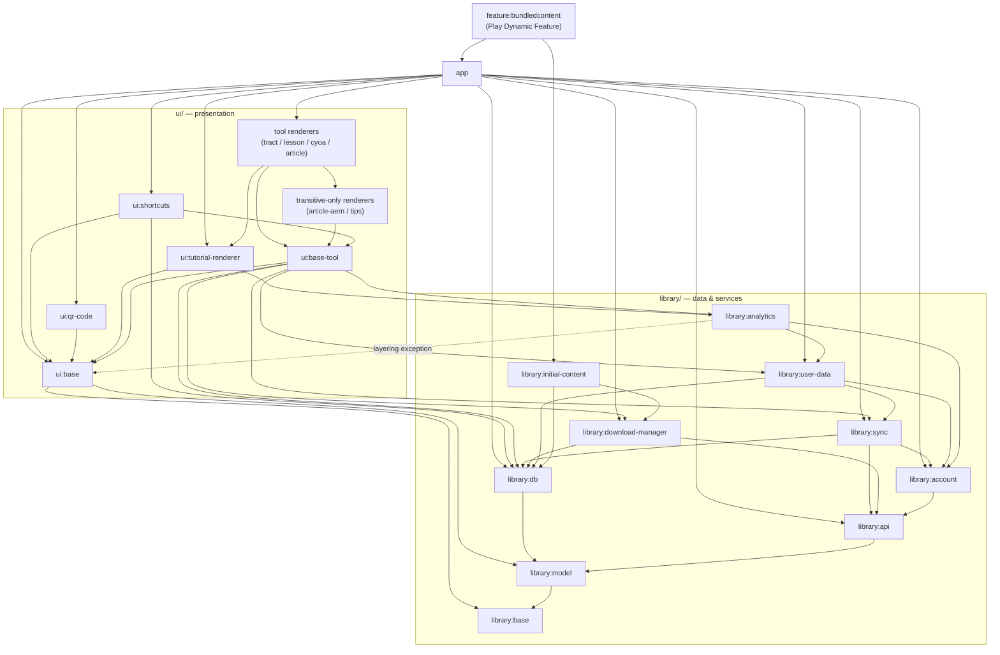
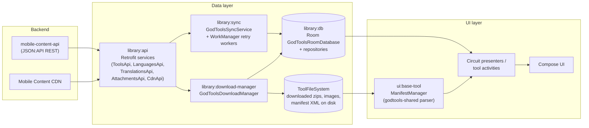

# Architecture Overview

This page describes the big-picture structure of the GodTools Android codebase: how the Gradle modules layer on top of each other, how dependency injection is wired with Hilt, how navigation and UI state are managed with Slack Circuit, and how data flows from the `mobile-content-api` backend through the local Room database and file system into Compose UI. It is the map you should read before diving into any individual subsystem page such as the [API Layer](API-Layer.md), [Data Layer](Data-Layer.md), or [UI Architecture](UI-Architecture.md).

## Module Topology

The root Gradle project is named `godtools` (`settings.gradle.kts`). It contains 23 modules plus one included build:

| Group | Module | Purpose |
|---|---|---|
| — | `app` | Main application module: `GodToolsApplication` (Hilt entry point), `DashboardActivity`, Dagger modules in `app/src/main/kotlin/org/cru/godtools/dagger/`, and all app-level screens (dashboard, settings, onboarding, tool details, login, account) |
| `library` | `model` | Data models and JSON:API type definitions |
| `library` | `db` | Room database (`GodToolsRoomDatabase`), DAOs, and repository interfaces/implementations |
| `library` | `api` | Retrofit REST services and the Scarlet WebSocket service for tract live-share |
| `library` | `sync` | `GodToolsSyncService`, sync task classes, and WorkManager retry workers |
| `library` | `base` | Core utilities, `Settings` (app language, feature-discovery tracking — see [UI Architecture](UI-Architecture.md#settings-and-feature-discovery-librarybase)), `ToolFileSystem` (on-disk tool content), shared constants |
| `library` | `account` | User authentication |
| `library` | `analytics` | Analytics event tracking (Firebase, Facebook, etc.) |
| `library` | `download-manager` | `GodToolsDownloadManager`: downloads translations and attachments to disk |
| `library` | `initial-content` | Bundled content inserted on first run; downloads its assets from the API **at build time** |
| `library` | `user-data` | User preferences and state |
| `ui` | `base` | `GodToolsTheme`, shared Compose infrastructure, Circuit wiring (`CircuitModule`, `CircuitActivity`), cross-module activity launch helpers |
| `ui` | `base-tool` | Shared tool-rendering infrastructure: `ManifestManager`, parser config, base tool activities |
| `ui` | `tract-renderer`, `lesson-renderer`, `article-renderer`, `article-aem-renderer`, `cyoa-renderer`, `tips-renderer`, `tutorial-renderer` | Renderers for the four rendered `Tool.Type`s — tract, lesson, cyoa, article (with `article-aem-renderer` as the ARTICLE sub-pipeline) — plus `tips-renderer` (training tips attached to tract/CYOA pages) and `tutorial-renderer` (app tutorials, not downloaded tool content); see [Tool Renderers](Tool-Renderers.md) |
| `ui` | `shortcuts` | Launcher shortcut management (no UI of its own) |
| `ui` | `qr-code` | QR-code sharing screen |
| `feature` | `bundledcontent` | Google Play **Dynamic Feature** carrying `library:initial-content` out of the base APK |
| — | `build-logic` | **Included build** (`includeBuild("build-logic")`) containing Gradle convention plugins |

`settings.gradle.kts` enables the `TYPESAFE_PROJECT_ACCESSORS` feature preview, so build scripts reference modules as `projects.library.api` rather than `project(":library:api")`.

### Module Dependency Graph

The graph below shows the project-to-project dependencies declared in each module's `build.gradle.kts` (simplified: the six tool-renderer modules are collapsed into two nodes — the four renderers `app` depends on directly, and the two (`article-aem` / `tips`) reached only transitively through other renderers — which hides their direct `library:api` / `library:db` / `library:sync` edges; `library:base` / `library:model` edges from nearly every module are also omitted for readability). The dashed edge is the deliberate layering exception described under [Layering Rules](#layering-rules).



Notable edges, all verifiable in the `build.gradle.kts` files:

- `app` declares `api(...)` on `library:api`, `library:base`, `library:db`, `library:download-manager` and `implementation(...)` on the rest (`app/build.gradle.kts`). It has **no direct dependency** on `library:initial-content`, `ui:base-tool`, `ui:article-aem-renderer`, or `ui:tips-renderer` — those arrive transitively or via the dynamic feature.
- Renderer modules depend on `ui:base-tool` (e.g. `api(projects.ui.baseTool)` in `ui/tract-renderer/build.gradle.kts`). A few renderers depend on each other: `tract-renderer` → `tutorial-renderer` + `tips-renderer`, `cyoa-renderer` → `tips-renderer`, `article-renderer` → `article-aem-renderer`.
- `feature:bundledcontent` depends on `library:initial-content` (`feature/bundledcontent/build.gradle.kts`) **and** on `:app` — the latter automatically, because `build-logic/src/main/kotlin/godtools.dynamic-feature-conventions.gradle.kts` adds `implementation(project(":app"))` to every dynamic-feature module. Dynamic features depend on the app, not the other way around.
- `build-logic` is not a module in the graph — it is an included build whose three convention plugins (`godtools.application-conventions`, `godtools.library-conventions`, `godtools.dynamic-feature-conventions`) configure every other module. See [Build System & CI](Build-System-and-CI.md).

### Layering Rules

1. **`library` modules never depend on `ui` modules or `app`.** They are pure data/service layers. The single deliberate exception: `library:analytics` depends on `ui:base` (`library/analytics/build.gradle.kts`) so analytics services can integrate with shared UI infrastructure.
2. **`ui` modules depend on `library` modules and on `ui:base` / `ui:base-tool`, never on `app`.**
3. **Tool renderer modules do not know about each other's activities.** Cross-module activity launches go through string class names in `ui/base/src/main/kotlin/org/cru/godtools/base/ui/Activities.kt` (e.g. `"org.cru.godtools.tract.activity.TractActivity"`, `"org.cru.godtools.ui.dashboard.DashboardActivity"`). Renaming or moving one of those activities silently breaks navigation — the compiler will not catch it.
4. **`app` is the composition root**: it is the only module that sees every renderer, provides environment configuration (`ConfigModule`), and assembles the Hilt graph.
5. **Backend URLs are decided by the build, not the code.** `ApiConfig(mobileContentApiUrl, cdnUrl)` is provided in `app/src/main/kotlin/org/cru/godtools/dagger/ConfigModule.kt` from `BuildConfig.MOBILE_CONTENT_API` / `BuildConfig.MOBILE_CONTENT_CDN`, which the `stage`/`production` product flavors set in `app/build.gradle.kts`. Library and UI modules never hardcode a backend host.

## Dependency Injection — Hilt

The DI entry point is `GodToolsApplication` (`app/src/main/kotlin/org/cru/godtools/GodToolsApplication.kt`), annotated `@HiltAndroidApp`. Beyond bootstrapping Hilt it:

- implements WorkManager's `Configuration.Provider`, supplying an injected `HiltWorkerFactory` so `@HiltWorker` classes (e.g. sync and download workers) get constructor injection;
- injects `EagerSingletonInitializer` (from Cru's gto-support library) to instantiate `@EagerSingleton`-annotated services at startup;
- initializes Crashlytics/Timber logging and installs `SplitCompat` for dynamic feature support.

Where Dagger/Hilt modules live:

| Location | Contents |
|---|---|
| `app/src/main/kotlin/org/cru/godtools/dagger/` | App-level modules: `AccountModule.kt`, `ConfigModule.kt`, `EventBusModule.kt`, `ServicesModule.kt`, and `features/` (dynamic-feature wiring) |
| Each `library`/`ui` module | Its own `@InstallIn(SingletonComponent::class)` modules next to the code they provide — e.g. `library/api/src/main/kotlin/org/cru/godtools/api/ApiModule.kt` (Retrofit + Scarlet), `library/db/src/main/kotlin/org/cru/godtools/db/DatabaseModule.kt` (Room + repositories), `library/sync/.../SyncModule.kt`, `library/download-manager/.../DownloadManagerModule.kt`, `ui/base/.../circuit/CircuitModule.kt`, `ui/base-tool/.../BaseToolRendererModule.kt` |
| `feature/bundledcontent/src/main/kotlin/org/cru/godtools/feature/bundledcontent/dagger/` | `BundledContentFeatureComponent.kt` — a plain Dagger `@Component` (not Hilt; dynamic features cannot use Hilt directly) that depends on the `BundledContentFeatureDependencies` interface exposed from `app/src/main/kotlin/org/cru/godtools/dagger/features/` and installs `InitialContentModule` from `library:initial-content`. The Hilt-to-plain-Dagger bridge is diagrammed in [Sync & Downloads](Sync-and-Downloads.md#delivery-via-the-bundledcontent-dynamic-feature) |

## Navigation & UI State — Slack Circuit

New UI is built with [Slack Circuit](https://slackhq.github.io/circuit/) (version `0.36.0`, pinned in `gradle/libs.versions.toml`): each screen is a `Screen` Parcelable paired with a `@Composable` Presenter function that returns a state object and a `@Composable` UI function, both registered via `@CircuitInject` with Hilt codegen.

Key wiring facts:

- `CircuitModule` (`ui/base/src/main/kotlin/org/cru/godtools/base/ui/circuit/CircuitModule.kt`) multibinds `Set<Presenter.Factory>` and `Set<Ui.Factory>` and provides the `Circuit` instance.
- Circuit codegen is enabled per-module by `configureCompose(project, enableCircuit = true)` in `build-logic/src/main/kotlin/AndroidConfiguration.kt`, which sets `circuit.codegen.mode=hilt`. **Only `app`, `ui:base`, and `ui:tutorial-renderer` enable it** — a `@CircuitInject` annotation in any other module compiles but is never registered in DI.
- `DashboardActivity` (`app/src/main/kotlin/org/cru/godtools/ui/dashboard/DashboardActivity.kt`) hosts a Circuit backstack rooted at `DashboardScreen`. A navigation interceptor intercepts every `Navigator.goTo` and redirects it into a **new Activity** — either `screen.startWith(activity)` for `IntentScreen`s or `startCircuitActivity(screen)` for Circuit screens — so the dashboard never pushes foreign screens onto its own backstack. (Dashboard-page navigation never reaches this interceptor because the nested `DashboardLayout` navigator consumes `DashboardPage` screens first.)
- `CircuitActivity` (`ui/base/src/main/kotlin/org/cru/godtools/base/ui/circuit/CircuitActivity.kt`) is a generic host that renders any `Screen` passed as an intent extra, using `NavigableCircuitContent` with `GestureNavigationDecorationFactory` (back navigation is handled inside Circuit).
- Screens that multiple modules must be able to navigate to (e.g. `DashboardScreen`, `AppLanguageScreen`) live in `ui/base/src/main/kotlin/org/cru/godtools/base/ui/circuit/screen/`; their Presenter/UI implementations live in `app`.
- Legacy tool activities (tract, CYOA, article) still use DataBinding/ViewBinding with controller classes; lessons and the tutorial are fully Compose. See [UI Architecture](UI-Architecture.md) and [Tool Renderers](Tool-Renderers.md) for the full picture.

Theming comes from `GodToolsTheme` (`ui/base/src/main/kotlin/org/cru/godtools/base/ui/theme/GodToolsTheme.kt`), applied once at each activity root — see `.claude/rules/design_system_rules.md` in the repo for the design-token conventions.

## High-Level Data Flow

GodTools content originates from Cru's `mobile-content-api` (a JSON:API REST service; production `https://mobile-content-api.cru.org/`, staging `https://mobile-content-api-stage.cru.org/`, defined in `build-logic/src/main/kotlin/Constants.kt` and baked into `BuildConfig` per flavor). There are two distinct paths: **metadata sync** (tool/language catalogs into Room) and **content download** (translation zip files and attachments onto disk).



**Metadata sync path.** `GodToolsSyncService` (`library/sync/src/main/kotlin/org/cru/godtools/sync/GodToolsSyncService.kt`) dispatches sync task classes (`ToolSyncTasks`, `LanguagesSyncTasks`, `UserSyncTasks`, etc. in `library/sync/.../task/`) that call the Retrofit services in `library/api` and upsert results into Room through the repository interfaces in `library/db/src/main/kotlin/org/cru/godtools/db/repository/` (`ToolsRepository`, `LanguagesRepository`, `TranslationsRepository`, `AttachmentsRepository`, and friends). When a sync fails it schedules a `@HiltWorker` retry (e.g. `SyncToolsWorker` in `library/sync/.../work/`). Details in [Sync & Downloads](Sync-and-Downloads.md).

**Content download path.** `GodToolsDownloadManager` (`library/download-manager/src/main/kotlin/org/cru/godtools/downloadmanager/GodToolsDownloadManager.kt`) downloads published translation files via `TranslationsApi`/`CdnApi` and attachments via `AttachmentsApi`/`CdnApi` into the `ToolFileSystem` (`library/base/src/main/kotlin/org/cru/godtools/base/ToolFileSystem.kt`), tracking downloaded state in Room. WorkManager workers (`DownloadLatestPublishedTranslationWorker`, `DownloadAttachmentWorker`) provide retry semantics.

**Render path.** When a tool opens, `ManifestManager` (`ui/base-tool/src/main/kotlin/org/cru/godtools/base/tool/service/ManifestManager.kt`) parses the downloaded manifest XML from `ToolFileSystem` using the Kotlin-multiplatform `godtools-shared` parser, caches the result, and exposes it as a flow; the renderer activity or presenter for the tool type then renders the parsed model with Compose (or legacy DataBinding controllers). If a manifest is corrupt, `ManifestManager` marks the translation not-downloaded and the download pipeline (`GodToolsDownloadManager.Dispatcher`, plus `BaseToolActivity` while the tool is open) re-downloads it — sync only handles JSON:API metadata, never translation files. The parser and renderer are developed in a separate repository — see [Working on the shared libraries](Tool-Renderers.md#working-on-the-shared-libraries).

**Read model for screens.** Dashboard and settings presenters observe Kotlin flows from the `library:db` repositories directly — the database is the single source of truth; the network only ever writes into it. See [Data Layer](Data-Layer.md).

## Build Variants at a Glance

- Product flavors (dimension `env`): `production` and `stage` — the flavor picks the backend (`app/build.gradle.kts`). Stage variants only exist for `debug` and `qa` build types (`build-logic/src/main/kotlin/AndroidConfiguration.kt`).
- Build types: `debug`, `qa` (inherits debug sources, but minified), `release`.
- Unit tests run only for the `debug` + `production` variant; use the aggregate task so you never have to know which variant a module exposes:

```bash
./gradlew test
```

Full details, including the build-time content download performed by `library:initial-content` and all CI workflows, are on [Build System & CI](Build-System-and-CI.md).

## Where to Go Next

- [Getting Started](Getting-Started.md) — clone, JDK, Git LFS, first build
- [API Layer](API-Layer.md) — every Retrofit/Scarlet service and endpoint
- [Data Layer](Data-Layer.md) — Room schema, DAOs, repositories
- [Sync & Downloads](Sync-and-Downloads.md) — sync tasks, workers, download manager internals
- [UI Architecture](UI-Architecture.md) — Circuit, theming, legacy DataBinding
- [Tool Renderers](Tool-Renderers.md) — per-tool-type rendering pipelines
- [Testing](Testing.md) — unit tests, Paparazzi snapshots
- [Contributing](Contributing.md) — branch conventions, ktlint, PR flow
