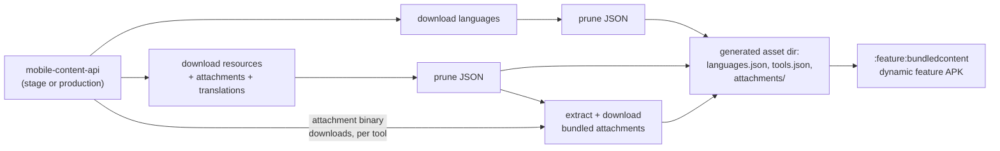
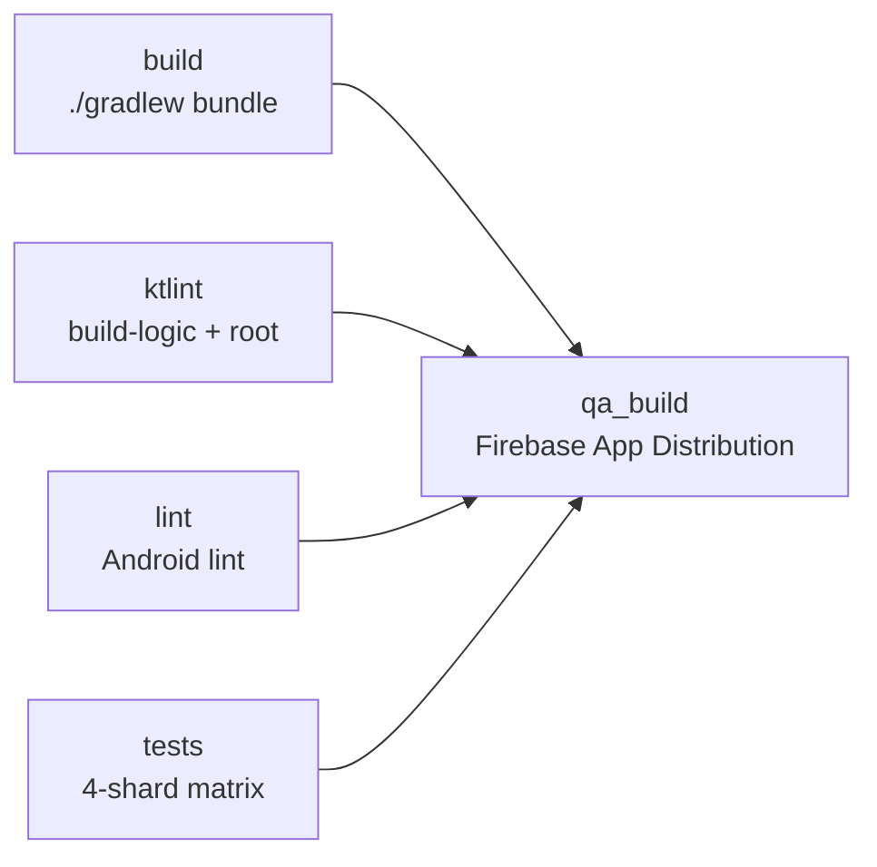

# Build System & CI

This page explains how the GodTools Android build is assembled: the Gradle convention plugins in `build-logic/`, the version catalog, the product-flavor/build-type matrix, how API base URLs are wired into the app, and how the `feature:bundledcontent` dynamic feature downloads its content at build time. It closes with a reference table of every GitHub Actions workflow, including the manual snapshot-recording workflow and the Crowdin translation workflows. For day-one setup steps see [Getting Started](Getting-Started.md); for the test stack that CI runs, see [Testing](Testing.md).

## Toolchain at a Glance

| Thing | Value | Where defined |
|---|---|---|
| Gradle | 9.7.0 (`-all` distribution) | `gradle/wrapper/gradle-wrapper.properties` |
| Launcher JDK | Temurin 25.0.4 | `.tool-versions` (used by CI's `actions/setup-java`) |
| Kotlin compile toolchain | Java 21 via `jvmToolchain(21)` | `build-logic/src/main/kotlin/AndroidConfiguration.kt` |
| Toolchain auto-provisioning | `org.gradle.toolchains.foojay-resolver-convention` 1.0.0 | `settings.gradle.kts` |
| Android Gradle Plugin | 9.3.1 | `gradle/libs.versions.toml` |
| Kotlin | 2.4.10 | `gradle/libs.versions.toml` |
| KSP | 2.3.11 | `gradle/libs.versions.toml` |
| `compileSdk` / `minSdk` | 37 / 24 (every module) | `AndroidConfiguration.kt` (`configureSdk()`) |
| `targetSdk` | 37 (app + dynamic feature) | `build-logic/src/main/kotlin/godtools.application-conventions.gradle.kts` |
| Project version | `6.4.1` (plus suffixes, see [Versioning](#versioning-and-signing)) | `gradle.properties` |

The launcher JDK and the compile toolchain intentionally differ: `.tool-versions` pins Temurin 25 for running Gradle, while Kotlin compilation always uses a Java 21 toolchain that the foojay resolver downloads automatically if needed.

## Gradle Project Topology

`settings.gradle.kts` names the root project `godtools`, enables the `TYPESAFE_PROJECT_ACCESSORS` feature preview (so build scripts can write `projects.library.api` instead of `project(":library:api")`), and includes:

- **`build-logic`** — an *included build* holding the convention plugins. Because it is a separate build, root-level tasks such as `ktlintCheck` do **not** cover it (see [ktlint](#static-analysis)).
- 10 `library:*` modules, 11 `ui:*` modules, `app`, and `feature:bundledcontent` (see [Architecture Overview](Architecture-Overview.md) for what each contains).

It also registers four custom Maven repositories that the build cannot resolve without:

| Repository | Serves |
|---|---|
| `https://cruglobal.jfrog.io/artifactory/maven-mobile/` | `org.ccci.gto.android` (gto-support), `org.cru.godtools.kotlin` (godtools-shared), Cru forks |
| `https://jitpack.io` | `com.github.*` artifacts (excluding `com.github.ajalt.colormath`) |
| `https://androidx.dev/storage/compose-compiler/repository/` | pre-release Compose compiler builds |
| `https://raw.githubusercontent.com/Deezer/KustomExport/mvn-repo` | `deezer.kustomexport`, a transitive dependency of godtools-shared |

Finally, `settings.gradle.kts` auto-accepts the Develocity build-scan terms of use when `GITHUB_ACTIONS=true` — CI passes `--scan` on every Gradle invocation; locally `--scan` will prompt you.

## Convention Plugins (`build-logic/`)

`build-logic` is an included build of precompiled script plugins (`build-logic/build.gradle.kts` applies `kotlin-dsl`). Every module applies exactly one of three conventions:

| Convention plugin | Base plugin | What it configures |
|---|---|---|
| `godtools.application-conventions` | `com.android.application` | `configureAndroidCommon(project)` + `configureQaBuildType(project)` + `configureFlavorDimensions(project)` + `defaultConfig.targetSdk = 37` + `excludeAndroidSdkDependencies()` + `configureKtlint()` |
| `godtools.library-conventions` | `com.android.library` | `configureAndroidCommon(project)` + `configureKtlint()` only — **no QA build type and no flavors by default** |
| `godtools.dynamic-feature-conventions` | `com.android.dynamic-feature` | Same as application conventions (minus `targetSdk`) **plus an automatic `implementation(project(":app"))` dependency** |

The shared configuration functions live in `build-logic/src/main/kotlin/`:

| File | Provides |
|---|---|
| `AndroidConfiguration.kt` | `configureAndroidCommon` (SDK levels, Java 21 toolchain, core-library desugaring, the `common` bundle — `kotlin-stdlib` + `timber` — added to every module, lint config `analysis/lint/lint.xml`, Guava `listenablefuture` capability resolution, `kotlin-metadata-jvm` version force for Dagger); `configureFlavorDimensions` (the `env` dimension); `configureQaBuildType`; `configureCompose(project, enableCircuit)` (Compose plugin + bundles; with Circuit also KSP, `kotlin-parcelize`, and `circuit.codegen.mode=hilt`); `excludeAndroidSdkDependencies` (globally excludes `org.json:json`, already in the Android SDK); `enableDatabinding` |
| `AndroidTestConfiguration.kt` | `configureTestOptions`: Android resources in unit tests, 3500 MB test JVM heap (Robolectric), the `test-framework` bundle on every module, hamcrest substitution, unit-test variant pruning, test sharding, and Kover wiring (XML report moved to `build/reports/kover/<variant>/report.xml` so Codecov auto-detects it) |
| `KtlintConfiguration.kt` | `configureKtlint()`: applies `org.jlleitschuh.gradle.ktlint`, pins ktlint CLI 1.8.0, adds the `ktlint-rulesets` bundle (Compose rules) |
| `EventBusConfiguration.kt` | `createEventBusIndex(className)`: legacy kapt + EventBus annotation processor with an `eventBusIndex` argument. Used by `library/analytics`, `ui/base-tool`, `ui/shortcuts`, `ui/tract-renderer` |
| `GodToolsCustomUriConfiguration.kt` | `configureGodToolsCustomUri()`: per-build-type manifest placeholder `hostGodtoolsCustomUri` and `BuildConfig.HOST_GODTOOLS_CUSTOM_URI` — `org.cru.godtools.debug` (debug), `org.cru.godtools.qa` (qa), `org.cru.godtools` (release) |
| `Constants.kt` | The mobile-content-api base URLs (see [API Base URLs](#api-base-url-configuration)) |
| `Project.kt` | Typed accessors (`libs`, `androidComponents`, `ksp`, `kapt`, `ktlint`) |
| `org/cru/godtools/gradle/bundledcontent/` | Build-time content download tasks (see [Dynamic Feature](#dynamic-feature-bundled-content)) |

## Version Catalog

All dependency and plugin versions live in a single Gradle version catalog, `gradle/libs.versions.toml`, shared with the `build-logic` included build (`build-logic/settings.gradle.kts` imports it via `from(files("../gradle/libs.versions.toml"))`). Notable pins: AGP 9.3.1, Kotlin 2.4.10, KSP 2.3.11, Dagger/Hilt 2.60.1, Circuit 0.36.0, Compose UI 1.11.4 / Material3 1.4.0, Room 2.8.4, OkHttp 5.4.0, Retrofit 3.0.0, Scarlet 0.1.12, Paparazzi 2.0.0-alpha05.

Defined bundles: `common`, `androidx-compose`, `androidx-compose-debug`, `androidx-compose-testing`, `circuit`, `ktlint-rulesets`, `test-framework`.

> **Gotcha:** two first-party dependency families are `-SNAPSHOT` versions resolved from Cru's Artifactory: `gtoSupport = "4.6.0-SNAPSHOT"` and `godtoolsShared = "1.4.0-SNAPSHOT"`. They can change between builds without any change in this repo. Like every Gradle-resolved dependency they are cached under `~/.gradle/caches` (managed on CI by `gradle/actions/setup-gradle`) — the build declares no `mavenLocal()` repository, so Gradle never touches `~/.m2`, and deleting `~/.m2` locally does nothing to force a fresh snapshot. (The `~/.m2/repository` cache in CI's `tests` job is unrelated: it holds the AOSP `android-all` images Robolectric downloads at test runtime — see [Testing](Testing.md#how-the-stack-is-wired).) Their sources live in [CruGlobal/android-gto-support](https://github.com/CruGlobal/android-gto-support) and [CruGlobal/kotlin-mpp-godtools-tool-parser](https://github.com/CruGlobal/kotlin-mpp-godtools-tool-parser) — see [Working on the shared libraries](Tool-Renderers.md#working-on-the-shared-libraries) for developing against them locally and pinning down which snapshot build resolved.

### Automated Dependency Updates

Version bumps in the catalog are largely bot-driven — if you see dependency PRs on `develop` merging themselves, that is working as intended:

- **Renovate** (`.github/renovate.json`, extends `config:recommended`) opens version-bump PRs labeled `dependencies` and **automerges them with a squash merge once CI passes** — no human review is required. A dependency dashboard issue in the repo tracks pending/blocked updates. Package rules group artifacts that must move in lockstep into a single PR: Kotlin + the Compose compiler plugin + Mockposable (tightly coupled), and each `firebase-appdistribution`/`firebase-crashlytics`/`firebase-inappmessaging`/`firebase-perf` family. Guava is held off `-jre` builds (`allowedVersions: "!/-jre$/"`), and the Facebook `resValue` identifiers in `app/build.gradle.kts` (`facebook_app_id`, `fb_login_protocol_scheme`, `facebook_client_token`) are explicitly ignored so Renovate's gradle manager doesn't mistake them for dependencies.
- **Dependabot** (`.github/dependabot.yml`) also scans the `gradle` ecosystem, but only monthly, with an open-PR limit of 10.

The `gtoSupport`/`godtoolsShared` `-SNAPSHOT` families above sit outside this machinery: bots never open PRs for them because the version string never changes — they update silently to whatever Artifactory currently serves.

## Flavor and Build-Type Matrix

The `env` flavor dimension is defined by `configureFlavorDimensions` in `AndroidConfiguration.kt` and applied only to `app`, `feature:bundledcontent` (via their conventions), and `library:initial-content` (explicitly, in `library/initial-content/build.gradle.kts`). All other library/ui modules have no flavors.

Build types: `debug`, `qa`, `release`. The `qa` type is created by `configureQaBuildType`: it `initWith(debug)`, sets `matchingFallbacks += debug`, and **reuses `src/debug/kotlin`, `src/debug/res/values`, and `src/debug/AndroidManifest.xml` as its source set** — there is no `src/qa` directory. Its `qaApi`/`qaImplementation` configurations extend the debug ones. In `app/build.gradle.kts`, QA is minified (unlike debug) and adds `proguard-rules-flipper.pro`.

Which variants exist (for flavored modules):

| | `debug` | `qa` | `release` |
|---|---|---|---|
| `production` | `productionDebug` | `productionQa` | `productionRelease` |
| `stage` | `stageDebug` | `stageQa` | ❌ **disabled** |

The `stage` flavor is disabled for the `release` build type via a `beforeVariants` selector in `configureFlavorDimensions` — only `debug` and `qa` build types get stage variants.

Unit tests are pruned even further by `AndroidTestConfiguration.kt`: **only `debug` build type + `production` flavor** variants have unit tests enabled. Flavored modules therefore expose `testProductionDebugUnitTest` while unflavored modules expose `testDebugUnitTest` — always use the aggregate task so you don't need to know which applies:

```bash
./gradlew test
```

Per-variant app identity (from `app/build.gradle.kts`): `applicationId` is `org.keynote.godtools.android` plus suffixes — `.stage` for the stage flavor, `.debug`/`.qa` for the debug/qa build types (e.g. `org.keynote.godtools.android.stage.debug`). Debug builds are named "GodTools (Dev)" and QA builds "GodTools (QA)" via the `app_name_debug` res value.

## API Base URL Configuration

The mobile-content-api base URLs are build-logic constants in `build-logic/src/main/kotlin/Constants.kt`:

```kotlin
const val URI_MOBILE_CONTENT_API_STAGE = "https://mobile-content-api-stage.cru.org/"
const val URI_MOBILE_CONTENT_API_PRODUCTION = "https://mobile-content-api.cru.org/"
```

`app/build.gradle.kts` turns these (plus per-flavor CDN and auth identifiers) into `BuildConfig` fields and res values per flavor:

| Config | `stage` flavor | `production` flavor |
|---|---|---|
| `BuildConfig.MOBILE_CONTENT_API` | `https://mobile-content-api-stage.cru.org/` | `https://mobile-content-api.cru.org/` |
| `BuildConfig.MOBILE_CONTENT_CDN` | `https://mobilecontent-stage.cru.org` | `https://mobilecontent.cru.org` |
| `BuildConfig.GOOGLE_SERVER_CLIENT_ID` | `71275134527-nvu2…` client | `71275134527-h5ad…` client |
| Facebook app id (res value) | `448969905944197` | `2236701616451487` |

`library/initial-content/build.gradle.kts` selects between the same two `Constants.kt` URLs per variant to decide where its build-time content download comes from. How the app's networking layer consumes `MOBILE_CONTENT_API` is covered in [API Layer](API-Layer.md) and [Services & Integrations](Services-and-Integrations.md).

## Versioning and Signing

- Base version is `version=6.4.1` in `gradle.properties`. The root `build.gradle.kts` appends an optional `-<versionSuffix>` (CI sets `versionSuffix=PR{n}` on pull requests) and then `-SNAPSHOT`, unless `-PreleaseBuild=true` is set — a property nothing in this repo currently sets (see the gotcha below).
- `versionCode` is computed from git history: `grgit.log(...).size + 4029265` in `app/build.gradle.kts`. **A shallow clone produces a wrong versionCode** — CI uses `fetch-depth: 0` where it matters.
- Release signing is a no-op locally: `gradle.properties` deliberately points `androidKeystorePath` at `non-existant-keystore-dont-create-me.store`, and `app/build.gradle.kts` only attaches the release signing config `if (it.storeFile?.exists() == true)`. No secrets are needed for a plain debug build — `app/google-services.json` is checked in.
- The Firebase App Distribution block in `app/build.gradle.kts` only activates with `-PfirebaseAppDistributionBuild`. It signs the `qa` build type with `firebase/app_distribution.keystore` (passwords injected from the `BETA_KEYSTORE_PASSWORD` CI secret), generates release notes from the last 10 commits, and uploads the **universal APKs** from `build/outputs/apk_from_bundle/{stage,production}Qa/` to the `android-testers` tester group.

> **Gotcha — no workflow in this repo produces a production release.** `build.yml` sets `ORG_GRADLE_PROJECT_releaseBuild: ${{ github.event_name == 'workflow_dispatch' && inputs.triggerRelease && (github.ref == 'refs/heads/master') }}`, but its `on:` block declares only `push` and `pull_request` — there is no `workflow_dispatch` trigger and no `triggerRelease` input, so the expression always evaluates to false and every CI build keeps the `-SNAPSHOT` suffix. That env line is vestigial config; don't go hunting for a manual release dispatch button. Production release builds, signing, and Google Play publishing happen outside this repository — ask a maintainer for the release process. (This matches the [Services & Integrations](Services-and-Integrations.md#google-play-features) note that CI only distributes QA builds via Firebase App Distribution.)

## Dynamic Feature: Bundled Content

`app/build.gradle.kts` declares `dynamicFeatures += ":feature:bundledcontent"` (with density and language bundle splits disabled). The feature module itself is tiny:

- `feature/bundledcontent/src/main/AndroidManifest.xml` — install-time delivery, removable, fused, not instant.
- `feature/bundledcontent/src/main/kotlin/org/cru/godtools/feature/bundledcontent/dagger/BundledContentFeatureComponent.kt` — a Dagger component wiring `library:initial-content` into the app (the reflective Hilt-to-plain-Dagger bridge is diagrammed in [Sync & Downloads](Sync-and-Downloads.md#delivery-via-the-bundledcontent-dynamic-feature)).
- `feature/bundledcontent/build.gradle.kts` — applies `godtools.dynamic-feature-conventions` (which auto-adds the `:app` dependency) and depends on `projects.library.initialContent`.

In other words, the dynamic feature is a thin Dagger shim whose real job is to carry `library:initial-content` — and its downloaded assets — out of the base APK.

`library:initial-content` is the only library module with the `env` flavor dimension because it **downloads live content from the mobile-content-api at build time**, using the flavor-appropriate URL. Its `build.gradle.kts` configures `configureBundledContent(...)` with `bundledTools = ["kgp", "fourlaws", "satisfied", "teachmetoshare"]`, `bundledAttachments = ["attr-banner", "attr-banner-about", "attr-about-banner-animation"]`, `bundledLanguages = ["en"]`, and `downloadTranslations = false` (the translation-download machinery exists but is currently off).

The machinery lives in `build-logic/src/main/kotlin/org/cru/godtools/gradle/bundledcontent/` (`BundledContentConfiguration.kt` plus the task classes `DownloadApiResourcesTask`, `PruneJsonApiResponseTask`, `ExtractAttachmentsTask`, `ExtractTranslationTask`):



> **Gotcha:** building the project requires network access to `mobile-content-api(-stage).cru.org` for these tasks. The download tasks are cacheable with retries, but a `clean` build re-downloads (`mustRunAfter("clean")`).

## Static Analysis

- **ktlint** (`org.jlleitschuh.gradle.ktlint` 14.2.0, ktlint CLI 1.8.0) is applied to every module by `configureKtlint()`; style config comes from `.editorconfig` (`android_studio` style, 120-char lines). Because `build-logic` is an included build, it must be linted separately — always run both:

  ```bash
  ./gradlew :build-logic:ktlintCheck ktlintCheck
  ```

- **Android lint** runs via `./gradlew lint` with a shared config at `analysis/lint/lint.xml` (wired to every module in `AndroidConfiguration.kt`; it downgrades `MissingTranslation` to a warning).
- **Detekt** has **no Gradle integration** — no plugin, no config file. It exists only as the `detekt-analysis.yml` CI workflow, which downloads the standalone Detekt CLI v1.15.0, runs it with default rules, and uploads SARIF to GitHub Code Scanning. `continue-on-error: true` is set on the *analysis* step and the URI-rewrite step only, so detekt **findings** never fail a build — they appear only in the repo's Security tab. The final `github/codeql-action/upload-sarif@v4` step is *not* guarded, so an upload failure does fail the job; the workflow declares no `permissions:` block, and on a fork PR the upload cannot succeed at all because the fork PR `GITHUB_TOKEN` is read-only and the `security-events: write` permission the upload needs is unavailable. Note: the workflow is currently **manually disabled** in the repository's GitHub Actions settings, so it does not run at all despite the triggers in the file.

## GitHub Actions Workflows

All workflows live in `.github/workflows/`. See [Testing](Testing.md) for the test/Paparazzi details and [Contributing](Contributing.md) for how these gate a PR.

| Workflow file | Name | Trigger | Purpose |
|---|---|---|---|
| `build.yml` | Build App | push + PR on `develop`, `master`, `feature/*` | Main CI: builds the bundle, runs ktlint, Android lint, sharded unit tests + Paparazzi + coverage, and conditionally deploys QA builds to Firebase App Distribution |
| `record-snapshots.yml` | Record Snapshots | `workflow_dispatch` only | Runs `./gradlew cleanRecordPaparazzi --scan` on the CI runner (full history + LFS checkout), then commits "Record updated snapshots" and pushes back to the triggering branch |
| `crowdin-upload.yml` | Crowdin Translation Upload | push to `develop` + `workflow_dispatch` | Uploads the latest source strings to Crowdin (`crowdin/github-action@v2` with `upload_sources: true`; project config in root `crowdin.yml`) |
| `crowdin-download.yml` | Crowdin Translation Download | weekly cron `0 0 * * 0` (Sundays 00:00 UTC) + `workflow_dispatch` | Downloads translations (`skip_untranslated_strings: true`) onto branch `chore/crowdinTranslations` and opens a PR titled "Update Translations" |
| `publish-wiki.yml` | Publish Wiki | every PR (deliberately unfiltered, so the check always reports a conclusion and can be marked required) + push on `develop` touching `wiki/**`, root-level `*.md`, `.github/scripts/check-wiki-links.py`, or the workflow file itself + `workflow_dispatch` | Two jobs. **`validate`** runs on every trigger, including pull requests, and executes `.github/scripts/check-wiki-links.py wiki`, which fails if a relative link points at a file that is not a page in `wiki/` or at a heading anchor that page does not have — the only gate that catches a renamed or deleted page before its dangling inbound links reach the live wiki. **`publish`** needs `validate` and mirrors `wiki/` to the GitHub Wiki: clones `<repo>.wiki.git`, rsyncs `wiki/` over it with `--delete`, rewrites inter-page link targets of the form `Page.md#anchor` to `Page#anchor` (the wiki serves pages without the extension), drops a leading H1 that duplicates the wiki's filename-derived page title, fails the run if any relative `.md` link remains, then commits and pushes (retrying onto the current wiki head). Guarded to `CruGlobal/godtools-android` on `develop`, so pull requests stop after `validate` |
| `detekt-analysis.yml` | Scan with Detekt | push on `develop`/`feature/*`/`master`, PR on `develop`/`feature/*`, weekly cron `21 7 * * 6`, `workflow_dispatch` | Runs the standalone Detekt CLI v1.15.0 and uploads SARIF results to GitHub Code Scanning; findings non-blocking (`continue-on-error` on the analysis step), but the SARIF upload step is unguarded and can fail the job — and currently **manually disabled** in the repo's Actions settings, so it does not run |
| `git-lfs-validation.yml` | Validate Git LFS | push + PR on `develop`, `master`, `feature/*` | `git lfs fsck --pointers` — catches Paparazzi snapshot PNGs committed as real binaries instead of LFS pointers |
| `gradle-wrapper-validation.yml` | Validate Gradle Wrapper | push + PR on `develop`, `master`, `feature/*` | `gradle/actions/wrapper-validation@v6` checksum-verifies `gradle-wrapper.jar` |

### `build.yml` Job Graph



- **`build`** — `./gradlew bundle --scan` (shallow checkout, so its versionCode is not authoritative).
- **`ktlint`** — `./gradlew :build-logic:ktlintCheck ktlintCheck --scan`; archives `**/build/reports/ktlint/`.
- **`lint`** — `./gradlew lint --scan`; archives lint reports.
- **`tests`** — 4-way matrix using `-PtestShard`/`-PtestTotalShards` (modules are assigned to shards by `project.path.hashCode() % totalShards` in `AndroidTestConfiguration.kt`). Checks out with `fetch-depth: 0` and `lfs: 'true'`, then runs `./gradlew test verifyPaparazzi koverXmlReportDebug koverXmlReportProductionDebug --max-workers 1 --scan`, uploads coverage to Codecov (`fail_ci_if_error: true`), and archives test reports plus `**/build/paparazzi/failures/`.
- **`qa_build` ("Deploy QA Build")** — runs only on pushes to `develop` **or** PRs labeled `Publish PR QA Build`; needs all four jobs. It writes the `FIREBASE_API_KEY` secret to `firebase/firebase_api_key.json`, then runs `./gradlew appDistributionUploadStageQa appDistributionUploadProductionQa -PfirebaseAppDistributionBuild --scan`, uploading both QA flavors to the `android-testers` Firebase App Distribution group.

CI-only secrets: `CODECOV_TOKEN`, `FIREBASE_API_KEY`, `BETA_KEYSTORE_PASSWORD`, `CROWDIN_API_TOKEN`.

### Recording Paparazzi Snapshots

Never run `recordPaparazzi` locally — rendering differs across machines, and the golden PNGs are Git LFS objects (`.gitattributes` tracks `**/snapshots/**/*.png`). Instead, push your feature branch and manually dispatch the **Record Snapshots** workflow on that branch; it records on the Linux CI runner and pushes the updated snapshots back to your branch. Verification stays local and in CI via:

```bash
./gradlew verifyPaparazzi
```

## Quick Command Reference

```bash
# Build the app bundle
./gradlew bundle

# Code style (covers the build-logic included build too)
./gradlew :build-logic:ktlintCheck ktlintCheck

# Android lint
./gradlew lint

# All unit tests (only debug+production variants exist)
./gradlew test

# One module / one class
./gradlew :library:model:test
./gradlew :library:model:test --tests "org.cru.godtools.model.ToolTest"

# Verify Paparazzi snapshots (requires Git LFS)
./gradlew verifyPaparazzi
```
