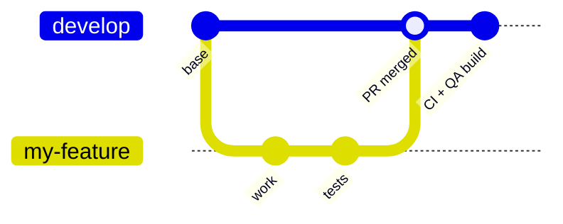
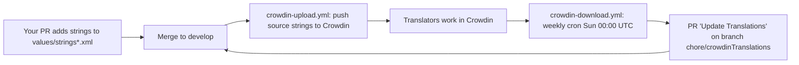

# Contributing

This page describes the day-to-day contribution workflow for the GodTools Android repository: how branches and pull requests flow, what to run before committing, the code style rules enforced by ktlint, how detekt analysis fits in, and how translated strings flow through Crowdin (and why you must never hand-edit them). It assumes you already have a working build — if not, start with [Getting Started](Getting-Started.md). For details on the CI jobs referenced here, see [Build System & CI](Build-System-and-CI.md); for the test suites your PR is expected to keep green, see [Testing](Testing.md).

## Branching and pull requests

The default branch is **`develop`** (documented in `CLAUDE.md` and `README.md`). All feature work branches from `develop`, and all pull requests target `develop`. `master` and `feature/*` branches also trigger CI (`.github/workflows/build.yml`), but the everyday flow is:



1. Branch from `develop` (in the main repository if you have write access, or in your fork — see below).
2. Make your changes, adding unit tests for new functionality (`README.md`, "Contributing").
3. Run the pre-commit checks below.
4. Open a PR against `develop` and wait for the CI checks to pass.

There is no `CONTRIBUTING.md` or PR template in the repo — the checklist in `README.md` plus the CI checks below are the contract.

### Working from a fork

If you don't have write access to `CruGlobal/godtools-android`, contribute through a fork and open a pull request to merge your work back:

1. **Fork the repository** on GitHub — the **Fork** button on [`CruGlobal/godtools-android`](https://github.com/CruGlobal/godtools-android) creates `<your-username>/godtools-android` under your account.
2. **Clone your fork and wire up the upstream remote.** Install Git LFS *before* cloning and do not use a shallow clone — both matter for this repo (see [Getting Started](Getting-Started.md#cloning)). Sort out GitHub authentication now as well: everything up to this point is an anonymous public read, but step 5 pushes, and GitHub no longer accepts an account password for HTTPS Git operations. Run `gh auth login` (it configures git's credential helper for you), supply a personal access token with `repo` scope when git prompts for a password, or clone over SSH (`git@github.com:<your-username>/godtools-android.git`) instead.

   ```bash
   # git-lfs must already be installed (brew / apt / Windows installer) — see Getting Started
   git lfs install
   git clone https://github.com/<your-username>/godtools-android.git
   cd godtools-android
   git remote add upstream https://github.com/CruGlobal/godtools-android.git
   ```

3. **Branch from the latest upstream `develop`:**

   ```bash
   git fetch upstream
   git checkout -b my-feature --no-track upstream/develop
   ```

   `--no-track` is deliberate: without it the new branch is set to track `upstream/develop`, the repository you have no write access to, until the `-u` in step 5 repoints it at your fork.

4. Make your changes and run the [pre-commit checklist](#pre-commit-checklist).
5. **Push the branch to your fork** (`origin`):

   ```bash
   git push -u origin my-feature
   ```

6. **Open the pull request to merge it back.** GitHub shows a "Compare & pull request" prompt on your fork right after the push; otherwise use **New pull request** on the main repository and choose *compare across forks*. Set the **base repository** to `CruGlobal/godtools-android`, the **base branch** to `develop`, and the head to `<your-username>:my-feature`, then describe what the change does and why. Leave **Allow edits by maintainers** (the checkbox under the description box) checked — maintainers need it to push a snapshot commit or a small fixup onto your branch. GitHub does not offer that checkbox for forks owned by an organization, so prefer a personal fork.
7. **Expect an approval gate on your first contribution.** By default GitHub holds workflow runs from first-time contributors until a maintainer clicks **Approve and run**, so a banner reading *1 workflow awaiting approval* on a fresh PR is expected, not a failure. Every subsequent push needs the same approval until one of your PRs is merged.
8. **Keep the PR current while it's under review.** If `develop` moves on, rebase rather than letting the branch drift:

   ```bash
   git fetch upstream
   git rebase upstream/develop
   git push --force-with-lease --force-if-includes
   ```

   **Fetch only `upstream` here — do not add a `git fetch origin`.** With no expected value, `--force-with-lease` takes the value it compares against from your remote-tracking ref `origin/my-feature`, so refreshing that ref immediately before the push makes the lease match whatever a maintainer just pushed: the check passes and the force-push destroys their commit. Git's own documentation warns that the protection "is trivially defeated if some background process is updating refs in the background". A *stale* `origin/my-feature` is exactly what makes the lease bite. `--force-if-includes` (git 2.30+) adds a second check that survives a fetch — it rejects the push unless the remote tip is reachable from your branch's reflog, i.e. unless you actually built on top of it.

   A rejected push (`stale info`, or *the tip of the remote-tracking branch has been updated since the last checkout*) is that safety net firing, not a problem to work around. Someone pushed to your branch — most often the **Record Snapshots** workflow's "Record updated snapshots" commit. Never reach for `--force`; pick their work up instead:

   ```bash
   git fetch origin
   git rebase origin/my-feature   # replay your commits on top of theirs
   git rebase upstream/develop
   git push --force-with-lease --force-if-includes
   ```

Fork PRs are accepted against `develop` just like same-repo branches, and the CI checks below run on them. Three fork-specific mechanics are worth knowing up front:

- **Record snapshots from your own fork.** The **Record Snapshots** workflow (`.github/workflows/record-snapshots.yml`) is `workflow_dispatch`-only and is copied into your fork like every other workflow file; `workflow_dispatch` targets a branch in whichever repository hosts the workflow, and the final step pushes the "Record updated snapshots" commit back to the branch it was dispatched on — in your fork, that branch is the PR head. Two one-time setup steps on your fork: enable workflows on its **Actions** tab (forks ship with them disabled), and, if the push step fails on permissions, set **Settings → Actions → General → Workflow permissions** to *Read and write permissions*. Then dispatch **Record Snapshots** on `my-feature` and the commit lands on the PR by itself. Ask a maintainer only if that setup isn't available to you.
- **QA builds are not available on fork PRs at all.** GitHub does not pass repository secrets to a workflow triggered by a pull request from a fork, and the `qa_build` job needs `FIREBASE_API_KEY` and `BETA_KEYSTORE_PASSWORD` (`.github/workflows/build.yml`). Labelling a fork PR with `Publish PR QA Build` therefore gets you nothing: `qa_build` declares `needs: [build, ktlint, lint, tests]`, so it is skipped outright whenever any of those go red (including the Codecov case in the next bullet), and even with all four green it can neither sign the APKs nor authenticate to Firebase. Expect the job to be skipped or red — never a Firebase build. The only route is for a maintainer to push your branch into `CruGlobal/godtools-android` and label a PR from there, or to merge it.
- **A red Unit Tests check may not be your code.** For the same reason, `secrets.CODECOV_TOKEN` is empty on a fork PR, so the `tests` job's coverage upload falls back to an untokenized upload while still running under `fail_ci_if_error: true` (`.github/workflows/build.yml`). A rejected upload fails the shard with no failing test. Read the job log before chasing it, and ask a maintainer if the Codecov step is what went red.

## Pre-commit checklist

Run these locally before committing / opening a PR:

```bash
# Code style — REQUIRED before every commit
./gradlew :build-logic:ktlintCheck ktlintCheck

# Unit tests (all enabled variants)
./gradlew test

# Android lint
./gradlew lint

# Paparazzi snapshot verification (requires Git LFS)
./gradlew verifyPaparazzi
```

Two gotchas worth knowing:

- **ktlint must be invoked twice-scoped.** `build-logic/` is an *included build* (`settings.gradle.kts`), so a plain `ktlintCheck` on the root build does not cover it. Both `README.md` and the CI ktlint job (`.github/workflows/build.yml`) use the exact command `./gradlew :build-logic:ktlintCheck ktlintCheck`.
- **Use the aggregate `test` task.** Unit tests are only enabled for the `debug` build type + `production` flavor (`build-logic/src/main/kotlin/AndroidTestConfiguration.kt`), so flavored modules expose `testProductionDebugUnitTest` while unflavored ones expose `testDebugUnitTest`. `./gradlew test` runs whichever applies without you having to know.

## Code style (ktlint)

Style is enforced by the [`org.jlleitschuh.gradle.ktlint`](https://github.com/JLLeitschuh/ktlint-gradle) Gradle plugin (v14.2.0), pinning **ktlint 1.8.0**, applied to every module by `configureKtlint()` in `build-logic/src/main/kotlin/KtlintConfiguration.kt`. An extra ruleset is added on top of the standard rules: the Compose ktlint rules `io.nlopez.compose.rules:ktlint:0.6.4` (the `ktlint-rulesets` bundle in `gradle/libs.versions.toml`).

The actual style configuration lives in `.editorconfig`:

| Setting | Value |
|---|---|
| Code style | `ktlint_code_style=android_studio` |
| Max line length | `120` |
| Indent | 4 spaces |
| `@Composable` naming | PascalCase allowed (`ktlint_function_naming_ignore_when_annotated_with=Composable`) |
| Import layout | `*,^` (lexicographic, aliases last) |
| Trailing commas | Allowed by the compiler (`ij_kotlin_allow_trailing_comma=true`) but *not enforced* — the `trailing-comma-on-call-site` and `trailing-comma-on-declaration-site` rules are disabled |
| Disabled rules | `standard:filename`, `standard:spacing-between-declarations-with-annotations`, `standard:trailing-comma-on-call-site`, `standard:trailing-comma-on-declaration-site` |

`./gradlew ktlintFormat` (provided by the same plugin) can auto-fix most violations, but always finish with the check command above since not everything is auto-correctable.

## detekt

Detekt runs **in CI only** — there is no detekt Gradle plugin or `detekt.yml` config anywhere in the repo. Note that the workflow is currently **manually disabled** in the repository's GitHub Actions settings, so in practice it does not run at all; the description below applies if it is re-enabled. The workflow `.github/workflows/detekt-analysis.yml`:

- runs on pushes to `develop`/`feature/*`/`master`, PRs to `develop`/`feature/*`, a weekly cron, and manual dispatch;
- downloads the standalone **detekt CLI v1.15.0** and runs it with default rules over the whole workspace;
- carries `continue-on-error: true` on the *analysis* step, so detekt **findings** never fail your PR;
- uploads SARIF results to GitHub Code Scanning (the repository's Security tab). Note this final `upload-sarif` step is *not* guarded by `continue-on-error`, so an upload failure fails the job — and on a fork PR it cannot succeed at all, because the fork PR `GITHUB_TOKEN` is read-only and the `security-events: write` permission the upload needs is unavailable.

Treat code-scanning annotations from detekt as advisory. You cannot reproduce this run via Gradle — if you want to check locally you would need the same standalone CLI version.

## What CI checks on your PR

All jobs are defined in `.github/workflows/` — see [Build System & CI](Build-System-and-CI.md) for full details.

| Check | Workflow | What it does | Blocking? |
|---|---|---|---|
| Build | `build.yml` (`build` job) | `./gradlew bundle` | Yes |
| ktlint | `build.yml` (`ktlint` job) | `./gradlew :build-logic:ktlintCheck ktlintCheck` | Yes |
| Android lint | `build.yml` (`lint` job) | `./gradlew lint` (config: `analysis/lint/lint.xml`) | Yes |
| Unit tests + snapshots | `build.yml` (`tests` job, 4-shard matrix) | `test verifyPaparazzi` + Kover coverage upload to Codecov | Yes |
| Gradle wrapper validation | `gradle-wrapper-validation.yml` | Checksum-verifies `gradle-wrapper.jar` | Yes |
| Git LFS validation | `git-lfs-validation.yml` | `git lfs fsck --pointers` — catches snapshots committed as real binaries instead of LFS pointers | Yes |
| detekt | `detekt-analysis.yml` | Static analysis → GitHub Code Scanning | Findings are non-blocking (`continue-on-error` on the analysis step), but the unguarded SARIF upload can fail the job; workflow currently disabled in Actions settings |

Additional PR mechanics:

- **QA builds from a PR:** adding the label `Publish PR QA Build` to a PR makes the `qa_build` job upload `stageQa` and `productionQa` builds to Firebase App Distribution (tester group `android-testers`). This also happens automatically on every push to `develop` (`.github/workflows/build.yml`). Applying the label requires triage rights, and it does not work on fork PRs at all — the job's Firebase and keystore secrets are withheld from fork-triggered runs, and it only starts once `build`, `ktlint`, `lint` and `tests` are green, so the labelled job ends up skipped or red rather than producing a build (see the fork note above).
- **PR version suffix:** CI builds PRs with `versionSuffix=PR{n}`, so PR artifacts are identifiable (`.github/workflows/build.yml`).
- **Paparazzi snapshots are recorded in CI, never locally.** If your UI change alters snapshots, trigger the manual **Record Snapshots** workflow (`.github/workflows/record-snapshots.yml`, `workflow_dispatch`) on your feature branch — it runs `./gradlew cleanRecordPaparazzi` on the CI runner and pushes a "Record updated snapshots" commit to your branch. Working from a fork, dispatch the workflow on your own fork's copy — the commit lands on your PR head branch (see the fork note above for the one-time fork setup). Local recording produces machine-dependent renders that fail `verifyPaparazzi` in CI. See [Testing](Testing.md).
- **Coverage** is collected via Kover and uploaded to Codecov with `fail_ci_if_error: true` (`.github/workflows/build.yml`).

## Translations (Crowdin)

User-visible strings are translated through [Crowdin](https://crowdin.com/) (project id `805338`, configured in the root `crowdin.yml`). The flow is fully automated in both directions:



- **Upload:** `.github/workflows/crowdin-upload.yml` runs on every push to `develop` (and manual dispatch) with `upload_sources: true`, pushing English source strings to Crowdin.
- **Download:** `.github/workflows/crowdin-download.yml` runs weekly (`cron: '0 0 * * 0'`, Sundays 00:00 UTC) and on manual dispatch. It downloads translations (`skip_untranslated_strings: true`) onto the branch `chore/crowdinTranslations` and opens a PR titled **"Update Translations"** with commit message "Download the latest translations from Crowdin".

Source files covered by Crowdin (`crowdin.yml`) are `strings*.xml` under `src/main/res/values/` in these modules:

| Module | Notes |
|---|---|
| `app` | Ignores `app/src/main/res/values/strings_country_native_names.xml` |
| `library/base` | |
| `ui/base` | |
| `ui/base-tool` | |
| `ui/lesson-renderer` | |
| `ui/tips-renderer` | |
| `ui/tract-renderer` | |
| `ui/tutorial-renderer` | |

Translations land in `values-%android_code%/` directories (e.g. `app/src/main/res/values-de/strings_dashboard.xml`) with `update_option: update_as_unapproved`.

**Rules for contributors:**

1. **Only edit the English source files** (`values/strings*.xml`). New strings go there; keys follow the `<screen>_<section>_<purpose>` convention (see `.claude/rules/design_system_rules.md` §13).
2. **Never hand-edit translated `values-*/strings_*.xml` files.** They are machine-managed by the Crowdin download workflow; manual edits will be overwritten by the next "Update Translations" PR and never reach Crowdin's translation memory.
3. **Don't worry about missing translations breaking the build.** `analysis/lint/lint.xml` downgrades the `MissingTranslation` lint issue to a warning specifically so new strings can ship before they are translated.
4. Manual Crowdin CLI use is possible but rarely needed — it requires the `CROWDIN_API_TOKEN` environment variable (`crowdin.yml`, `README.md`).

## AI-assisted work

The repo carries checked-in guidance for AI coding assistants — read (and keep in sync) when relevant:

- **`CLAUDE.md`** — repository-level instructions: default branch, build/test commands, module layout, key frameworks and patterns (Hilt, Circuit, Room, WorkManager), and code style. If you change a workflow or convention documented there, update it in the same PR.
- **`.claude/rules/design_system_rules.md`** — the Jetpack Compose design-system rules: Material3 tokens (`MaterialTheme.colorScheme`/`typography`/`shapes`), `GodToolsTheme.extendedColorScheme`, spacing grid, icon conventions, accessibility requirements, and string-resource conventions. These rules apply to *all* new Compose UI, human- or AI-written; see [UI Architecture](UI-Architecture.md) for the underlying theme code in `ui/base`.
- **`.claude/skills/`** — project-local Claude Code skills: `pr-review` (reviews a PR against project conventions) and `record-screenshots` (drives the Record Snapshots workflow and folds the resulting screenshot commit into your branch).

## Keeping this wiki current

This wiki lives in the `wiki/` directory of the repository and is versioned alongside the code (see [Home](Home.md)). Pages are mirrored to the browsable [GitHub Wiki](https://github.com/CruGlobal/godtools-android/wiki) by the `Publish Wiki` workflow (`.github/workflows/publish-wiki.yml`) on every push to `develop` that touches `wiki/`; the same workflow's `validate` job also runs on pull requests, failing the check when a relative link or heading anchor no longer resolves — edit pages by pull request against this directory, never on the GitHub Wiki, which the next sync overwrites. The repository's `README.md` links here from its **Documentation** section — that link is the canonical entry point for new contributors, so keep it intact if you restructure the README or rename/move wiki pages. The same expectation that applies to `CLAUDE.md` above applies here: **if your PR changes behavior, configuration, or a workflow documented in a wiki page, update the affected page in the same PR.** The pages cite concrete specifics — library versions, database schema versions, default values, file and line references — that silently rot when the code moves on without them.

**Adding a page:** create `wiki/<Page-Name>.md` — GitHub derives the published page's title and URL from the filename, turning hyphens into spaces, so `Build-System-and-CI.md` is served as *Build System and CI* at `/wiki/Build-System-and-CI`. Then register it in both hand-maintained navigation lists, or the page ships reachable only by search: `wiki/_Sidebar.md`, which GitHub renders as the sidebar of every published wiki page, and the **Wiki Navigation** table on [Home](Home.md). Nothing in CI checks either list. Point links at other wiki pages *with* the `.md` extension — target `Testing.md`, not `Testing` — so they resolve while browsing the `wiki/` directory on GitHub; the publish workflow strips the extension as it syncs, since the GitHub Wiki serves pages without one. `.github/scripts/check-wiki-links.py` enforces that on every pull request touching `wiki/`, so an extensionless target fails CI.

**Renaming or deleting a page:** update every inbound link in the same PR — the link check fails the build on any that still point at the old filename, and on any `#anchor` whose heading you renamed along the way. Fix the two navigation lists above too, and expect the old `/wiki/<Page-Name>` URL to start returning 404: the GitHub Wiki has no redirects, so anything linking to it from outside the repository needs updating separately.

When editing wiki pages, prefer stable anchors (class, function, and constant names) over raw line numbers, which break on unrelated edits to the cited file.

## Quick reference

| Task | Command / action |
|---|---|
| Base branch for PRs | `develop` |
| Contribute without write access | Fork → branch from `upstream/develop` → PR to `CruGlobal:develop` (see [Working from a fork](#working-from-a-fork)) |
| Pre-commit style check | `./gradlew :build-logic:ktlintCheck ktlintCheck` |
| Auto-fix style | `./gradlew ktlintFormat` (then re-run the check) |
| Run all unit tests | `./gradlew test` |
| Verify snapshots | `./gradlew verifyPaparazzi` (Git LFS required) |
| Update snapshots | Trigger the **Record Snapshots** GitHub Actions workflow on your branch (from a fork: dispatch it on your own fork — see [Working from a fork](#working-from-a-fork)) |
| Android lint | `./gradlew lint` |
| Get a QA build of your PR | Add the `Publish PR QA Build` label (unavailable on fork PRs — a maintainer must re-push the branch to the main repo) |
| Add a user-visible string | English `values/strings*.xml` only — Crowdin handles the rest |
| Change behavior a wiki page documents | Update the affected `wiki/` page in the same PR |
