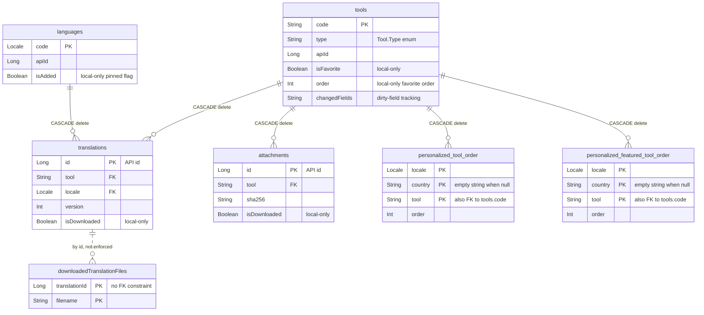
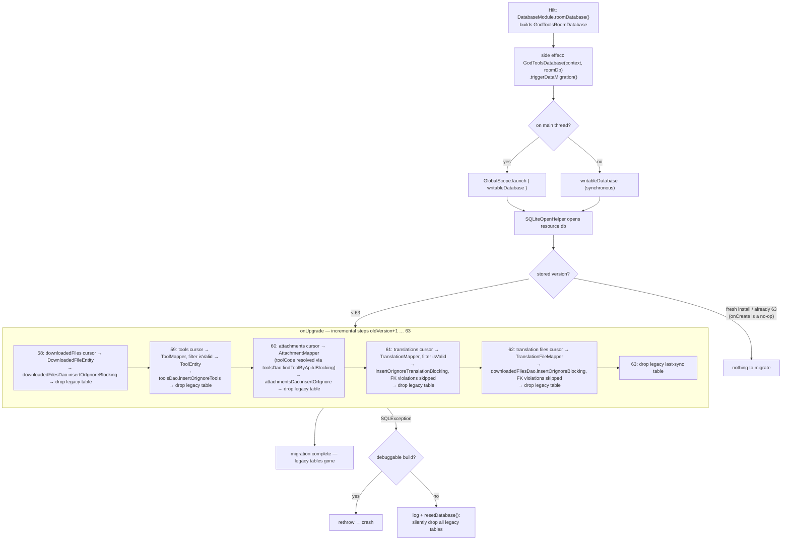

# Data Layer

This page covers the two modules that make up the GodTools data layer: `library/model` (plain Kotlin models that double as JSON:API DTOs) and `library/db` (the Room database, DAOs, and the repository layer that the rest of the app talks to). It explains which entities exist, how they relate, how migrations work, why sync writes go through special "partial" entities, and how data is exposed reactively via Kotlin `Flow` and Compose helpers. For how these models travel over the network see [API Layer](API-Layer.md); for who triggers the writes see [Sync & Downloads](Sync-and-Downloads.md); for how presenters consume the data see [UI Architecture](UI-Architecture.md).

## Module overview

| Module | Purpose | Public surface |
|---|---|---|
| `library/model` | Data models + JSON:API type definitions. Each class is annotated with `@JsonApiType` / `@JsonApiId` / `@JsonApiAttribute` / `@JsonApiIgnore` from the `org.ccci.gto.android:gto-support-jsonapi` library (`gradle/libs.versions.toml`), so the same class is both the domain model and the wire format. | All model classes |
| `library/db` | Room database (`GodToolsRoomDatabase`), entities, DAOs, repository implementations, plus the legacy SQLite database used only for one-way migration. | Repository **interfaces** in `library/db/src/main/kotlin/org/cru/godtools/db/repository/` — everything Room-specific is `internal` |

`library/db/build.gradle.kts` declares `api(projects.library.model)`, so depending on `:library:db` transitively exposes the models. Neither module has product flavors; both apply only `godtools.library-conventions`, so their unit-test task is `testDebugUnitTest` (or just use the aggregate `test` task).

## Models & JSON:API type definitions (`library/model`)

All models live in `library/model/src/main/kotlin/org/cru/godtools/model/`.

| Class | JSON:API type | Identity | Notes |
|---|---|---|---|
| `Tool` | `resource` | `code` locally, `apiId` (`@JsonApiId`) on the API | `Tool.Type` enum: `TRACT`, `ARTICLE`, `CYOA`, `LESSON`, `META` (`"metatool"`), `UNKNOWN`; `Type.NORMAL_TYPES = {TRACT, CYOA, ARTICLE}`. Categories: `gospel`, `articles`, `conversation_starter`, `growth`, `training`. `isValid` requires a non-empty `code`, a known `type`, and an `apiId`. |
| `Translation` | `translation` | `id: Long` (API id) | `toolCode`/`languageCode` fall back to the nested `resource`/`language` JSON:API relationships. `isValid` requires a tool code, a valid language code, and `is-published`. Top-level helpers `getName`/`getDescription`/`getTagline(tool)` fall back to the `Tool`'s fields. |
| `Language` | `language` | `code: Locale` | `INVALID_CODE = Locale.forLanguageTag("x-inv")`. Companion helpers for display-name sorting/filtering using collators. |
| `Attachment` | `attachment` | `id` (from `Base`, `INVALID_ID = -1`) | `localFilename = "<sha256>.<extension>"`; `getFile(fs: FileSystem)` resolves the on-disk file via the `:library:base` `FileSystem`. |
| `User` | `user` | `id: String` | Carries `apiFavoriteTools` (`favorite-tools` relationship) and `attr-initial-favorite-tools-synced`. |
| `UserCounter` | `user-counter` | counter **name** is the `@JsonApiId` | `apiCount`/`apiDecayedCount` are deserialize-only; `delta` (`increment`) is serialize-only. Names must match `UserCounter.VALID_NAME`. |
| `Followup` | `follow_up` | auto-generated local id | Queued locally and submitted later; see `FollowupsRepository`. |
| `GlobalActivityAnalytics` | `global-activity-analytics` | — | Four global counters (users, countries, launches, gospel presentations). |
| `TrainingTip`, `TranslationKey`, `DownloadedFile`, `DownloadedTranslationFile` | — (not JSON:API) | — | `TranslationKey = (tool, locale)`; `DownloadedFile` is a `@JvmInline value class` around a filename (deprecated `typealias LocalFile`). |

### Local-only state

Fields the server must never see (or overwrite) are marked `@JsonApiIgnore`. On `Tool` these are `order`, `isFavorite`, `pendingShares`, `primaryLocale`, `parallelLocale`, `progress`, `progressLastPageId`; on `Language` it is `isAdded` (the "pinned" flag); on `Translation` and `Attachment` it is `isDownloaded`.

### Change tracking

`ChangeTrackingModel` / `ReadOnlyChangeTrackingModel` (`library/model/src/main/kotlin/org/cru/godtools/model/ChangeTrackingModel.kt`) record dirty field names in a comma-separated `changedFieldsStr`. `Tool` implements the read-only variant, and the only field tracked in practice is `Tool.ATTR_IS_FAVORITE` (`"isFavorite"`). This is how a locally toggled favorite survives a sync — conflict resolution is by dirty-flag, not by timestamp (see `storeFavoriteToolsFromSync` below).

### JSON:API wiring

The shared `JsonApiConverter` is built in `library/api/src/main/kotlin/org/cru/godtools/api/ApiModule.kt` (`jsonApiConverter()`), registering these model classes plus converters, including `ToolTypeConverter` (`library/model/src/main/kotlin/org/cru/godtools/model/jsonapi/ToolTypeConverter.kt`), which maps `Tool.Type` to/from its JSON string. Details in [API Layer](API-Layer.md).

### Test helpers

`randomTool()`, `randomTranslation()`, `randomUser()` and a fake `Attachment(...)` factory live in the **main** source set annotated `@RestrictTo(RestrictTo.Scope.TESTS)` (e.g. the bottom of `Tool.kt`), with a TODO to move them to testFixtures. Both modules also enable real `testFixtures` (see `library/model/build.gradle.kts`, `library/db/build.gradle.kts`), which contain `Language` fixtures and an `InMemoryLastSyncTimeRepository`.

## Room database (`library/db`)

`GodToolsRoomDatabase` (`library/db/src/main/kotlin/org/cru/godtools/db/room/GodToolsRoomDatabase.kt`) is an `internal abstract class`, database name `"GodTools"`, currently **version 27**. Type converters come entirely from the external gto-support library ([CruGlobal/android-gto-support](https://github.com/CruGlobal/android-gto-support); see [Working on the shared libraries](Tool-Renderers.md#working-on-the-shared-libraries)): `@TypeConverters(Java8TimeConverters::class, LocaleConverter::class)` — no Room type converters are defined in this repo (the only in-repo converter is the JSON:API `ToolTypeConverter` in `library/model`). The database exposes 11 abstract DAO vals and 11 abstract repository vals; the repository implementations are themselves `@Dao` abstract classes that Room constructs with the database as a constructor argument.

### Entities

All entities are `internal` and live in `library/db/src/main/kotlin/org/cru/godtools/db/room/entity/`.

| Entity | Table | Primary key | Foreign keys / notes |
|---|---|---|---|
| `ToolEntity` | `tools` | `code: String` | Column defaults via `@ColumnInfo(defaultValue = …)`. Two-way mappers `ToolEntity(Tool)` / `toModel()`. |
| `LanguageEntity` | `languages` | `code: Locale` | `isAdded` = pinned language. |
| `TranslationEntity` | `translations` | `id: Long` (API id) | FKs `tool` → `tools.code` and `locale` → `languages.code`, both `CASCADE` on update and delete. Indices on `(tool, locale)`, `(tool, locale, version DESC)`, `(locale)`. |
| `AttachmentEntity` | `attachments` | `id: Long` | FK `tool` → `tools.code`, `CASCADE`. |
| `DownloadedFileEntity` | `downloadedFiles` | `filename` | Tracks files present on disk. |
| `DownloadedTranslationFileEntity` | `downloadedTranslationFiles` | `@Embedded Key(translationId, filename)` | No FK constraint on `translationId`. |
| `FollowupEntity` | `followups` | autogenerated `id` | Local outbound queue. |
| `GlobalActivityEntity` | `global_activity` | `id` forced to `1` | Single-row table. |
| `TrainingTipEntity` | `training_tips` | `@Embedded Key(tool, locale, tipId)` | Has an `isNew` flag not present in the `TrainingTip` model. |
| `UserEntity` | `users` | `id: String` | — |
| `UserCounterEntity` | `user_counters` | `name` | Server state (`count`, `decayedCount`) plus locally pending `delta`. |
| `LastSyncTimeEntity` | `last_sync_times` | `id` | Vararg key flattened with `":"` (`flattenKey`). |
| `PersonalizedToolOrderEntity` | `personalized_tool_order` | compound `(locale, country, tool)` | FK `tool` → `tools.code`, `CASCADE`; `country` stored as `""` when null. |
| `PersonalizedFeaturedToolOrderEntity` | `personalized_featured_tool_order` | compound `(locale, country, tool)` | Same shape as above. |

### Core entity relationships



Deleting a tool cascades to `translations`, `attachments`, and both personalized-order tables. Because of these FK constraints, `storeInitialTranslations` (`TranslationsRoomRepository.kt`) and `storeInitialAttachments` pre-filter incoming rows against existing tools/languages so inserts cannot violate FKs.

### Migrations

The current database uses Room **auto-migrations** only — there are no hand-written `Migration` objects:

```kotlin
autoMigrations = [
    AutoMigration(from = 7, to = 22, spec = Migration7To22::class),
    AutoMigration(from = 22, to = 23),
    // … 23→24→25→26→27
]
```

`Migration7To22` is a `@RenameColumn` spec (`languages.id` → `apiId`) whose `onPostMigrate` deletes stale `last_sync_times` rows. Any migration path not covered falls back to `fallbackToDestructiveMigration(dropAllTables = true)` via the `enableMigrations()` extension in `GodToolsRoomDatabase.kt` — **a missing migration silently wipes data rather than crashing**. A version-history comment block in the same file maps DB versions to app releases; update it when bumping the version.

Schema JSON is exported via the KSP arg `room.schemaLocation` to `library/db/room-schemas/` (`library/db/build.gradle.kts`), and that directory is also mounted as **test assets** so `MigrationTestHelper`-based tests can replay old schemas. When you bump the DB version you must commit the new `room-schemas/org.cru.godtools.db.room.GodToolsRoomDatabase/N.json` and add an `AutoMigration` entry.

### The legacy SQLite database

A second database still exists: `org.keynote.godtools.android.db.GodToolsDatabase` (`library/db/src/main/kotlin/org/keynote/godtools/android/db/GodToolsDatabase.kt`), file `resource.db`, version 63, a `WalSQLiteOpenHelper`. Its only remaining job is a one-way migration of old installs into Room: `onUpgrade` steps 58–62 read legacy tables via cursor mappers (`ToolMapper`, `AttachmentMapper`, `TranslationMapper`, `TranslationFileMapper`; column contract in `Contract.kt`), insert into the Room DB using `*Blocking` DAO methods (the migration runs synchronously inside `onUpgrade`), then drop the legacy table. On `SQLException` the error is rethrown on debuggable builds but the database is silently reset on release builds. The migration is triggered as a side effect of Hilt providing the Room database: `DatabaseModule.roomDatabase` calls `GodToolsDatabase(context, it).triggerDataMigration()` (`library/db/src/main/kotlin/org/cru/godtools/db/DatabaseModule.kt`).



## Repository layer

The repository **interfaces** in `library/db/src/main/kotlin/org/cru/godtools/db/repository/` are the entire public API of `:library:db`. The `*RoomRepository` implementations (`library/db/src/main/kotlin/org/cru/godtools/db/room/repository/`), the DAOs, and the entities are all `internal`. Hilt wiring lives in `DatabaseModule` (installed in `SingletonComponent`): the Room database is `@Singleton`; each repository binding is `@Provides @Reusable`, delegating to the database's abstract vals. UI code, sync code, and everything else simply `@Inject`s the interface.

| Interface | What it manages | Highlights |
|---|---|---|
| `ToolsRepository` | Tools, favorites, personalized/featured ordering | `findTool(Flow)`, `getToolsFlowByType`, `getFavoriteToolsFlow()` (filters `isFavorite`, sorts with `Tool.COMPARATOR_FAVORITE_ORDER`), `getFeaturedToolsFlow(locale, country)`, `pinTool`/`unpinTool`, `storeToolOrder`, `updateToolLocales`/`updateToolProgress`/`updateToolViews` |
| `TranslationsRepository` | Published translations per tool+language | `findLatestTranslation(Flow)(code, locale, downloadedOnly)`, `markTranslationDownloaded`, `markStaleTranslationsAsNotDownloaded`, `markBrokenManifestNotDownloaded` |
| `LanguagesRepository` | Languages, pinned languages | `getPinnedLanguagesFlow`, `pinLanguage`/`unpinLanguage`, `getLanguagesFlowForToolCategory` |
| `AttachmentsRepository` | Tool banners/animations and their download state | `findAttachmentFlow`, `updateAttachmentDownloaded`, `attachmentsChangeFlow` |
| `DownloadedFilesRepository` | Files on disk | Used by the download manager |
| `UserRepository` / `UserCountersRepository` | Authenticated user, user counters | `UserCountersRepository.transaction { }` lets `:library:sync` atomically read dirty counters (`delta != 0`); `updateCounter(name, delta)` |
| `FollowupsRepository` | Local queue of follow-up form submissions | Create / get / delete |
| `LastSyncTimeRepository` | Sync staleness bookkeeping | `isLastSyncStale(vararg key, staleAfter)`, `resetLastSyncTime(isPrefix = true)` deletes by key prefix |
| `GlobalActivityRepository`, `TrainingTipsRepository` | Global analytics row; training-tip completion state | — |

### Which methods are for whom

The interfaces intentionally mix three audiences — the region comments in each interface file mark them:

- **UI / feature code** uses the read methods (`find*`, `get*Flow`) and the user-action mutators (`pinTool`, `unpinTool`, `storeToolOrder`, `updateToolLocales`, `updateToolProgress`, `updateToolViews`, `pinLanguage`, `updateCounter`, …).
- **`// region Sync Methods`** (`store*FromSync`, `deleteIfNotFavorite`, `deleteTranslationIfNotDownloaded`, `removeLanguagesMissingFromSync`, …) are called by `library/sync/src/main/kotlin/org/cru/godtools/sync/repository/SyncRepository.kt` — do not call these from UI code.
- **`// region Initial Content Methods`** (`storeInitial*`) are called by `:library:initial-content` to seed bundled data; they are all insert-or-**ignore**, so they never overwrite synced data.
- **`// region DownloadManager Methods`** on `TranslationsRepository` are for `:library:download-manager`.

### How sync avoids clobbering local state

Sync writes never use full-entity upserts. Instead, column-subset classes in `library/db/src/main/kotlin/org/cru/godtools/db/room/entity/partial/` are used with `@Upsert(entity = …)` / `@Update(entity = …)` so a write touches only the columns the server owns:

- `SyncTool` deliberately **excludes** `isFavorite`, `order`, `pendingShares`, `primaryLocale`/`parallelLocale`, `progress`, and `changedFields`.
- `SyncLanguage` excludes `isAdded`, preserving pinned languages.
- `SyncToolPlaceholder` (just `apiId` + `code`) creates stub tool rows so FK constraints hold when personalized-order rows arrive before the full tool.
- `ToolFavorite` (`code` + `isFavorite` + `changedFields`) implements `ChangeTrackingModel`; its `isFavorite` setter calls `markChanged(Tool.ATTR_IS_FAVORITE)`.

Favorite conflict resolution lives in `ToolsRoomRepository.storeFavoriteToolsFromSync`: for each tool it only applies the server's favorite state if `isFieldChanged(Tool.ATTR_IS_FAVORITE)` is false, and clears the dirty flag once local and server agree. A naive `@Upsert(ToolEntity::class)` in sync code would silently destroy user state — always route server data through the `partial/` classes.

### Notable implementation details

- **"Latest translation" is computed in Kotlin, not SQL**: `TranslationsDao.getLatestTranslations` returns all versions ordered `version DESC`, and `TranslationsRoomRepository.findLatestTranslation` takes the first row matching `downloadedOnly`.
- `pinTool` is `@Transaction`al: it prepends the tool to the favorite order and marks `isFavorite` through the change-tracked `ToolFavorite`; `storeToolOrder` resets every tool's `order` and reindexes.
- Personalized/featured tool order is keyed by `(locale, country)` with `country.orEmpty()` — a null country and `""` are the same bucket (`ToolsRoomRepository.kt`).
- `LastSyncTimeRoomRepository` contains a workaround splitting a vararg+default-arg function in two due to an AndroidX Room bug (see the comment in `library/db/src/main/kotlin/org/cru/godtools/db/room/repository/LastSyncTimeRoomRepository.kt`).

## Reactive data exposure

### Flows

Every read path has a `suspend` one-shot and/or a `Flow` variant generated by Room; repositories map `Flow<Entity>` to `Flow<Model>` with `kotlinx.coroutines.flow.map` (see `ToolsRoomRepository.kt`). Because they are Room query flows, they re-emit whenever the underlying tables change — Circuit presenters simply collect them, e.g. `app/src/main/kotlin/org/cru/godtools/ui/dashboard/home/HomePresenter.kt` collects `toolsRepository.getFavoriteToolsFlow()`.

Table-level invalidation flows — `toolsChangeFlow()`, `translationsChangeFlow()`, `attachmentsChangeFlow()` — are built on `db.changeFlow("<table>")` from gto-support and emit an initial value on collection (documented on `AttachmentsRepository.attachmentsChangeFlow`). `ui/shortcuts/src/main/kotlin/org/cru/godtools/shortcuts/GodToolsShortcutManager.kt` merges all three to know when to rebuild launcher shortcuts.

### Compose helpers

`:library:db` compiles Compose (`configureCompose(project)` in `library/db/build.gradle.kts`), so the repository interface files ship `@Composable` helpers that wrap flows in `remember { … }.collectAsState()`:

| Helper | Defined in |
|---|---|
| `ToolsRepository.produceToolState(toolCode)` | `library/db/src/main/kotlin/org/cru/godtools/db/repository/ToolsRepository.kt` |
| `TranslationsRepository.produceLatestTranslationState(...)` / `rememberLatestTranslation(...)` | `library/db/src/main/kotlin/org/cru/godtools/db/repository/TranslationsRepository.kt` |
| `LanguagesRepository.rememberLanguage(locale)` | `library/db/src/main/kotlin/org/cru/godtools/db/repository/LanguagesRepository.kt` |
| `AttachmentsRepository.rememberAttachmentFile(fileSystem, attachmentId)` | `library/db/src/main/kotlin/org/cru/godtools/db/repository/AttachmentsRepository.kt` |

Presenters use them directly, e.g. `app/src/main/kotlin/org/cru/godtools/ui/tooldetails/ToolDetailsPresenter.kt` calls `toolsRepository.produceToolState(toolCode)` and `translationsRepository.rememberLatestTranslation(...)`. Don't be surprised that a "db" module depends on the Compose runtime — this is deliberate.

## Testing the data layer

```bash
# All model tests
./gradlew :library:model:test

# All db tests (includes Room migration tests)
./gradlew :library:db:test

# A single test class
./gradlew :library:model:test --tests "org.cru.godtools.model.ToolTest"
```

Classes named `*IT` in `library/db/src/test/` (e.g. `GodToolsRoomDatabaseMigrationIT`) run as plain unit tests under Robolectric (`@RunWith(AndroidJUnit4::class)`), not as on-device instrumentation. Migration tests rely on the `room-schemas` directory being wired as test assets in `library/db/build.gradle.kts`. See [Testing](Testing.md) for the broader test setup.

## Gotchas for new developers

1. **Two databases exist.** Room's `GodTools` DB is current; `resource.db` only migrates old installs and is triggered as a side effect of Hilt providing the Room database.
2. **A missing Room migration wipes data, it doesn't crash** (`fallbackToDestructiveMigration(dropAllTables = true)`). Version bumps need a committed schema JSON, an `AutoMigration` entry, and an updated version-history comment.
3. **Adding a field to `Tool` touches many places**: `Tool.kt` (constructor, hand-written `equals`/`hashCode`, `JSONAPI_FIELDS`), `ToolEntity` (both mappers), and — deliberately decide — `SyncTool` (include it only if the server owns it; leaving it out is how local-only state is protected).
4. **Never write server data with full entities** — use the `partial/` sync classes.
5. Everything Room-facing is `internal`. A new query means extending the repository interface, the `*RoomRepository`, and the DAO together.
6. `randomTool()` & friends live in the main source set of `:library:model` — usable from any module's tests without a testFixtures dependency.

## Related pages

- [Architecture Overview](Architecture-Overview.md) — where these modules sit in the overall app
- [API Layer](API-Layer.md) — the Retrofit/JSON:API clients that produce these models
- [Sync & Downloads](Sync-and-Downloads.md) — the WorkManager sync that calls the `store*FromSync` methods
- [UI Architecture](UI-Architecture.md) — Circuit presenters consuming repository flows
- [Testing](Testing.md) — running unit, Robolectric, and Paparazzi tests
