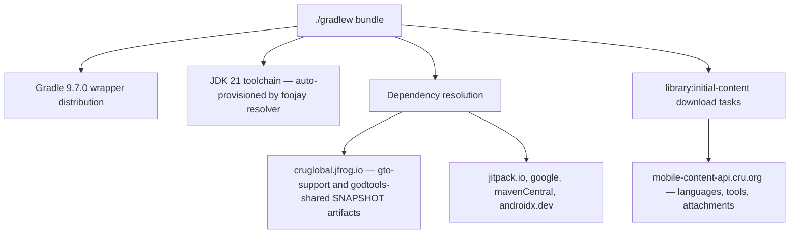

# Getting Started

This page takes you from a fresh machine to a running GodTools debug build on an emulator. It covers prerequisites (JDK, Git LFS, Android Studio), cloning correctly, the first build and what it downloads, choosing among the build variants, and a troubleshooting section for the failures new contributors actually hit. Every claim here is sourced from the repository's build files, so when in doubt, the cited file wins over tribal knowledge. For what the code *does* once it builds, continue to [Architecture Overview](Architecture-Overview.md).

## Prerequisites

| Requirement | Details | Source |
|---|---|---|
| JDK | `.tool-versions` pins `java temurin-25.0.4+7.0.LTS` (asdf/mise format). The *compile* toolchain is Java **21** via `jvmToolchain(21)`, auto-provisioned by the foojay resolver plugin if your launcher JDK doesn't have it — but the **launcher JDK itself must be 17+**: Gradle 9.x refuses to run on older JVMs, and toolchain auto-provisioning only covers compilation, not Gradle itself. JDK 11 (still a common LTS) fails immediately. Simplest: just install the pinned Temurin 25. | `.tool-versions`, `build-logic/src/main/kotlin/AndroidConfiguration.kt`, `settings.gradle.kts`, `gradle/wrapper/gradle-wrapper.properties` |
| Android SDK | `compileSdk = 37`, `minSdk = 24`, `targetSdk = 37`. Install SDK Platform 37 via Android Studio's SDK Manager. Gradle locates the SDK via `sdk.dir` in a gitignored `local.properties` (Android Studio writes it on first sync) or the `ANDROID_HOME` environment variable — with neither set, any `./gradlew` build fails immediately with "SDK location not found". On a machine without Android Studio: install the SDK command-line tools, set `ANDROID_HOME`, and accept licenses with `sdkmanager --licenses`. | `build-logic/src/main/kotlin/AndroidConfiguration.kt`, `build-logic/src/main/kotlin/godtools.application-conventions.gradle.kts` |
| Git LFS | **Install before cloning.** Paparazzi snapshot PNGs (`**/snapshots/**/*.png`) are LFS objects; without LFS you get text pointer files and `verifyPaparazzi` fails. | `.gitattributes`, `README.md` |
| Android Studio | The primary IDE. No version is pinned in the repo; you need a release whose supported AGP range includes **9.3.1** (Gradle 9.7.0 comes from the wrapper). Check your installed version against the official [AGP/Android Studio compatibility table](https://developer.android.com/build/releases/gradle-plugin#android_gradle_plugin_and_android_studio_compatibility) — a too-old Studio fails Gradle sync with an "incompatible/unsupported Android Gradle plugin version" error (see [Troubleshooting](#troubleshooting-first-builds)). | `gradle/libs.versions.toml`, `gradle/wrapper/gradle-wrapper.properties` |
| Network access | The first build reaches several hosts beyond Maven Central — see [What the first build downloads](#what-the-first-build-downloads). The first `./gradlew test` run has its own network dependency on top of that: Robolectric downloads AOSP images from Maven Central at test-*execution* time (see the note in that section). | `settings.gradle.kts`, `library/initial-content/build.gradle.kts`, `build-logic/src/main/kotlin/AndroidTestConfiguration.kt` |

> **Note on README/CLAUDE.md mismatches:** `README.md`'s Requirements block is stale in two places. It says "JDK 21" while `.tool-versions` pins Temurin 25 — both work in practice: CI installs the JDK from `.tool-versions` (`.github/workflows/build.yml` uses `java-version-file: ".tool-versions"`), and Gradle's toolchain support compiles with Java 21 regardless of the launcher JDK. Don't fight the toolchain — let foojay provision it. It also says "compile/target SDK 36", but the build sets **37** (`AndroidConfiguration.kt`, `godtools.application-conventions.gradle.kts`) — the build files are authoritative. `CLAUDE.md` (which [Contributing](Contributing.md) points to as the repository-level instructions) carries the same stale JDK line — "JDK 21 (Temurin), specified in `.tool-versions`", self-contradictory since `.tool-versions` pins Temurin 25. Same rule applies: the build files win.

Gradle itself needs no installation: the wrapper pins **Gradle 9.7.0** (`gradle/wrapper/gradle-wrapper.properties`).

## Cloning

```bash
# 1. Install Git LFS FIRST (once per machine)
brew install git-lfs        # macOS
sudo apt-get install git-lfs # Debian/Ubuntu
git lfs install

# 2. Clone — do NOT use a shallow clone (see note below)
git clone https://github.com/CruGlobal/godtools-android.git
cd godtools-android
```

Three cloning rules that are non-obvious:

1. **Full history matters.** `app/build.gradle.kts` computes `versionCode = grgit.log(...).size + 4029265` — the git commit count plus a fixed offset. A shallow clone (`--depth 1`) produces a wrong, tiny `versionCode`. CI checks out with `fetch-depth: 0` for the jobs where this matters (`.github/workflows/build.yml`).
2. **LFS before clone.** If you cloned without LFS installed, recover with `git lfs install && git lfs pull` from the repo root.
3. **Build from a real git clone — a GitHub "Download ZIP" / source tarball cannot build.** A snapshot has no `.git` directory, so the grgit-based `versionCode` computation in `app/build.gradle.kts` fails during Gradle *configuration*, with a grgit/null error that mentions neither git nor `versionCode`. The Paparazzi snapshot PNGs are also stranded as LFS pointer files — there is no repository for `git lfs pull` to pull into.

The default branch is **`develop`** — branch from it and open PRs against it (`CLAUDE.md`, `README.md`).

## First build

The CI-verified build task is the app bundle:

```bash
./gradlew bundle
```

For day-to-day development you usually want a single debug APK instead:

```bash
# Assemble the recommended everyday variant
./gradlew :app:assembleProductionDebug
```

### What the first build downloads

The first build is network-heavy in ways that surprise people. Beyond the usual dependency resolution, the `library:initial-content` module runs Gradle tasks at **build time** that download live content (languages, tools, attachments) from the mobile-content-api, packaged as bundled assets (`build-logic/src/main/kotlin/org/cru/godtools/gradle/bundledcontent/BundledContentConfiguration.kt`, wired in `library/initial-content/build.gradle.kts` with tools `kgp`, `fourlaws`, `satisfied`, `teachmetoshare` and language `en`). Note that these download tasks are attached to `library:initial-content`'s asset merge, and only `feature:bundledcontent` depends on that module — so they run for `./gradlew bundle` (which builds the dynamic feature) but **not** for a plain `./gradlew :app:assembleProductionDebug`.



Two consequences (both verified in `settings.gradle.kts` and `gradle/libs.versions.toml`):

- Dependencies resolve from custom Maven repositories, most importantly `https://cruglobal.jfrog.io/artifactory/maven-mobile/` (Cru's own artifactory hosting `gtoSupport` and `godtoolsShared`), plus JitPack and two smaller repos. A proxy or firewall that blocks these breaks the build.
- `gtoSupport = "4.6.0-SNAPSHOT"` and `godtoolsShared = "1.4.0-SNAPSHOT"` are **SNAPSHOT** dependencies — they can change upstream between builds without any change in this repo.

> **One more download happens at *test*-execution time, not build time.** The first `./gradlew test` run makes Robolectric (part of the `test-framework` bundle every module gets via `AndroidTestConfiguration.kt`) download its `org.robolectric:android-all-instrumented` AOSP image from Maven Central into `~/.m2/repository` — Robolectric's own dependency resolver fetches directly from Maven Central and **ignores the Gradle repositories declared in `settings.gradle.kts`**. So a corporate proxy/mirror setup that satisfied every build step above can still block the first test run (see [Troubleshooting](#troubleshooting-first-builds)). Every module's `src/test/resources/robolectric.properties` pins `sdk=NEWEST_SDK`, so one large newest image is fetched. This is why CI's tests job has a dedicated `~/.m2/repository` "Cache Maven" step (`.github/workflows/build.yml`) separate from the Gradle cache.

## Running on an emulator

1. In Android Studio, create a device via **Device Manager** (any image with API level ≥ 24, per `minSdk` in `build-logic/src/main/kotlin/AndroidConfiguration.kt`).
2. Open the project in Android Studio and pick the **`productionDebug`** variant of `:app` in the Build Variants panel, then Run — or install from the command line:

```bash
# Install the production-flavor debug build on the running emulator/device
./gradlew :app:installProductionDebug

# Or the staging-API variant
./gradlew :app:installStageDebug
```

Debug builds install as a separate app named **"GodTools (Dev)"** with application ID `org.keynote.godtools.android.debug` (`app/build.gradle.kts`), so they coexist with a Play Store install. Debug builds also bundle Flipper and LeakCanary for debugging (`app/build.gradle.kts`).

> **Base APK only:** the Gradle `install*` tasks deploy just the base `:app` APK — the install-time dynamic feature `feature:bundledcontent` (which carries `library:initial-content`) is a separate artifact and is **not** installed. Bundled-content seeding only runs when that split is present, so expect an empty first launch that needs the network before any tool renders (see [Sync & Downloads](Sync-and-Downloads.md), gotchas 7–8). When testing initial-content behavior, prefer Android Studio's **Run**, which deploys the dynamic feature alongside the base APK.

## Build variants

Two axes are defined in `build-logic/src/main/kotlin/AndroidConfiguration.kt` and `app/build.gradle.kts`:

- **Product flavors** (dimension `env`): `production`, `stage` — which backend the app talks to. API URLs live in `build-logic/src/main/kotlin/Constants.kt`; CDN URLs in `app/build.gradle.kts`.
- **Build types**: `debug`, `qa`, `release`. `qa` is `initWith(debug)` but minified, and it **reuses the `src/debug/` source set** — there is no `src/qa/` directory (`configureQaBuildType` in `AndroidConfiguration.kt`).

The `stage` flavor is disabled for `release` builds via a `beforeVariants` block, so only five app variants exist:

| Variant | API base URL | Application ID | Notes |
|---|---|---|---|
| `productionDebug` | `https://mobile-content-api.cru.org/` | `org.keynote.godtools.android.debug` | **Recommended for daily development.** Only variant with unit tests. |
| `stageDebug` | `https://mobile-content-api-stage.cru.org/` | `org.keynote.godtools.android.stage.debug` | Staging backend, debuggable |
| `productionQa` | `https://mobile-content-api.cru.org/` | `org.keynote.godtools.android.qa` | Minified debug; distributed to testers via Firebase App Distribution |
| `stageQa` | `https://mobile-content-api-stage.cru.org/` | `org.keynote.godtools.android.stage.qa` | Minified debug against staging |
| `productionRelease` | `https://mobile-content-api.cru.org/` | `org.keynote.godtools.android` | Play Store build; signing only applies if a real keystore exists |
| ~~`stageRelease`~~ | — | — | **Does not exist** (disabled in `configureFlavorDimensions`) |

Only `app`, `feature:bundledcontent`, and `library:initial-content` carry the `env` flavor dimension; all other library/ui modules build a single flavorless variant per build type (`configureFlavorDimensions` is applied by the application/dynamic-feature conventions and explicitly in `library/initial-content/build.gradle.kts`). This is why some modules expose `testProductionDebugUnitTest` and others only `testDebugUnitTest` — always use the aggregate `./gradlew test` task rather than guessing variant task names.

**Unit tests only exist for `debug` + `production`** — `AndroidTestConfiguration.kt` disables unit tests for every other variant, so tasks like `testStageDebugUnitTest` don't exist.

## Secrets and config files: what you do (not) need

Short version: **a plain debug build needs zero secrets** — it builds, installs, and runs without obtaining anything. (Social *sign-in* is a different story — see the note below the table.) Verified state of every credential-ish file:

| File / value | Status | Detail |
|---|---|---|
| `app/google-services.json` | ✅ Committed | Firebase config with entries for all five package-name variants — nothing to obtain for *building*. It does **not** make Google/Facebook sign-in work from a locally built debug APK — see the note below. |
| `local.properties` | Gitignored, standard | Android Studio generates it with your SDK path; no extra keys are read from it. |
| Release keystore | Not needed | `gradle.properties` sets `androidKeystorePath=non-existant-keystore-dont-create-me.store`; `app/build.gradle.kts` only attaches the release signing config `if (it.storeFile?.exists() == true)`, so local release builds silently fall back to unsigned. |
| `firebase/app_distribution.keystore` | Committed, CI-only | Passwords injected in CI (`BETA_KEYSTORE_PASSWORD`); the App Distribution block only activates with `-PfirebaseAppDistributionBuild` (`app/build.gradle.kts`). |
| `firebase/firebase_api_key.json` | Not committed, CI-only | Written from the `FIREBASE_API_KEY` secret in `.github/workflows/build.yml`. |
| `CROWDIN_API_TOKEN` | Optional | Only needed to run the Crowdin CLI manually (`crowdin.yml`, `README.md`); CI workflows handle normal translation sync. |

> **Social sign-in does not work from a locally built debug APK.** `app/google-services.json` registers Android OAuth clients for `org.keynote.godtools.android.debug` against two *fixed* signing-certificate SHA-1s (and none at all for `org.keynote.godtools.android.stage.debug`), but your local debug build is signed with your machine's auto-generated `~/.android/debug.keystore` — a unique SHA-1 that isn't registered. Google Sign-In (`GoogleModule.kt` in `library/account` builds `GoogleSignInOptions` with `requestIdToken(BuildConfig.GOOGLE_SERVER_CLIENT_ID)`) therefore fails with an opaque `ApiException: 10` (**`DEVELOPER_ERROR`**), and Facebook Login likewise requires your signing key hash to be registered in the Facebook app console. No shared debug keystore is checked into the repo — `firebase/app_distribution.keystore` is the CI-only QA signing key. To exercise login/favorites/user-sync flows, use a CI-signed QA build from Firebase App Distribution, or ask a Cru maintainer to register your debug certificate's SHA-1 (and Facebook key hash) for the debug application IDs.

## Editor setup

**Android Studio** is the assumed IDE — open the repo root and let Gradle sync. Code style is enforced by ktlint using settings from `.editorconfig` (`android_studio` style, 120-char lines, 4-space indent), which Android Studio and most editors pick up automatically.

**VS Code** users get a checked-in `.vscode/` directory with three files:

- `tasks.json` — the five standard Gradle tasks as preconfigured build/test tasks: **Gradle: Build App Bundle** (`bundle`), **Gradle: ktlint Check** (`:build-logic:ktlintCheck ktlintCheck`), **Gradle: Android Lint** (`lint`), **Gradle: All Unit Tests** (`test`, the default test task), and **Gradle: Verify Paparazzi Snapshots** (`verifyPaparazzi`).
- `settings.json` — mirrors `.editorconfig` (4-space indent, 120-char ruler, final newline, trailing-whitespace trim) and excludes `build/` and `.gradle/` from the file tree, search, and file watcher.
- `extensions.json` — recommends Kotlin, Gradle, EditorConfig, and Markdown-mermaid extensions.

The `.editorconfig` applies in any editor, and all builds/tests run through the Gradle wrapper commands shown on this page; but expect Android-specific tooling (variant switching, emulator integration, Compose previews) to be Android Studio-only.

## Onboarding checklist

- [ ] Install Git LFS and run `git lfs install` **before** cloning
- [ ] Clone `https://github.com/CruGlobal/godtools-android.git` with full history (no `--depth`)
- [ ] Install a JDK — the launcher must be **17+** (Gradle 9 requirement); simplest is the Temurin 25 pinned in `.tool-versions`. The Java 21 compile toolchain auto-provisions.
- [ ] Install Android SDK Platform 37 via Android Studio (or via `sdkmanager` with `ANDROID_HOME` / `local.properties` set — see [Prerequisites](#prerequisites))
- [ ] Run `./gradlew :app:assembleProductionDebug` — confirms dependency access to `cruglobal.jfrog.io` (this task does **not** exercise the content downloads; `:app` has no dependency on `library:initial-content`)
- [ ] Run `./gradlew bundle` once — builds `feature:bundledcontent` and with it `library:initial-content`, whose build-time download tasks confirm access to `mobile-content-api.cru.org`
- [ ] Create an emulator (API ≥ 24) and run `./gradlew :app:installProductionDebug`
- [ ] Run `./gradlew test` once to warm up the Robolectric AOSP images — this needs network access to Maven Central at test-execution time (the images download into `~/.m2/repository`, bypassing Gradle's repositories), and expect high memory use — each test JVM gets a 3.5 GB heap per `AndroidTestConfiguration.kt`
- [ ] Run `./gradlew :build-logic:ktlintCheck ktlintCheck` — note **both** invocations; `build-logic` is an included build not covered by the root `ktlintCheck`
- [ ] Read [Architecture Overview](Architecture-Overview.md) and [UI Architecture](UI-Architecture.md) before writing UI code
- [ ] Never run `recordPaparazzi` locally — use the manual **Record Snapshots** GitHub Actions workflow (`.github/workflows/record-snapshots.yml`); see [Testing](Testing.md)

## Troubleshooting first builds

| Symptom | Cause | Fix |
|---|---|---|
| Gradle sync fails: "This version of Android Studio cannot open this project" / unsupported AGP version | Installed Android Studio's supported AGP range doesn't include 9.3.1 (`gradle/libs.versions.toml`) | Update Android Studio to a release supporting AGP 9.3.1 — see the [AGP/Studio compatibility table](https://developer.android.com/build/releases/gradle-plugin#android_gradle_plugin_and_android_studio_compatibility) |
| `./gradlew` dies at startup: "Gradle requires JVM 17 or later" / `UnsupportedClassVersionError` | Launcher JDK is older than 17 — Gradle 9.7.0 needs Java 17+ to *run*; toolchain auto-provisioning only covers compilation | Install a JDK 17+ as the launcher — simplest is the Temurin 25 pinned in `.tool-versions` |
| Build fails immediately: "SDK location not found" | Neither `sdk.dir` in `local.properties` nor `ANDROID_HOME` points at an Android SDK | Open the project in Android Studio once (it writes `local.properties`), or install the SDK command-line tools, set `ANDROID_HOME`, and run `sdkmanager --licenses` |
| Google sign-in fails with `ApiException: 10` (`DEVELOPER_ERROR`) on a local debug build | Your `~/.android/debug.keystore` SHA-1 isn't among the fixed certificate hashes registered in `app/google-services.json`; Facebook Login fails similarly for unregistered key hashes | Expected for local debug builds — test auth flows on a CI-signed QA build, or get your debug cert registered (see [Secrets and config files](#secrets-and-config-files-what-you-do-not-need)) |
| `verifyPaparazzi` fails everywhere; snapshot PNGs are ~130-byte text files | Cloned without Git LFS — you have LFS pointer files, not images | `git lfs install && git lfs pull` |
| Cannot resolve `org.ccci.gto.android:*` or `org.cru.godtools.kotlin:*` | Network/proxy blocking `cruglobal.jfrog.io` (declared in `settings.gradle.kts`) | Allow access to `https://cruglobal.jfrog.io/artifactory/maven-mobile/` and `https://jitpack.io` |
| `library:initial-content` download tasks fail | No network path to `mobile-content-api.cru.org` / `mobile-content-api-stage.cru.org` — content is downloaded at build time (`BundledContentConfiguration.kt`) | Get network access; note `./gradlew clean` forces a re-download |
| Task `testStageDebugUnitTest` (or `testReleaseUnitTest`) not found | Unit tests are only enabled for `debug` + `production` variants (`AndroidTestConfiguration.kt`) | Run the aggregate `./gradlew test`, or `testProductionDebugUnitTest` / `testDebugUnitTest` per module |
| Local ktlint passes but CI's ktlint job fails | Root `ktlintCheck` doesn't cover the `build-logic` included build | Run `./gradlew :build-logic:ktlintCheck ktlintCheck` (both) |
| Machine grinds / OOM during `./gradlew test` | Robolectric loads an AOSP image per SDK; each test JVM gets `maxHeapSize = "3500m"` | Add `--max-workers 1` (CI does exactly this in `.github/workflows/build.yml`) |
| First `./gradlew test` fails with `Unable to resolve artifact: org.robolectric:android-all-instrumented...` even though the build worked | Robolectric downloads its AOSP images from Maven Central at test-*execution* time into `~/.m2/repository`, bypassing the Gradle repositories in `settings.gradle.kts` — an offline or proxy-restricted environment can pass every build step and still fail here | Allow direct access to Maven Central (`repo1.maven.org`) for the first test run, or pre-populate `~/.m2/repository` from a machine that has it (CI's "Cache Maven" step in `.github/workflows/build.yml` does exactly this) |
| `versionCode` looks tiny or builds differ from CI | Shallow clone — `versionCode` counts git commits (`app/build.gradle.kts`) | Re-fetch full history: `git fetch --unshallow` |
| Build dies during Gradle *configuration* with a grgit/null error, before any task runs | Source obtained as a GitHub ZIP / tarball snapshot — no `.git` directory, so grgit cannot compute `versionCode` (`app/build.gradle.kts`); the snapshot's Paparazzi PNGs are also unfetchable LFS pointers | Start over from a real `git clone` with full history and LFS (see [Cloning](#cloning)) — a source snapshot cannot build |
| A build succeeded yesterday, fails today with no local change | `gtoSupport` / `godtoolsShared` are `-SNAPSHOT` dependencies (`gradle/libs.versions.toml`) that shifted upstream | Check for an updated snapshot; retry with `--refresh-dependencies` to pick up (or pin down) the latest — [Working on the shared libraries](Tool-Renderers.md#working-on-the-shared-libraries) shows how to identify the resolved snapshot build and where the upstream source lives |
| `--scan` prompts about terms of service | Develocity ToS is auto-accepted only when `GITHUB_ACTIONS=true` (`settings.gradle.kts`) | Drop `--scan` locally, or accept the prompt |
| Snapshot tests differ slightly from CI-recorded goldens | Paparazzi rendering is machine-dependent; goldens are recorded on Linux CI runners | Never record locally — trigger the `Record Snapshots` workflow on your branch (`record-snapshots.yml`) |
| Release build is unsigned | Expected: the release signing config no-ops without a real keystore (`gradle.properties`, `app/build.gradle.kts`) | Nothing to fix for local development |

## Where to go next

- [Home](Home.md) — wiki index
- [Architecture Overview](Architecture-Overview.md) — module map and how the pieces fit
- [Build System & CI](Build-System-and-CI.md) — convention plugins, variant machinery, and the GitHub Actions pipeline in depth
- [Testing](Testing.md) — unit tests, Turbine/MockK conventions, and the Paparazzi snapshot workflow
- [Contributing](Contributing.md) — branch/PR conventions and pre-commit checks
