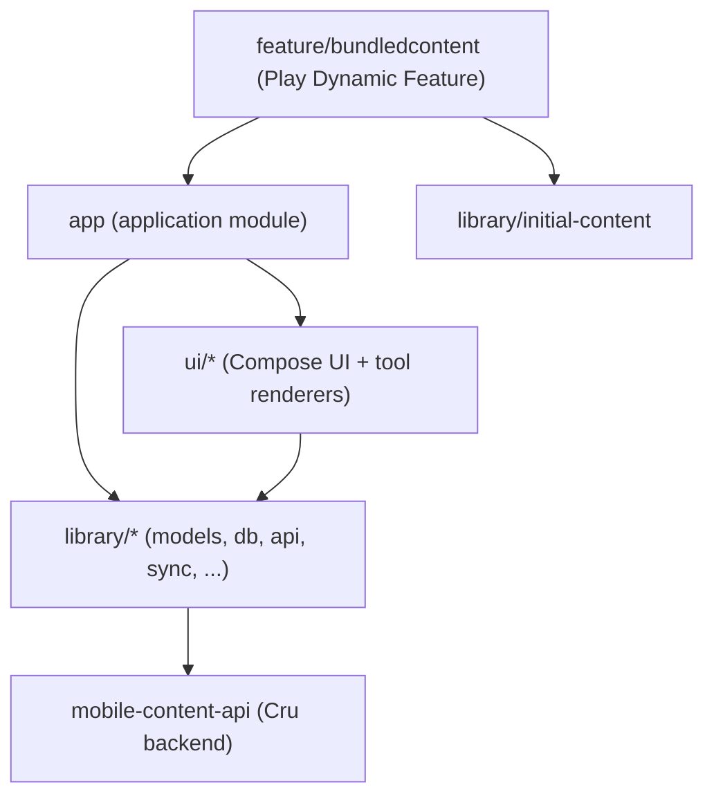

# GodTools Android Wiki

Welcome to the developer wiki for the GodTools Android app. This page explains what the project is, gets you to a first successful build as fast as possible, sketches the repository layout, and links every other wiki page. The wiki lives in the `wiki/` directory of the repository itself; all diagrams are fenced `mermaid` code blocks that GitHub renders natively.

## What is GodTools?

GodTools is a mobile discipleship app built by [Cru](https://www.cru.org/); this repository (`CruGlobal/godtools-android`) is the Android client (see `README.md`). The app presents interactive gospel-sharing "tools" — tracts, lessons, articles, choose-your-own-adventure experiences, and more — in many languages. Content is served by Cru's mobile-content-api (`https://mobile-content-api.cru.org/` in production, `https://mobile-content-api-stage.cru.org/` for staging; both defined in `build-logic/src/main/kotlin/Constants.kt`), synced into a local Room database, and rendered by a family of per-tool-type renderer modules under `ui/`.

Key technology at a glance (details on the linked pages):

| Concern | Technology | Wiki page |
|---|---|---|
| Language / build | Kotlin, Gradle (wrapper 9.7.0, `gradle/wrapper/gradle-wrapper.properties`), convention plugins in `build-logic/` | [Build System & CI](Build-System-and-CI.md) |
| Dependency injection | Hilt (Dagger 2) | [Architecture Overview](Architecture-Overview.md) |
| UI | Jetpack Compose + Material 3, Slack Circuit for navigation/UI state | [UI Architecture](UI-Architecture.md) |
| Networking | Retrofit (REST), Scarlet (WebSocket), OkHttp | [API Layer](API-Layer.md) |
| Persistence | Room (`library/db`) | [Data Layer](Data-Layer.md) |
| Background work | WorkManager (`library/sync`, `library/download-manager`) | [Sync & Downloads](Sync-and-Downloads.md) |
| Testing | JUnit 4, MockK, Robolectric, Turbine, Paparazzi snapshots | [Testing](Testing.md) |

## Quick Start

Prerequisites: **Git LFS** (install it *before* cloning — Paparazzi snapshot PNGs are LFS objects per `.gitattributes`), the Android SDK, and a JDK. Gradle locates the Android SDK via `sdk.dir` in a gitignored `local.properties` file (Android Studio generates it on first sync) or via the `ANDROID_HOME` environment variable — without one of these, `./gradlew bundle` fails immediately with "SDK location not found". On a machine without Android Studio, install the SDK command-line tools, set `ANDROID_HOME`, and accept licenses with `sdkmanager --licenses`. The Kotlin compile toolchain is Java 21 (`jvmToolchain(21)` in `build-logic/src/main/kotlin/AndroidConfiguration.kt`) and is auto-provisioned by the foojay resolver plugin (`settings.gradle.kts`), but the JVM that *runs* Gradle must itself be **17+** — Gradle 9.7.0 refuses to start on older JVMs, and toolchain auto-provisioning does not cover the launcher. Simplest is the Temurin 25.0.4 that `.tool-versions` pins as the launcher JDK. The first build needs network access: `library/initial-content` downloads bundled content from the mobile-content-api at build time, and some dependencies resolve from Cru's Maven repositories (`settings.gradle.kts`).

```bash
# Install Git LFS first (macOS example), then clone
brew install git-lfs
git lfs install
git clone https://github.com/CruGlobal/godtools-android.git
cd godtools-android

# Build the app bundle
./gradlew bundle

# Run all unit tests (all enabled variants)
./gradlew test

# Verify Paparazzi snapshot tests (requires Git LFS)
./gradlew verifyPaparazzi

# Code style checks (run before every commit; covers the build-logic included build too)
./gradlew :build-logic:ktlintCheck ktlintCheck

# Android lint
./gradlew lint
```

Two rules worth knowing on day one:

- The default branch is **`develop`** — branch from it and target it with PRs (`CLAUDE.md`).
- **Never record Paparazzi snapshots locally.** Trigger the manual `Record Snapshots` GitHub Actions workflow (`.github/workflows/record-snapshots.yml`) on your feature branch instead. See [Testing](Testing.md).

More detail, including build variants and first-week gotchas, is on [Getting Started](Getting-Started.md).

## Repository Layout at a Glance

All modules are declared in `settings.gradle.kts`; `build-logic/` is an included build providing the `godtools.application-conventions`, `godtools.library-conventions`, and `godtools.dynamic-feature-conventions` plugins.

```
app/                  # Main application module (Hilt entry point, DashboardActivity, navigation)
build-logic/          # Gradle convention plugins (included build)
feature/
  bundledcontent/     # Google Play Dynamic Feature carrying bundled initial content
library/              # Core non-UI modules
  account/ analytics/ api/ base/ db/ download-manager/
  initial-content/ model/ sync/ user-data/
ui/                   # UI modules and per-tool-type renderers
  base/ base-tool/ article-aem-renderer/ article-renderer/ cyoa-renderer/
  lesson-renderer/ qr-code/ shortcuts/ tips-renderer/ tract-renderer/ tutorial-renderer/
analysis/             # Shared lint config (analysis/lint/lint.xml)
firebase/             # CI-only Firebase App Distribution keystore (+ firebase_api_key.json written by CI)
gradle/               # Version catalog (libs.versions.toml) and wrapper
.claude/              # AI-assistant config: rules/design_system_rules.md + project skills — see Contributing
.github/workflows/    # CI (build, tests, Paparazzi recording, Crowdin, detekt, validations)
.vscode/              # Checked-in VS Code tasks/settings/extension recommendations — see Getting Started
wiki/                 # This wiki
```



- **`app/`** — `GodToolsApplication` (Hilt entry point), `DashboardActivity`, Dagger modules in `app/src/main/kotlin/org/cru/godtools/dagger/`, and app-level screens/navigation.
- **`library/`** — non-UI core: `model` (data models, JSON:API types), `db` (Room), `api` (Retrofit/Scarlet clients), `sync` (WorkManager sync), `base` (utilities/settings/filesystem), `account` (auth), `analytics`, `download-manager`, `initial-content` (build-time bundled content), `user-data`.
- **`ui/`** — `base` (shared Compose components + `GodToolsTheme`), `base-tool` (shared rendering infrastructure), one renderer module per tool type, plus `shortcuts` and `qr-code`.
- **`feature/bundledcontent`** — a thin Dagger shim that ships `library/initial-content` (and its downloaded assets) as an install-time Play Dynamic Feature instead of in the base APK.

Build variants: product flavors `production` and `stage` (dimension `env`; `stage` exists only for the `debug` and `qa` build types) and build types `debug`, `qa` (inherits `debug`), `release` — configured in `build-logic/src/main/kotlin/AndroidConfiguration.kt` and `app/build.gradle.kts`. See [Build System & CI](Build-System-and-CI.md).

## Wiki Navigation

| Page | What it covers |
|---|---|
| [Home](Home.md) | This page — project overview, quick start, repo layout, wiki index |
| [Getting Started](Getting-Started.md) | Environment setup, first build, running the app, common gotchas |
| [Architecture Overview](Architecture-Overview.md) | Module dependency graph, Hilt DI, high-level data flow through the app |
| [Services & Integrations](Services-and-Integrations.md) | External services: mobile-content-api, CDN, Firebase, Facebook/Google auth, Crowdin |
| [API Layer](API-Layer.md) | `library/api` — Retrofit REST clients, Scarlet WebSocket, OkHttp configuration |
| [Data Layer](Data-Layer.md) | `library/model` and `library/db` — models, Room database, DAOs, repositories |
| [Sync & Downloads](Sync-and-Downloads.md) | `library/sync` and `library/download-manager` — WorkManager sync and tool downloads |
| [UI Architecture](UI-Architecture.md) | Compose + Material 3 theming in `ui/base`, Circuit Presenter/UI pattern, navigation |
| [Tool Renderers](Tool-Renderers.md) | `ui/base-tool` and the per-tool-type renderer modules (tract, lesson, article, CYOA, tips, tutorial) |
| [Build System & CI](Build-System-and-CI.md) | Gradle convention plugins, flavors/build types, version catalog, GitHub Actions workflows |
| [Testing](Testing.md) | Unit test stack, test variants and sharding, Paparazzi snapshot workflow, coverage |
| [Contributing](Contributing.md) | Branching off `develop`, code style (ktlint), PR expectations, translations |

## About This Wiki

- **Location:** these pages live in the `wiki/` directory of the `godtools-android` repository and are versioned alongside the code.
- **Diagrams:** drawn as fenced `mermaid` code blocks, which GitHub renders automatically — no external tooling required.
- **Conventions:** file paths in this wiki are repo-relative (e.g. `app/build.gradle.kts`); shell commands are copy-pasteable from the repository root.
