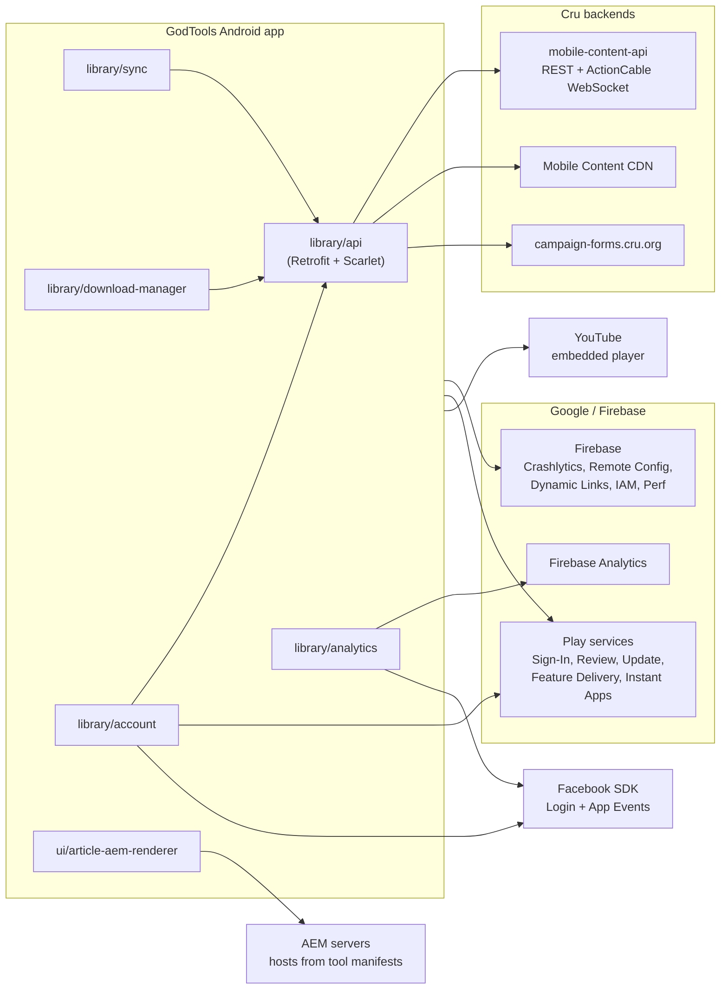
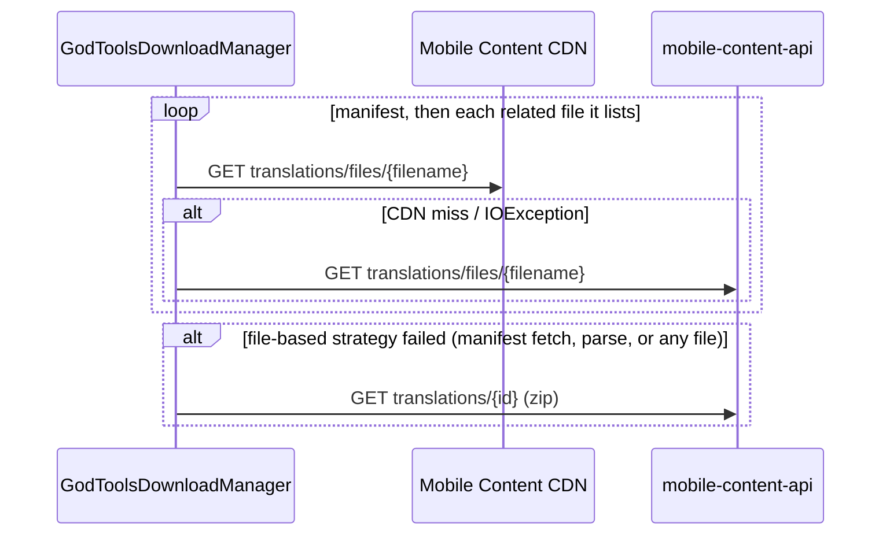
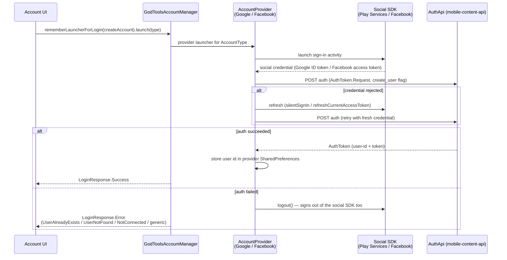

# Services & Integrations

This page catalogs every external service the GodTools Android app talks to — at runtime, at build time, and in CI — and where each integration lives in the codebase. For the internal mechanics of the network layer see [API Layer](API-Layer.md); for how fetched data is persisted see [Data Layer](Data-Layer.md); for the orchestration of syncs and downloads see [Sync & Downloads](Sync-and-Downloads.md). All URLs, class names, and file paths below are taken directly from the code.

## Service Topology

All Cru-backend HTTP clients live in `library/api`, so that traffic is routed through the `api` node: `library/download-manager` reaches the CDN via `CdnApi` (whose CDN-host Retrofit instance is built in `ApiModule.cdnApi`) and `library/account` exchanges social credentials via `AuthApi` — neither module builds its own HTTP client.

The `App --> firebase` edge covers the Firebase products whose integration points are spread across modules not shown individually: Crashlytics (`app`), Remote Config (`library/base`), Dynamic Links (`ui/base`), In-App Messaging trigger events (`app`), and Performance Monitoring (`ui/shortcuts`) — see the [Firebase table](#firebase) for exact files. Only Firebase Analytics is integrated via `library/analytics`. Likewise, the `App --> play` edge covers the Play products integrated outside `library/account`: In-App Review (`app`), In-App Updates (`app`), Feature Delivery (`app` + `feature/bundledcontent`), and Instant Apps checks (`app`, `ui/shortcuts`, `ui/tract-renderer`) — see the [Google Play features table](#google-play-features). Only Play Sign-In is integrated via `library/account` (`GoogleAccountProvider.kt`).

Build-time / CI-only services (not shown above): Cru JFrog Artifactory and other Maven repos (dependency resolution), mobile-content-api again (bundled-content download during Gradle build), Crowdin (string translations), Firebase App Distribution and Codecov (CI). Details in the sections below and in [Build System & CI](Build-System-and-CI.md).

## mobile-content-api (Cru) — primary backend

Cru's Rails JSON:API backend serves everything the app renders: tools, translations, languages, attachments, users, favorites, counters, and global analytics.

The base URL is `https://mobile-content-api.cru.org/` for the `production` flavor and `https://mobile-content-api-stage.cru.org/` for `stage`, defined once in `build-logic/src/main/kotlin/Constants.kt` (`URI_MOBILE_CONTENT_API_PRODUCTION` / `URI_MOBILE_CONTENT_API_STAGE`); the canonical per-flavor URL table lives in [Build System & CI](Build-System-and-CI.md#api-base-url-configuration).

The URL is injected per flavor as the `MOBILE_CONTENT_API` `buildConfigField` in `app/build.gradle.kts`, then surfaced to DI as `ApiConfig(mobileContentApiUrl, cdnUrl)` via `app/src/main/kotlin/org/cru/godtools/dagger/ConfigModule.kt` (`library/api/src/main/kotlin/org/cru/godtools/api/ApiConfig.kt`). The `stage` flavor only exists for `debug` and `qa` build types.

### Retrofit wiring

`library/api/src/main/kotlin/org/cru/godtools/api/ApiModule.kt` builds one shared `OkHttpClient` (60s connect/read timeouts) and **two** Retrofit instances against the same base URL:

- `@Named("MOBILE_CONTENT_API")` — unauthenticated, with `LocaleConverterFactory` + `JsonApiConverterFactory` (gto-support JSON:API).
- `@Named("MOBILE_CONTENT_API_AUTHENTICATED")` — the same Retrofit rebuilt with an OkHttp client that adds `MobileContentApiSessionInterceptor` (network interceptor) and `SessionRetryInterceptor(sessionInterceptor, 3)`.

### REST endpoints

All interfaces live in `library/api/src/main/kotlin/org/cru/godtools/api/`. Eleven Retrofit interfaces cover the REST surface — unauthenticated: `ToolsApi`, `LanguagesApi`, `TranslationsApi`, `AttachmentsApi`, `AnalyticsApi`, `ViewsApi`, `FollowupApi`, `AuthApi`; authenticated (everything under `users/me`): `UserApi`, `UserCountersApi`, `UserFavoriteToolsApi`. The canonical per-endpoint catalog — methods, paths, and quirks such as the DELETE-with-body favorite-tools call — is in [API Layer](API-Layer.md#service-interfaces-and-endpoints).

### Session / auth mechanism

`library/api/src/main/kotlin/org/cru/godtools/api/MobileContentApiSessionInterceptor.kt` (abstract, extends gto-support's `SessionInterceptor`) attaches the API token to authenticated requests and treats HTTP 401 as an invalid session, triggering re-authentication. The concrete implementation is provided in `library/account/src/main/kotlin/org/cru/godtools/account/AccountModule.kt`, delegating to `GodToolsAccountManager`. The header format and retry mechanics are detailed in [API Layer](API-Layer.md#how-auth-attaches-to-requests); for the login flow see [Authentication](#authentication-google--facebook-login) below.

### Consumers

- `library/sync/src/main/kotlin/org/cru/godtools/sync/GodToolsSyncService.kt` orchestrates sync tasks (`library/sync/src/main/kotlin/org/cru/godtools/sync/task/`) with WorkManager retry workers in `library/sync/src/main/kotlin/org/cru/godtools/sync/work/`.
- `library/download-manager/src/main/kotlin/org/cru/godtools/downloadmanager/GodToolsDownloadManager.kt` downloads translation and attachment files.
- `library/account` calls `AuthApi` during login.

## mobile-content-api WebSocket (Tract live share)

The tract renderer's "live share" feature (a presenter drives page navigation on subscribers' devices) uses a Rails ActionCable WebSocket at `${mobileContentApiUrl}cable`, built with Tinder Scarlet in `ApiModule.actionCableScarlet` (`library/api/src/main/kotlin/org/cru/godtools/api/ApiModule.kt`).

- Interface: `library/api/src/main/kotlin/org/cru/godtools/api/TractShareService.kt` — `PublishChannel` (send `NavigationEvent`, receive `PublisherInfo`) and `SubscribeChannel` (receive `NavigationEvent`). Message models live in `library/api/src/main/kotlin/org/cru/godtools/api/model/`.
- Consumers: `ui/tract-renderer/src/main/kotlin/org/cru/godtools/tract/liveshare/TractPublisherController.kt` and `TractSubscriberController.kt`.
- Lifecycle: `AndroidLifecycle.ofApplicationForeground(app).combineWith(referenceLifecycle)` — the socket only connects while the app is foregrounded **and** at least one controller has acquired the shared `ReferenceLifecycle`.

## Mobile Content CDN

Published translation files are preferentially downloaded from a CDN host rather than the API host: `https://mobilecontent.cru.org` (`production`) / `https://mobilecontent-stage.cru.org` (`stage`), set per flavor as the `MOBILE_CONTENT_CDN` `buildConfigField` in `app/build.gradle.kts` (canonical URL table: [Build System & CI](Build-System-and-CI.md#api-base-url-configuration)).

`library/api/src/main/kotlin/org/cru/godtools/api/CdnApi.kt` exposes a single streaming endpoint, `GET translations/files/{filename}`. The CDN Retrofit instance has **no converter factories** — raw `ResponseBody` only. `GodToolsDownloadManager.downloadPublishedFileIfNecessary()` tries the CDN first and falls back to `TranslationsApi.downloadFile` on the API host (`library/download-manager/src/main/kotlin/org/cru/godtools/downloadmanager/GodToolsDownloadManager.kt`).

## Sequence: downloading a tool translation

Only the external touchpoints are shown — the internal pipeline (Room `DownloadedFile` bookkeeping, stale-translation pruning, and the WorkManager retry workers in `library/download-manager/src/main/kotlin/org/cru/godtools/downloadmanager/work/`) belongs to `library/download-manager` and is walked step-by-step in [Sync & Downloads](Sync-and-Downloads.md#godtoolsdownloadmanager):

Files are verified against the manifest's SHA-256 checksum and size before being recorded (`storeFile()` in `GodToolsDownloadManager.kt`).

## Adobe Experience Manager (AEM) — article content

Article-type tools render web articles hosted on Cru AEM servers. There is **no fixed AEM base URL**: `ui/article-aem-renderer/src/main/kotlin/org/cru/godtools/article/aem/api/AemApi.kt` uses `@Url` parameters exclusively (its Retrofit is built with a placeholder base URL in `AemArticleRendererModule.kt` — do not "fix" this). The actual hosts come from `aem-imports` declared in tool manifests.

Flow (`ui/article-aem-renderer/src/main/kotlin/org/cru/godtools/article/aem/service/AemArticleManager.kt`):

1. For each downloaded ARTICLE translation, the manifest's `aemImports` URIs are stored in a dedicated Room DB (`db/ArticleRoomDatabase.kt` in the same module).
2. Each import is synced by fetching `<uri>.9999.json` (with a cache-busting `?_=<timestamp>` query param), parsed by `service/support/AemJsonParser.kt`.
3. Article HTML is fetched, its referenced resources extracted (`service/support/HtmlParser.kt`) and cached to disk via `util/AemFileSystem.kt`.
4. Articles are rendered in a WebView (`ui/AemArticleActivity.kt`), with `ui/ArticleWebViewClient.kt` serving cached resources.

`AemArticleManager.Dispatcher` reacts to tool/translation changes, refreshes stale imports, and runs periodic cleanup. Deep-linked articles are fetched on demand via `downloadDeeplinkedArticle(uri)`. The full pipeline — including the module's dedicated `ArticleRoomDatabase` and the WebView request interception — is diagrammed in [Tool Renderers](Tool-Renderers.md#article-aem-uiarticle-aem-renderer).

## Firebase

Firebase project `godtools-b2f82` (project number `71275134527`). `app/google-services.json` registers exactly five Android clients: `org.keynote.godtools.android` plus the `.debug`, `.qa`, `.stage.debug`, and `.stage.qa` applicationId variants — adding a new flavor/buildType combination breaks the Google Services plugin until a matching client is registered. Gradle plugins applied in `app/build.gradle.kts`: `google-services`, `firebase-crashlytics`, `firebase-perf`, `firebase-appdistribution`.

| Product | Used for | Integration lives in |
|---|---|---|
| Crashlytics | Crash reporting; custom keys (`InstantApp`, `InstallerPackage`, `SystemLanguageRaw`, `SystemLanguage`) and a Timber `CrashlyticsTree` | `app/src/main/kotlin/org/cru/godtools/GodToolsApplication.kt` (`initializeCrashlytics()`); NDK variant is debug-only (`debugImplementation(libs.firebase.crashlytics.ndk)`) |
| Analytics | Screen/action event tracking | `library/analytics/src/main/kotlin/org/cru/godtools/analytics/firebase/FirebaseAnalyticsService.kt` (see [Analytics providers](#analytics-providers)) |
| Remote Config | Feature flags | Provided in `library/base/src/main/kotlin/org/cru/godtools/base/BaseModule.kt` (`setDefaultsAsync` + `fetchAndActivate()` at provision time); keys and defaults in `library/base/src/main/kotlin/org/cru/godtools/base/Config.kt` |
| Dynamic Links | Resolving `godtools.page.link` short links into in-app deep links | `ui/base/src/main/kotlin/org/cru/godtools/base/ui/firebase/DynamicLinksSpringboardActivity.kt`; host registered in `ui/base/src/main/AndroidManifest.xml` |
| In-App Messaging | Contextual campaigns triggered on dashboard tab views | Dep + `app/proguard-rules-firebase-inappmessaging.pro`; trigger events (`iam_mytools`, `iam_lessons`, `iam_tools`) defined in `library/analytics/src/main/kotlin/org/cru/godtools/analytics/firebase/model/FirebaseIamActionEvent.kt`, posted from `app/src/main/kotlin/org/cru/godtools/ui/dashboard/DashboardLayout.kt` |
| Performance Monitoring | Automatic traces + one custom trace, `"UpdateShortcutsWorker.doWork()"` | `ui/shortcuts/src/main/kotlin/org/cru/godtools/shortcuts/UpdateShortcutsWorker.kt` |
| App Distribution | CI-only distribution of QA builds to the `android-testers` group | `app/build.gradle.kts` (active only with `-PfirebaseAppDistributionBuild`); credentials from `firebase/firebase_api_key.json`, written by `.github/workflows/build.yml` |

Remote Config keys (defaults in parentheses, from `Config.kt`): `tool_content_feature_page_collection_page_enabled` (true), `tutorial_lesson_page_swipe_enabled` (true), `ui_dashboard_personalization_enabled` (false), `ui_dashboard_home_favorite_tool_cards_count` (5), `ui_account_globalactivity_enabled` (true), `ui_opt_in_notification_enabled` (true), `ui_opt_in_notification_time_interval` (41), `ui_opt_in_notification_prompt_limit` (5).

**Not used despite appearances:** `firebase-messaging` is declared in `library/analytics/build.gradle.kts` but has zero source usage and no FCM service in any manifest. The `POST_NOTIFICATIONS` permission is requested by the Remote-Config-gated opt-in prompt (`app/src/main/kotlin/org/cru/godtools/ui/dashboard/optinnotification/OptInNotificationController.kt`), but no push client exists in this repo.

## Analytics providers

All analytics services subscribe to `AnalyticsScreenEvent`/`AnalyticsActionEvent` on greenrobot EventBus and filter by the `AnalyticsSystem` enum, which is exactly `{ FACEBOOK, FIREBASE, USER }` (`library/analytics/src/main/kotlin/org/cru/godtools/analytics/model/AnalyticsSystem.kt`). They are wired as eager singletons in `library/analytics/src/main/kotlin/org/cru/godtools/analytics/AnalyticsModule.kt`.

| Provider | Class | Notes |
|---|---|---|
| Firebase Analytics | `library/analytics/src/main/kotlin/org/cru/godtools/analytics/firebase/FirebaseAnalyticsService.kt` | Screen events become `screen_view` with `cru_sitesection`/`cru_sitesubsection`/`cru_contentlanguage` params; sets user properties incl. logged-in status/provider from `GodToolsAccountManager` |
| Facebook App Events | `library/analytics/src/main/kotlin/org/cru/godtools/analytics/facebook/FacebookAnalyticsService.kt` | Uses `AppEventsLogger`; app IDs are per-flavor `resValue`s in `app/build.gradle.kts` (stage `448969905944197`, production `2236701616451487`), registered as `com.facebook.sdk.ApplicationId` meta-data in `app/src/main/AndroidManifest.xml` |
| User counters ("USER") | `library/analytics/src/main/kotlin/org/cru/godtools/analytics/user/UserAnalyticsService.kt` | Maps events to counters validated by the shared KMP `user-activity` library, persisted locally, and synced to mobile-content-api by `library/sync/src/main/kotlin/org/cru/godtools/sync/task/UserCounterSyncTasks.kt` via `UserCountersApi` |
| Timber (debug only) | `library/analytics/src/debug/kotlin/org/cru/godtools/analytics/TimberAnalyticsService.kt` | Logs all events in debug builds |

There is no AppsFlyer, Adobe Analytics, or Snowplow. `play-tagmanager` and `play-installreferrer` are declared in `library/analytics/build.gradle.kts` but unused.

## Authentication (Google & Facebook login)

`library/account` owns social login and the exchange of social credentials for a mobile-content-api token. `AccountType` (`library/account/src/main/kotlin/org/cru/godtools/account/AccountType.kt`) is exactly `{ FACEBOOK, GOOGLE }` — Okta remnants exist (`okta_access_token` attribute in `library/api/src/main/kotlin/org/cru/godtools/api/model/AuthToken.kt`, a manifest `<queries>` comment) but there is **no Okta provider**.

| Provider | Class | Credential exchanged |
|---|---|---|
| Google Sign-In (Play Services `play-services-auth`) | `library/account/src/main/kotlin/org/cru/godtools/account/provider/google/GoogleAccountProvider.kt` | Google ID token → `AuthApi.authenticate` |
| Facebook Login (Facebook SDK) | `library/account/src/main/kotlin/org/cru/godtools/account/provider/facebook/FacebookAccountProvider.kt` | Facebook access token → `AuthApi.authenticate` |

Per-flavor config in `app/build.gradle.kts`: `GOOGLE_SERVER_CLIENT_ID` buildConfigField (production `71275134527-h5adpeeefcevhhhng1ggi5ngn6ko6d3k.apps.googleusercontent.com`, stage `71275134527-nvu2ehje1j6g459ofg5aldn1n21fadpg.apps.googleusercontent.com`) and Facebook app id / client token / login protocol scheme `resValue`s.

The facade is `GodToolsAccountManager` (`library/account/src/main/kotlin/org/cru/godtools/account/GodToolsAccountManager.kt`). It also backs the `MobileContentApiSessionInterceptor` implementation (in `AccountModule.kt`), so authenticated API calls transparently re-authenticate on 401. "Authenticated" means the social SDK has an account **and** a stored mobile-content-api user id for it; a failed API auth logs the user out of the social SDK too.

The interactive login handshake (`rememberLauncherForLogin` in `GodToolsAccountManager` and the providers):

The `AuthToken` is not persisted by the login flow itself — only the user id is. The API session token is (re-)established on demand: the session interceptor's `establishSession()` re-runs the same `authenticateWithMobileContentApi()` path (no UI involved) and stores the result as a `UserIdSession`. That 401 re-auth loop is diagrammed in [API Layer](API-Layer.md#how-auth-attaches-to-requests).

## Cru Campaign Forms (email signup)

- URL `https://campaign-forms.cru.org/` and form id `3fb6022c-5ef9-458c-928a-0380c4a0e57b`, hardcoded as `buildConfigField`s for **all** flavors in `library/api/build.gradle.kts` — there is no stage variant of this service.
- `library/api/src/main/kotlin/org/cru/godtools/api/CampaignFormsApi.kt`: `POST forms` (form-encoded `id`, `email_address`, `first_name`, `last_name`). Its Retrofit provider sits under a "region Adobe APIs" comment in `ApiModule.kt`.
- Caller: `app/src/main/kotlin/org/cru/godtools/service/AccountListRegistrationService.kt` — an eager singleton that watches `UserManager.userFlow` and signs each logged-in user (with an email) up once, guarded by `Settings.isAddedToCampaign`. A TODO notes there is no retry on connectivity failure.

## Crowdin (translation pipeline)

String resources are translated in Crowdin, not in this repo.

- `crowdin.yml` (repo root): project id `805338`, base_url `https://api.crowdin.com`, token from the `CROWDIN_API_TOKEN` env var. Sources are `strings*.xml` from `app`, `library/base`, `ui/base`, `ui/base-tool`, `ui/lesson-renderer`, `ui/tips-renderer`, `ui/tract-renderer`, and `ui/tutorial-renderer` (ignoring `strings_country_native_names.xml`); translations land in `values-%android_code%/` with `update_option: update_as_unapproved`.
- `.github/workflows/crowdin-upload.yml` uploads sources on every push to `develop`.
- `.github/workflows/crowdin-download.yml` runs weekly (cron `0 0 * * 0`) and on demand; it commits downloaded translations to branch `chore/crowdinTranslations` and opens a PR titled "Update Translations".

Practical consequence: never hand-edit translated `values-*/strings_*.xml` files — they are overwritten by the pipeline. Add new strings to the English `values/strings_*.xml` files only. Note there is no monolithic `strings.xml` in this repo — each module splits its strings into `strings_<area>.xml` files (e.g. `strings_dashboard.xml`), matched by `crowdin.yml`'s `strings*.xml` globs, and Crowdin's `%original_file_name%` mapping preserves those names in the `values-*` translation directories.

## JFrog Artifactory & Maven repositories

Dependency resolution is configured in `settings.gradle.kts` and requires four custom Maven repositories beyond `google()` / `mavenCentral()` / `gradlePluginPortal()`: Cru's JFrog Artifactory at `https://cruglobal.jfrog.io/artifactory/maven-mobile/` (gto-support `org.ccci.gto.android` + `.testing`, godtools-shared `org.cru.godtools.kotlin`, and the `org.cru.mobile.fork.*` fork groups — `org.cru.mobile.fork.co.brainly` is also registered in `pluginManagement`), jitpack.io, the androidx.dev pre-release Compose compiler repository, and a GitHub-hosted KustomExport repo. The canonical repository table is in [Build System & CI](Build-System-and-CI.md#gradle-project-topology); the exact `includeGroup`/`excludeGroup` content filters live only in `settings.gradle.kts` itself.

**Gotcha:** both `gtoSupport = "4.6.0-SNAPSHOT"` and `godtoolsShared = "1.4.0-SNAPSHOT"` (`gradle/libs.versions.toml`) are SNAPSHOT versions served from Artifactory — dependency behavior can change without a commit in this repo. The upstream sources are [CruGlobal/android-gto-support](https://github.com/CruGlobal/android-gto-support) and [CruGlobal/kotlin-mpp-godtools-tool-parser](https://github.com/CruGlobal/kotlin-mpp-godtools-tool-parser); see [Working on the shared libraries](Tool-Renderers.md#working-on-the-shared-libraries). The bottom of `settings.gradle.kts` also auto-accepts the `scans.gradle.com` build-scan ToS when `GITHUB_ACTIONS=true`.

## Google Play features

| Feature | Library | Integration |
|---|---|---|
| In-App Review | `review-ktx` | "Rate app" drawer item in `app/src/main/kotlin/org/cru/godtools/ui/drawer/DrawerMenuLayout.kt` (`ReviewManagerFactory.create` + request/launch review) |
| In-App Updates | `app-update-ktx` | `app/src/main/kotlin/org/cru/godtools/ui/dashboard/AppUpdateSnackbar.kt` — prompts a flexible/immediate update when the installed version is stale |
| Feature Delivery | `feature-delivery` | `dynamicFeatures += ":feature:bundledcontent"` in `app/build.gradle.kts`; `SplitCompat.install` in `GodToolsApplication.attachBaseContext`; the feature's Dagger component (`feature/bundledcontent/src/main/kotlin/.../dagger/BundledContentFeatureComponent.kt`) is loaded reflectively by `app/src/main/kotlin/org/cru/godtools/dagger/features/FeaturesModule.kt` |
| Instant Apps | `com.google.android.instantapps` | `<dist:module dist:instant="true"/>` in `app/src/main/AndroidManifest.xml`; runtime checks in `GodToolsApplication.kt`, `FirebaseAnalyticsService.kt`, `ui/shortcuts/.../GodToolsShortcutManager.kt` (shortcuts disabled), and `ui/tract-renderer/.../TractActivity.kt` (`InstantApps.showInstallPrompt`) |

### Bundled content is downloaded from mobile-content-api at build time

The `feature/bundledcontent` dynamic feature wraps `library/initial-content`, whose bundled assets (`languages.json`, `tools.json`, attachments) are downloaded from mobile-content-api by Gradle tasks in `build-logic/src/main/kotlin/org/cru/godtools/gradle/bundledcontent/`. Configuration in `library/initial-content/build.gradle.kts`: bundled tools `kgp`, `fourlaws`, `satisfied`, `teachmetoshare`; bundled language `en`; the API URL follows the flavor. **A first clean build therefore requires network access to mobile-content-api.**

There is no Google Play publishing workflow in this repo — CI distributes QA builds via Firebase App Distribution only (`.github/workflows/build.yml`).

## Deep-link & share domains

Constants in `library/base/src/main/kotlin/org/cru/godtools/base/Constants.kt` and the app manifests:

| Domain | Purpose |
|---|---|
| `knowgod.com` | Share-URL base and tract/lesson deep links (`ui/tract-renderer/src/main/AndroidManifest.xml`, `ui/lesson-renderer/.../LessonDeepLink.kt`) |
| `godtoolsapp.com` / `get.godtoolsapp.com` | `/deeplink/...` app links plus drawer links (feedback, terms, etc. in `app/src/main/kotlin/org/cru/godtools/ui/drawer/DrawerMenuLayout.kt`) |
| `godtools.dynalinks.app` | Third-party short-link domain handled alongside godtoolsapp.com |
| `godtools.page.link` | Firebase Dynamic Links → `DynamicLinksSpringboardActivity` |
| `godtools://` | Custom scheme with a build-variant-specific host (`build-logic/src/main/kotlin/GodToolsCustomUriConfiguration.kt`) |

## YouTube

Video in tool/tutorial content streams from YouTube via the third-party player `com.pierfrancescosoffritti.androidyoutubeplayer:core` (`gradle/libs.versions.toml`), wrapped in `ui/base/src/main/kotlin/org/cru/godtools/base/ui/youtubeplayer/YouTubePlayer.kt` and used by `ui/tutorial-renderer/src/main/kotlin/org/cru/godtools/tutorial/ui/youtubeplayer/YoutubePlayerOverlay.kt`.

## CI & developer-facing services

Full detail in [Build System & CI](Build-System-and-CI.md); the external services touched by `.github/workflows/` are:

| Workflow | External service |
|---|---|
| `build.yml` | Codecov upload, Gradle build scans (`--scan`), Firebase App Distribution (QA deploy jobs, secrets `FIREBASE_API_KEY`, `BETA_KEYSTORE_PASSWORD`) |
| `crowdin-upload.yml` / `crowdin-download.yml` | Crowdin |
| `detekt-analysis.yml` | GitHub code scanning (SARIF) — the workflow is currently **manually disabled** in the repo's Actions settings, so nothing is uploaded; see [Build System & CI](Build-System-and-CI.md#static-analysis) |
| `record-snapshots.yml` | Records Paparazzi snapshots on CI (Git LFS) — never record locally; see [Testing](Testing.md) |
| `git-lfs-validation.yml`, `gradle-wrapper-validation.yml` | Repo hygiene checks |

Debug builds also embed **Flipper** (`app/src/debug/kotlin/org/cru/godtools/dagger/FlipperModule.kt`) whose network plugin is registered as an OkHttp network interceptor — all HTTP traffic to the services above is inspectable from the Flipper desktop app in debug builds — plus **LeakCanary**.

## Gotchas for new developers

1. **Stage vs. production is a product flavor, not a build type**, and the stage flavor only exists for `debug`/`qa` build types. API, CDN, Facebook, and Google config all switch per flavor in `app/build.gradle.kts`; Campaign Forms has no stage endpoint.
2. **Clean builds need network access** to mobile-content-api (bundled-content download) and to Cru's Artifactory (SNAPSHOT deps).
3. **The `Authorization` header carries the bare token** — no `Bearer` prefix (`MobileContentApiSessionInterceptor.attachSession`).
4. **Injecting a `users/me` API from the unauthenticated Retrofit compiles but always 401s** — authenticated wiring is per-interface in `ApiModule`.
5. **New JSON:API model classes must be registered** in `ApiModule.jsonApiConverter()` or (de)serialization fails at runtime.
6. **Remote Config is fetched once at DI-provision time** (`BaseModule`); values read early may still be the in-code defaults from `Config.kt`.
7. **No push notifications exist** despite the `POST_NOTIFICATIONS` permission and a declared `firebase-messaging` dependency.
8. **The live-share WebSocket only connects** while the app is foregrounded and a controller holds the `ReferenceLifecycle`.
9. **`AemApi`'s placeholder base URL is intentional** — all AEM calls use absolute `@Url`s from tool manifests.
