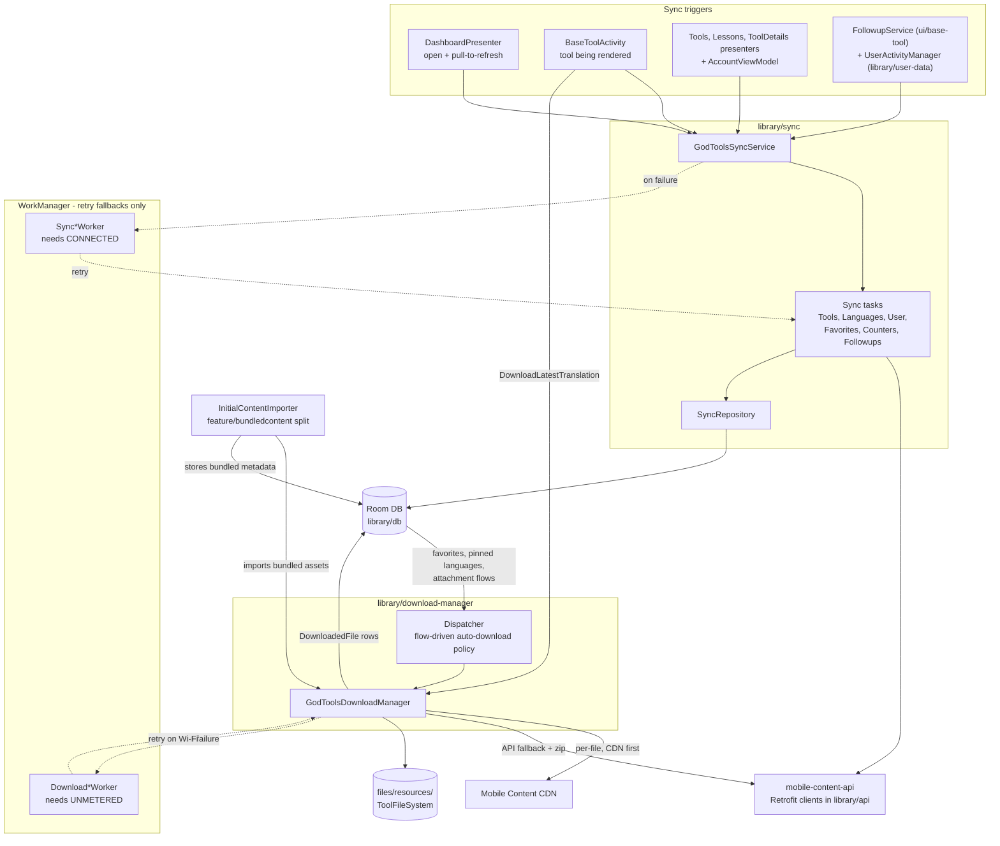
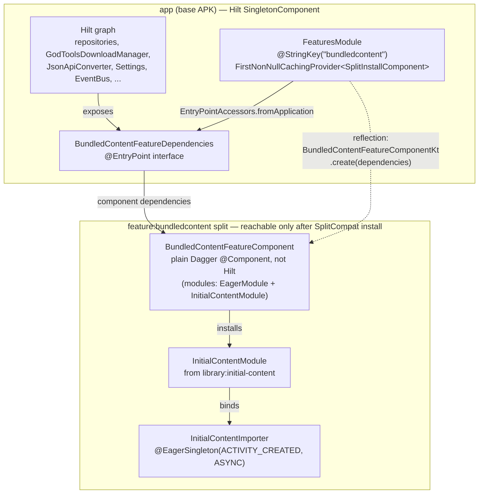

# Sync & Downloads

This page explains how content gets onto the device: JSON:API metadata sync in `library/sync`, the binary download pipeline and on-disk file storage in `library/download-manager` + `library/base`, first-run seeding of bundled content via `library/initial-content` and the `feature/bundledcontent` dynamic feature, and what actually syncs for a signed-in user via `library/user-data`. It assumes you already know the module layout from the [Architecture Overview](Architecture-Overview.md); the REST endpoints referenced here are defined in the [API Layer](API-Layer.md) and everything lands in the Room database described in the [Data Layer](Data-Layer.md).

## Big Picture

Content arrives in two distinct stages, backed by different modules:

| Stage | Module | What moves | Where it lands |
|---|---|---|---|
| Metadata sync | `library/sync` | Tools, languages, translations, attachments, user data (JSON:API) | Room DB (`library/db`) |
| Binary download | `library/download-manager` | Translation files/zips, attachment images/animations | `files/resources/` on disk + bookkeeping rows in Room |
| First-run seeding | `library/initial-content` (via `feature/bundledcontent`) | Bundled `tools.json`/`languages.json` + attachment binaries from APK assets | Same Room tables + same disk directory, through the download manager's import APIs |
| User data | `library/user-data` | Favorite tools, user counters, profile | Room + `users/me` API endpoints (through `library/sync` tasks) |

A key property of the whole subsystem: **there is no periodic background sync**. Every sync and download is triggered inline by UI code or by reactive Flows; WorkManager is used only as a *retry* mechanism when an inline attempt fails.

## Pipeline Flow

## Metadata Sync (`library/sync`)

### Entry point: `GodToolsSyncService`

`library/sync/src/main/kotlin/org/cru/godtools/sync/GodToolsSyncService.kt` is the `@Singleton` facade the rest of the app calls. Each sync runs on `Dispatchers.IO.limitedParallelism(8)` (`SYNC_PARALLELISM = 8`). Sync task implementations are resolved from a Dagger multibound `Map<Class<out BaseSyncTasks>, Provider<BaseSyncTasks>>` — the `@Multibinds` declaration lives in `library/sync/src/main/kotlin/org/cru/godtools/sync/SyncModule.kt` and the bindings (with a custom `@SyncTaskKey` map key) in `library/sync/src/main/kotlin/org/cru/godtools/sync/task/SyncTaskModule.kt`.

Error handling in `executeSync` is deliberately quiet: `IOException` is swallowed and the sync returns `false`; any other exception is logged via Timber (tag `GodToolsSyncService`) and also returns `false`; `CancellationException` is rethrown.

Some sync entry points schedule a one-shot WorkManager retry when the inline attempt returns `false` or is cancelled; others have **no** fallback and simply stay stale until their TTL expires:

| `GodToolsSyncService` method | WorkManager retry fallback? |
|---|---|
| `syncTools`, `syncLanguages`, `syncFollowups` (via `syncFollowupsAsync`), `syncToolShares` (via `syncToolSharesAsync`), `syncDirtyFavoriteTools` | Yes |
| `syncTool`, `syncFeaturedTools`, `syncToolOrder`, `syncUser`, `syncUserCounters`, `syncGlobalActivity`, `syncFavoriteTools` | No |

`syncFavoriteTools` and `syncUserCounters` always chase themselves with a `syncDirtyFavoriteTools` / `syncDirtyUserCounters` launch in a private supervisor scope (`finally` blocks), so local dirty state is pushed even when the pull side short-circuits.

### Sync tasks

All tasks live in `library/sync/src/main/kotlin/org/cru/godtools/sync/task/` and extend `BaseSyncTasks`. Each guards concurrent execution with a `Mutex` (or `MutexMap`) and short-circuits when `LastSyncTimeRepository.isLastSyncStale(...)` says the data is fresh — unless the caller passes `force = true` (pull-to-refresh does).

| Task | API calls | Staleness key(s) | TTL |
|---|---|---|---|
| `ToolSyncTasks.kt` | `GET resources?filter[system]=GodTools` (`ToolsApi.list`), `GET resources?filter[abbreviation]=<code>` (`getTool`), `GET resources/featured`, `GET resources/default_order`, `POST views` (`ViewsApi.submitViews`) | `last_synced.tools`, `last_synced.tool.<code>`, `last_synced.featured_tools.<locale>.<country>`, `last_synced.tool_order.<locale>.<country>` | 1 day |
| `LanguagesSyncTasks.kt` | `GET languages` (`LanguagesApi.list`) | `last_synced.languages` | 1 week |
| `UserSyncTasks.kt` | `GET users/me` (`UserApi.getUser`) | `last_synced.user.<userId>` | 1 week |
| `UserCounterSyncTasks.kt` | `GET users/me/counters`, `PATCH users/me/counters/{id}` (`UserCountersApi`) | `last_synced.user_counters.<userId>` | 1 day |
| `UserFavoriteToolsSyncTasks.kt` | `GET users/me`, `POST users/me/relationships/favorite-tools`, `DELETE` (with body) same path (`UserFavoriteToolsApi`) | `last_synced.favorite_tools.<userId>` | 1 day |
| `FollowupSyncTasks.kt` | `POST follow_ups` (`FollowupApi.subscribe`) | none — always attempts all queued followups | — |
| `AnalyticsSyncTasks.kt` | `GET analytics/global` (`AnalyticsApi.getGlobalActivity`) | `last_synced.global_activity` | 1 day |

Notes on individual tasks:

- **Share counts** — `ToolSyncTasks.syncShares()` posts each tool with `pendingShares > 0` to `POST views` and decrements the local pending count on success.
- **User counters** — `UserCounterSyncTasks.syncDirtyCounters()` pushes local deltas (only counter names matching `UserCounter.VALID_NAME`, defined in `library/model/src/main/kotlin/org/cru/godtools/model/UserCounter.kt`), then subtracts the pushed delta locally. `UserActivityManager.updateCounter` (see below) fires this after every counter change.
- **Favorite tools are bidirectional with dirty flags** — dirty detection is `Tool.isFieldChanged(Tool.ATTR_IS_FAVORITE)`. On first authenticated sync (when the server-side `User.isInitialFavoriteToolsSynced` flag is false), `syncDirtyFavoriteTools` uploads *all* local favorites, then `PATCH`es `users/me` to set the initial-favorite-tools-synced flag (`library/sync/src/main/kotlin/org/cru/godtools/sync/task/UserFavoriteToolsSyncTasks.kt`).
- **User-scoped tasks are no-ops when signed out** — e.g. `syncFavoriteTools` returns `true` immediately when `!accountManager.isAuthenticated`.

### Storing responses: `SyncRepository`

`library/sync/src/main/kotlin/org/cru/godtools/sync/repository/SyncRepository.kt` persists JSON:API responses into the `library/db` repositories (`ToolsRepository`, `TranslationsRepository`, `AttachmentsRepository`, `LanguagesRepository`, `UserRepository`), walking JSON:API `Includes` recursively (latest-translations → language, attachments, metatool → default-variant). It also prunes: tools missing from a full sync are deleted unless favorited, and translations missing from a sync are deleted unless downloaded.

### Retry workers

All sync workers are `@HiltWorker` `CoroutineWorker`s in `library/sync/src/main/kotlin/org/cru/godtools/sync/work/`, enqueued as unique one-time work with `ExistingWorkPolicy.KEEP`, tag `"sync"`, and a `NetworkType.CONNECTED` constraint (see `SyncWorkRequestBuilder` in `BaseSyncWorker.kt`). Nothing schedules them proactively — they exist only as retry fallbacks.

| Worker | Unique work name |
|---|---|
| `SyncToolsWorker.kt` | `SyncTools` |
| `SyncLanguagesWorker.kt` | `SyncLanguages` |
| `SyncFollowupsWorker.kt` | `SyncFollowup` |
| `SyncToolSharesWorker.kt` | `SyncToolShares` |
| `SyncDirtyFavoriteToolsWorker.kt` | `SyncDirtyFavoriteTools` |

WorkManager itself is wired for Hilt in the app module: `app/src/main/kotlin/org/cru/godtools/GodToolsApplication.kt` implements `Configuration.Provider` with a `HiltWorkerFactory`, and the `WorkManager` instance is provided in `app/src/main/kotlin/org/cru/godtools/dagger/ServicesModule.kt`.

### Who actually triggers syncs

| Caller | Sync calls |
|---|---|
| `app/src/main/kotlin/org/cru/godtools/ui/dashboard/DashboardPresenter.kt` | `syncFollowupsAsync`, `syncToolSharesAsync`, `syncFavoriteTools(force)`, `syncTools(force)` on presentation and pull-to-refresh |
| `app/src/main/kotlin/org/cru/godtools/ui/dashboard/tools/ToolsPresenter.kt` | `syncFeaturedTools`, `syncToolOrder` |
| `app/src/main/kotlin/org/cru/godtools/ui/dashboard/lessons/LessonsPresenter.kt` | `syncToolOrder` |
| `app/src/main/kotlin/org/cru/godtools/ui/tooldetails/ToolDetailsPresenter.kt` | `syncDirtyFavoriteTools` after pin/unpin |
| `app/src/main/kotlin/org/cru/godtools/ui/account/AccountViewModel.kt` | `syncUser`, `syncUserCounters`, `syncGlobalActivity` |
| `ui/base-tool/src/main/kotlin/org/cru/godtools/base/tool/activity/BaseToolActivity.kt` | `syncTool` for each tool being rendered (when connectivity is available), `syncToolSharesAsync` |
| `ui/base-tool/src/main/kotlin/org/cru/godtools/base/tool/service/FollowupService.kt` | `syncFollowupsAsync` when a followup form is queued |
| `library/user-data/src/main/kotlin/org/cru/godtools/user/activity/UserActivityManager.kt` | `syncDirtyUserCounters` after every counter update |

One quirk worth knowing: **`syncLanguages` has no production caller** — outside of `library/sync` itself, nothing invokes it. The languages table is populated by bundled `languages.json` (initial content) plus the `latest-translations.language` includes on tool syncs.

### Last-sync bookkeeping

Staleness timestamps are persisted in Room via `library/db/src/main/kotlin/org/cru/godtools/db/repository/LastSyncTimeRepository.kt` (`getLastSyncTime`, `isLastSyncStale(staleAfter)`, `updateLastSyncTime`, `resetLastSyncTime(isPrefix)`), implemented by `library/db/src/main/kotlin/org/cru/godtools/db/room/repository/LastSyncTimeRoomRepository.kt`. Because TTLs are DB-persisted, `force = true` is the only way to bypass them; user-scoped tasks call `resetLastSyncTime(..., isPrefix = true)` so switching accounts re-syncs from scratch.

## Download Pipeline (`library/download-manager`)

### `GodToolsDownloadManager`

`library/download-manager/src/main/kotlin/org/cru/godtools/downloadmanager/GodToolsDownloadManager.kt` is the single `@Singleton` that moves bytes to disk. It downloads two kinds of content:

**Translations** — `downloadLatestPublishedTranslation(tool, locale)`:

1. Skips entirely if the latest translation for that `TranslationKey(tool, locale)` is already `isDownloaded` (per-key `MutexMap` prevents duplicate concurrent downloads).
2. Tries the *file-based* strategy first (`downloadTranslationFiles`): download the translation's manifest, parse it with `ManifestParser` from the shared KMP parser (`org.cru.godtools.shared.tool.parser`, configured `withParseRelated(false)`), then download every `manifest.relatedFiles` entry concurrently. Each file is skipped if a `DownloadedFile` row already exists; otherwise it is fetched **CDN first, API fallback** — `CdnApi.downloadPublishedFile` (`GET translations/files/{filename}` against the CDN host) then `TranslationsApi.downloadFile` (`GET translations/files/{filename}` against the API host). Bytes stream through an okio `HashingSource.sha256`; on a size or sha256 mismatch the partial file is deleted and the file counts as failed.
3. Falls back to the *zip* strategy (`downloadTranslationZip`): `TranslationsApi.download` (`GET translations/{id}`), extracted entry-by-entry; entries whose filename already has a `DownloadedFile` row are not rewritten.
4. Either way, `DownloadedFile` and `DownloadedTranslationFile` rows are recorded and the translation is marked downloaded (`TranslationsRepository.markTranslationDownloaded`). On success, `pruneStaleTranslations()` marks older downloaded versions of the same tool+locale as not-downloaded (implemented in `library/db/src/main/kotlin/org/cru/godtools/db/room/repository/TranslationsRoomRepository.kt`); the cleanup pass then deletes their files. On failure a retry worker is scheduled.

**Attachments** — `downloadAttachment(attachmentId)`: downloads via `AttachmentsApi.download` (`GET attachments/{id}/download`), records a `DownloadedFile`, and sets the attachment's downloaded flag. Attachment filenames are content-derived: `Attachment.localFilename` is `<sha256>.<extension>` (`library/model/src/main/kotlin/org/cru/godtools/model/Attachment.kt`), so identical binaries dedupe naturally.

**Imports** — `importAttachment(id, InputStream)` and `importTranslation(translation, zipStream, size)` push bundled-asset bytes through the same bookkeeping; `importTranslation` short-circuits when a same-or-newer version is already downloaded. These are what initial-content seeding uses.

**Progress** — per-`TranslationKey` `MutableStateFlow<DownloadProgress?>` exposed via `getDownloadProgressFlow`, plus Compose helpers `produceDownloadProgressState` / `rememberDownloadProgress`. `DownloadProgress` with `max == 0` renders as indeterminate.

### Auto-download policy: `GodToolsDownloadManager.Dispatcher`

A nested `@Singleton` in the same file, instantiated eagerly at first activity creation (`@EagerSingleton(on = ACTIVITY_CREATED, threadMode = ASYNC)` in `library/download-manager/src/main/kotlin/org/cru/godtools/downloadmanager/DownloadManagerModule.kt`). It is purely Flow-driven — no polling:

- favorite tools × current app language (`Settings.appLanguageFlow`, `library/base/src/main/kotlin/org/cru/godtools/base/Settings.kt` — see [UI Architecture](UI-Architecture.md#settings-and-feature-discovery-librarybase)) → download those translations;
- favorite tools → download each tool's `defaultLocale` translation;
- **all** tools × pinned languages (`LanguagesRepository.getPinnedLanguagesFlow()`) → download those translations — pinning a language fans out downloads for *every* tool, not just favorites;
- attachments marked downloaded whose file has vanished from disk → re-download;
- tool banner attachments (`bannerId`, `detailsBannerId`, `detailsBannerAnimationId`) not yet downloaded → download.

UI code also triggers downloads directly: `BaseToolActivity` (`ui/base-tool/src/main/kotlin/org/cru/godtools/base/tool/activity/BaseToolActivity.kt`) and `TractActivity` call `downloadLatestPublishedTranslationAsync(...)` while a tool is open (see [Tool Renderers](Tool-Renderers.md)), and the `DownloadLatestTranslation` composable (`library/download-manager/src/main/kotlin/org/cru/godtools/downloadmanager/compose/DownloadLatestTranslation.kt`) — which calls `downloadLatestPublishedTranslation` in a `LaunchedEffect` whenever connected — is used by the app's `ToolDetailsPresenter`.

### Download retry workers

In `library/download-manager/src/main/kotlin/org/cru/godtools/downloadmanager/work/`, both tagged `DownloadManager` (`Constants.kt`), unique one-time work with `ExistingWorkPolicy.KEEP`:

| Worker | Unique work name | Network constraint |
|---|---|---|
| `DownloadAttachmentWorker.kt` | `DownloadAttachment:<id>` | `NetworkType.UNMETERED` |
| `DownloadLatestPublishedTranslationWorker.kt` | `DownloadTranslation:<tool>:<languageTag>` | `NetworkType.UNMETERED` |

Note the asymmetry with sync workers: download retries require an **unmetered** network even though the original inline attempt ran on any network. A translation download that fails on cellular will not retry until Wi-Fi.

### Cleanup

A conflated actor (`cleanupActor` in `GodToolsDownloadManager.kt`) runs once at startup and again 30 seconds (`CLEANUP_DELAY = 30_000L`) after each trigger. It performs, in order: `detectMissingFiles` (delete DB rows whose file is gone), `deleteOrphanedTranslationFiles` (rows belonging to translations no longer marked downloaded), `deleteUnusedDownloadedFiles` (files referenced by neither attachments nor translation files — removed from DB *and* disk), and `deleteOrphanedFiles` (disk files with no DB row). A `ReadWriteMutex` (`filesystemMutex`) coordinates this with in-flight downloads: downloads take the read lock, cleanup takes the write lock.

## Where Files Live on Disk (`library/base`)

- `library/base/src/main/kotlin/org/cru/godtools/base/FileSystem.kt` — a generic directory under `context.filesDir/<dirName>` with async creation (`exists()` awaits `mkdirs`), `file(name)`, `openInputStream(name)`, and a blocking accessor `getFileBlocking`.
- `library/base/src/main/kotlin/org/cru/godtools/base/ToolFileSystem.kt` — the `@Singleton` subclass `FileSystem(context, "resources")`. **All tool content lives flat in `files/resources/`**, with a Hilt `@EntryPoint` accessor `Context.toolFileSystem`.

Filenames are content-derived, and dedup is handled by two model types in `library/model/src/main/kotlin/org/cru/godtools/model/DownloadedFile.kt`: `DownloadedFile(filename)` (one row per physical file) and `DownloadedTranslationFile(translation, filename)` (many-to-many between translations and files). Multiple translations that share an image store it once on disk. Because the cleanup actor deletes any disk file without a `DownloadedFile` row, never write stray files into `files/resources/`.

## Initial Bundled Content

### Runtime seeding (`library/initial-content`)

`library/initial-content/src/main/kotlin/org/cru/godtools/init/content/InitialContentImporter.kt` is a `@Singleton` whose `init` block launches a seeding pipeline on `Dispatchers.IO`: load bundled languages (parallel with tools) → load bundled tools → load + import attachments in parallel with (after languages) load + import translations → `initFavoriteTools`.

The actual steps live in `library/initial-content/src/main/kotlin/org/cru/godtools/init/content/task/Tasks.kt`:

- `loadBundledLanguages` / `loadBundledTools` / `loadBundledAttachments` parse the APK assets `languages.json` and `tools.json` with the shared `JsonApiConverter`, and each short-circuits if the corresponding Room table already has data (`storeInitialLanguages` / `storeInitialTools` / `storeInitialAttachments`).
- `importBundledAttachments` streams `assets/attachments/<localFilename>` into `GodToolsDownloadManager.importAttachment` for attachments not yet downloaded.
- `importBundledTranslations` imports `assets/translations/<translationId>.<ext>` files via `downloadManager.importTranslation`, skipping when a same-or-newer version is already downloaded.
- `initFavoriteTools` runs once (guard key `last_synced.default_tools` in `LastSyncTimeRepository`) and pins up to `NUMBER_OF_FAVORITES = 4` tools ordered by `Tool.initialFavoritesPriority`, preferring tools that have a translation in the current app language. It calls `pinTool(it, trackChanges = false)` so seeded favorites are *not* marked dirty and never get uploaded by favorite-tools sync.

### Build-time bundling (Gradle)

The bundled assets are **not checked in** — they are fetched from the live API at build time. `library/initial-content/build.gradle.kts` calls `configureBundledContent` with:

- `bundledTools = ["kgp", "fourlaws", "satisfied", "teachmetoshare"]`
- `bundledAttachments = ["attr-banner", "attr-banner-about", "attr-about-banner-animation"]`
- `bundledLanguages = ["en"]`
- `downloadTranslations = false` — **no translation zips are currently bundled**, so first-run tool content still requires a network download; only metadata, four default favorites, and banner attachments are seeded.

`build-logic/src/main/kotlin/org/cru/godtools/gradle/bundledcontent/BundledContentConfiguration.kt` registers per-variant Gradle tasks that download `languages.json` from `<api>languages` and `tools.json` from `<api>resources?filter[system]=GodTools&include=attachments,latest-translations.language`, prune them (`PruneJsonApiResponseTask`), and download the attachment binaries into generated asset directories. The API URL is flavor-dependent (`URI_MOBILE_CONTENT_API_STAGE` vs `URI_MOBILE_CONTENT_API_PRODUCTION` from `build-logic/src/main/kotlin/Constants.kt`), so clean builds need network access and stage vs production variants bundle different snapshots. See [Build System & CI](Build-System-and-CI.md).

### Delivery via the `bundledcontent` dynamic feature

The app module does **not** depend on `library/initial-content` directly. Only `feature/bundledcontent/build.gradle.kts` does, and `app/build.gradle.kts` declares `dynamicFeatures += ":feature:bundledcontent"`. Wiring:

- `feature/bundledcontent/src/main/kotlin/org/cru/godtools/feature/bundledcontent/dagger/BundledContentFeatureComponent.kt` is a plain Dagger component whose `InitialContentModule` binds `InitialContentImporter` as an `@EagerSingleton(ACTIVITY_CREATED, ASYNC)`.
- The app instantiates it reflectively: `app/src/main/kotlin/org/cru/godtools/dagger/features/FeaturesModule.kt` registers a `@StringKey("bundledcontent")` SplitInstall component provider that reflectively invokes the component factory, passing dependencies exposed through the Hilt entry point `app/src/main/kotlin/org/cru/godtools/dagger/features/BundledContentFeatureDependencies.kt`.

The full Hilt-to-plain-Dagger bridge across the split boundary:

Consequence: seeding only runs once the Play dynamic feature split is installed and reachable via reflection.

## User-Data Syncing (`library/user-data`)

This module is small — two classes under `library/user-data/src/main/kotlin/org/cru/godtools/user/`:

- `data/UserManager.kt` — exposes `userFlow`, the current `User` from `UserRepository` keyed by `GodToolsAccountManager.userIdFlow` (shared with replay 1).
- `activity/UserActivityManager.kt` — the user-counters facade. `updateCounter(name, change)` validates the name against `UserCounter.VALID_NAME`, writes to `UserCountersRepository`, then immediately launches `GodToolsSyncService.syncDirtyUserCounters()`. `userActivityFlow` combines counters with the completed-training-tips count (`TrainingTipsRepository`) into a `UserActivity` from the shared KMP library `org.cru.godtools.shared.user.activity`.

What syncs server-side for a signed-in user: profile (`users/me`), favorite tools, and user counters — plus anonymous followups and share counts. What does **not** sync: app settings (`Settings` in `library/base` is device-local `SharedPreferences` + Preferences DataStore, with the app language delegated to AndroidX per-app locales — see [UI Architecture](UI-Architecture.md#settings-and-feature-discovery-librarybase)) and training-tip completions (they feed `userActivityFlow` locally but no sync task uploads them).

## Endpoints & Environment Configuration

| Config | Value | Where |
|---|---|---|
| mobile-content-api (stage) | `https://mobile-content-api-stage.cru.org/` | `build-logic/src/main/kotlin/Constants.kt`, wired as `BuildConfig.MOBILE_CONTENT_API` in `app/build.gradle.kts` |
| mobile-content-api (production) | `https://mobile-content-api.cru.org/` | same |
| Mobile Content CDN (stage) | `https://mobilecontent-stage.cru.org` | `app/build.gradle.kts` (`MOBILE_CONTENT_CDN`) |
| Mobile Content CDN (production) | `https://mobilecontent.cru.org` | same |
| Auth | `UserApi`, `UserCountersApi`, `UserFavoriteToolsApi` use an authenticated Retrofit instance; everything else is unauthenticated | `library/api/src/main/kotlin/org/cru/godtools/api/ApiModule.kt` — see [API Layer](API-Layer.md) and [Services & Integrations](Services-and-Integrations.md) |

Canonical per-flavor URL table: [Build System & CI](Build-System-and-CI.md#api-base-url-configuration).

Sync and download-manager modules have no product flavors; `library/initial-content` opts into the `env` flavor dimension (`configureFlavorDimensions(project)` in its build file) because its bundled assets differ per environment.

## Gotchas for New Developers

1. **No periodic background sync exists.** Every WorkManager job here is a one-shot retry enqueued only after an inline attempt fails or is cancelled. Fresh data depends on UI-driven triggers.
2. **Download retries wait for Wi-Fi** (`NetworkType.UNMETERED`) while sync retries only need `CONNECTED`.
3. **`syncLanguages` is effectively dead code** — no production caller. Languages come from bundled content and tool-sync includes.
4. **Tasks without a retry worker** (`syncTool`, `syncFeaturedTools`, `syncToolOrder`, `syncUser`, `syncUserCounters`, `syncGlobalActivity`) silently stay stale until their TTL-based next attempt.
5. **TTLs persist in Room** (`last_synced.*` keys), so `force = true` (pull-to-refresh) is the only bypass; user-scoped keys are wiped on account switch via `resetLastSyncTime(isPrefix = true)`.
6. **Clean builds hit the live API** to generate `library/initial-content` assets — network is required for those Gradle tasks.
7. **Bundled translations are disabled** (`downloadTranslations = false`), so a fresh install needs the network before any tool can actually render.
8. **Seeding requires the dynamic feature** — `InitialContentImporter` only runs when the `bundledcontent` split is installed.
9. **Don't write stray files to `files/resources/`** — the cleanup actor deletes anything on disk that lacks a `DownloadedFile` row.
10. **Pinning a language triggers downloads for all tools** in that language via the `Dispatcher`, not just favorites — a potentially large fan-out.

## Related Pages

- [API Layer](API-Layer.md) — Retrofit interfaces, authenticated vs unauthenticated clients, JSON:API plumbing
- [Data Layer](Data-Layer.md) — Room database, DAOs, and the repositories sync writes into
- [Architecture Overview](Architecture-Overview.md) — module map and DI setup
- [Tool Renderers](Tool-Renderers.md) — how downloaded manifests and files are consumed at render time
- [Build System & CI](Build-System-and-CI.md) — flavors, build types, and the bundled-content Gradle tasks
