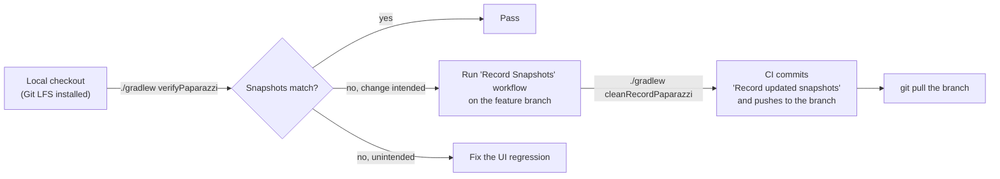

# Testing

This page documents how testing works in the GodTools Android repo: the actual libraries in use (and where they come from), how to run unit tests given the project's variant quirks, how Paparazzi snapshot testing is wired through Git LFS and CI, and the conventions you should follow when writing new tests. For the CI jobs that run these tests see [Build System & CI](Build-System-and-CI.md); for the Circuit Presenter/UI architecture the UI tests exercise see [UI Architecture](UI-Architecture.md).

## Test stack

Everything below is verified against `gradle/libs.versions.toml` and the module `build.gradle.kts` files.

| Library | Version | Scope | Notes |
|---|---|---|---|
| JUnit 4 | 4.13.2 | every module | The project is **JUnit 4 only** — there is no JUnit 5/Jupiter anywhere. Tests use `kotlin-test-junit` on top of it. |
| kotlin-test (`kotlin-test-junit`) | Kotlin 2.4.10 | every module | Preferred assertion/annotation surface (`kotlin.test.Test`, `assertEquals`, `assertIs`, …). |
| AndroidX Test JUnit ext | 1.3.0 | every module | Provides the `AndroidJUnit4` runner used with Robolectric. |
| MockK | 1.14.11 | every module | The only mocking library; used in ~90 test files. |
| Robolectric | 4.15.1 | every module | Runs Android-dependent unit tests on the JVM. |
| Turbine (+ `gtoSupport-turbine`) | 1.2.1 | opt-in per module | Flow testing. Declared in `app`, `library/{account,base,db,download-manager,user-data}`, `ui/{base-tool,tips-renderer}`. |
| kotlinx-coroutines-test | via `kotlinCoroutines` | opt-in per module | `runTest`, `UnconfinedTestDispatcher`, `Dispatchers.setMain`; declared in most library modules and `app`. |
| Circuit test (`circuit-test`) | 0.36.0 | Compose modules | `presenter.test { }`, `FakeNavigator`, `TestEventSink` for Presenter/UI tests. Part of the `androidx-compose-testing` bundle. |
| Compose UI test (`ui-test-junit4`) | 1.11.4 | Compose modules | `createComposeRule()` running under Robolectric (not on-device). |
| Paparazzi | 2.0.0-alpha05 | `app`, `ui/qr-code` | Snapshot testing; shared base class ships as a testFixture from `ui/base`. |
| TestParameterInjector | 1.22 | `app`, `ui/qr-code` (+ `ui/base` fixtures) | Drives the Paparazzi device/locale/night-mode matrix. |
| MockWebServer | OkHttp 5.4.0 | `library/api` only | HTTP-level API client tests. |
| JsonUnit AssertJ | 6.0.1 | `library/api` only | JSON body assertions (`assertThatJson`). |
| Hilt testing (`hilt-android-testing`) | Dagger 2.60.1 | `app`, `library/download-manager`, several `ui/*` modules | `@HiltAndroidTest` for DI-heavy Robolectric tests. |
| Mockposable | 0.19 | `app` only | Compiler plugin (`plugins = listOf("mockk")` in `app/build.gradle.kts`) enabling MockK to mock `@Composable` functions. |
| Kover | 0.9.9 | every module | Coverage; report path rewritten so Codecov auto-detects it. |

### How the stack is wired

Test configuration is centralized in the build conventions (see [Build System & CI](Build-System-and-CI.md)). `build-logic/src/main/kotlin/AndroidTestConfiguration.kt` runs for **every** Android module and:

- adds the `test-framework` bundle (`junit`, `kotlin-test-junit`, `androidx-test-junit`, `mockk`, `robolectric` — `gradle/libs.versions.toml`) as `testImplementation`, so you never declare these yourself;
- enables `isIncludeAndroidResources = true` and raises the test JVM heap to `maxHeapSize = "3500m"` (Robolectric loads an AOSP image per SDK version);
- substitutes `org.hamcrest:hamcrest-core`/`hamcrest-library` with the condensed `org.hamcrest:hamcrest:3.0` artifact;
- applies the Kover plugin and moves the XML report to `build/reports/kover/<variant>/report.xml`.

Module-specific test dependencies (Turbine, MockWebServer, Hilt testing, etc.) are declared per-module in each `build.gradle.kts`.

Every module that runs Robolectric tests has a `src/test/resources/robolectric.properties` containing `sdk=NEWEST_SDK`, so Robolectric tests target the newest supported Android SDK.

### Test fixtures

Three modules publish `testFixtures` (enabled via `testFixtures.enable = true` in their `build.gradle.kts`; Kotlin support comes from `android.experimental.enableTestFixturesKotlinSupport=true` in `gradle.properties`):

| Module | Fixture contents |
|---|---|
| `ui/base` | `BasePaparazziTest` (`ui/base/src/testFixtures/kotlin/org/cru/godtools/base/ui/BasePaparazziTest.kt`) |
| `library/model` | `randomLanguage(...)` (`library/model/src/testFixtures/kotlin/org/cru/godtools/model/Language+TestFixtures.kt`) |
| `library/db` | `InMemoryLastSyncTimeRepository` (`library/db/src/testFixtures/kotlin/org/cru/godtools/db/repository/InMemoryLastSyncTimeRepository.kt`) |

Note that some test-data builders live in **main** source sets, not fixtures — e.g. `randomTool(...)` in `library/model/src/main/kotlin/org/cru/godtools/model/Tool.kt` and `randomTranslation(...)` in `library/model/src/main/kotlin/org/cru/godtools/model/Translation.kt`.

## Running tests

```bash
# All unit tests, all modules (the safe default)
./gradlew test

# One module
./gradlew :library:model:test
./gradlew :app:test

# A single test class
./gradlew :library:model:test --tests "org.cru.godtools.model.ToolTest"

# Verify Paparazzi snapshots (requires Git LFS — see below)
./gradlew verifyPaparazzi
```

### Variant quirks: `testProductionDebugUnitTest` vs `testDebugUnitTest`

Unit tests are **only enabled for the `debug` build type with the `production` flavor**. `AndroidTestConfiguration.kt` disables every other unit-test variant:

```kotlin
// only enable unit tests for debug builds targeting production
builder.enableUnitTest = builder.buildType == BUILD_TYPE_DEBUG && env == FLAVOR_ENV_PRODUCTION
```

Because only `app` and `library/initial-content` (plus the dynamic feature) carry the `env` flavor dimension, the concrete task name differs per module:

| Module kind | Unit-test task |
|---|---|
| Flavored (`app`, `library/initial-content`) | `testProductionDebugUnitTest` |
| Unflavored (everything else) | `testDebugUnitTest` |

You do not need to memorize which is which — the aggregate `test` task runs whichever variants exist and is what CI uses. Asking for a disabled variant (e.g. `testStageDebugUnitTest`, `testReleaseUnitTest`) fails.

### Sharding and resource usage

- CI splits the test run into 4 shards via `-PtestShard=N -PtestTotalShards=4`; `AndroidTestConfiguration.kt` disables unit tests in any module whose `project.path.hashCode()` doesn't map to the requested shard. You can use the same properties locally to run a subset.
- Each test JVM gets a 3.5 GB heap; CI runs `./gradlew test verifyPaparazzi koverXmlReportDebug koverXmlReportProductionDebug --max-workers 1 --scan` (`.github/workflows/build.yml`). Expect a full local `test` run to be memory-hungry.

### Coverage

Kover is applied to every module. CI generates XML reports with `koverXmlReportDebug` / `koverXmlReportProductionDebug` and uploads them to Codecov (`codecov/codecov-action@v7` in `.github/workflows/build.yml`, with `fail_ci_if_error: true`). Reports land at `build/reports/kover/<variant>/report.xml` in each module.

## Paparazzi snapshot testing

Paparazzi renders Compose UI on the JVM (no emulator) and compares against golden PNGs committed to the repo.

### Where it lives

- The Paparazzi Gradle plugin is applied only in `app/build.gradle.kts` and `ui/qr-code/build.gradle.kts`.
- Golden images live in `app/src/test/snapshots/` and `ui/qr-code/src/test/snapshots/`, stored in **Git LFS** (`.gitattributes`: `**/snapshots/**/*.png filter=lfs diff=lfs merge=lfs -text`).
- Snapshot tests in `app` live in the `testDebug` source set and are named `*PaparazziTest.kt` (e.g. `app/src/testDebug/kotlin/org/cru/godtools/ui/dashboard/DashboardLayoutPaparazziTest.kt`); `ui/qr-code` has `ui/qr-code/src/test/kotlin/org/cru/godtools/qrcode/activity/QRCodeComposablePaparazziTest.kt`.

**Git LFS is mandatory.** If you clone without LFS, the snapshot PNGs are pointer files and `verifyPaparazzi` fails with image mismatches. CI even has a dedicated workflow (`.github/workflows/git-lfs-validation.yml`, `git lfs fsck --pointers`) to catch snapshots committed as real binaries. See [Getting Started](Getting-Started.md).

### `BasePaparazziTest`

All snapshot tests extend `BasePaparazziTest` (`ui/base/src/testFixtures/kotlin/org/cru/godtools/base/ui/BasePaparazziTest.kt`), which:

- parameterizes over device (`Nexus 5`, `Pixel 6 Pro` via a TestParameterInjector `DeviceConfigProvider`), locale, `NightMode`, and an `AccessibilityMode` that adds Paparazzi's `AccessibilityRenderExtension`;
- sets `maxPercentDifference = 0.001`;
- wraps content in `GodToolsTheme { ContentWithOverlays { ... } }`, providing a local `EventBus` (`LocalEventBus`) and a stubbed `OnBackPressedDispatcherOwner`;
- skips redundant combinations (`excludeRedundantTests`): accessibility renders only run for Nexus 5, default locale, non-night mode.

A typical subclass declares the matrix with `@RunWith(TestParameterInjector::class)` constructor parameters and calls the protected `snapshot { ... }` / `centerInSnapshot { ... }` helpers; `DashboardLayoutPaparazziTest` additionally builds a fake `Circuit` with `presenterOf { state }` presenters and installs a Coil `FakeImageLoaderEngine` so image loads are deterministic.

### Verify locally, record in CI — never record locally



- **Verify:** `./gradlew verifyPaparazzi`. On failure, diff images are written to `**/build/paparazzi/failures/` (CI archives these as artifacts).
- **Record:** **never run `recordPaparazzi` locally.** Rendering output differs across machines/OSes, so goldens must be generated on the Linux CI runner. Push your branch, then manually trigger the **Record Snapshots** workflow (`.github/workflows/record-snapshots.yml`, `workflow_dispatch`) against your feature branch. It runs `./gradlew cleanRecordPaparazzi --scan`, commits `"Record updated snapshots"`, and pushes to the same branch — then pull the branch. A helper skill for this flow exists at `.claude/` (`record-screenshots`).

## Conventions in existing tests

These patterns are drawn from the current test suite; follow them for new tests.

### General

- **`kotlin.test` over raw JUnit APIs**: `import kotlin.test.Test`, `assertEquals`, `assertIs`, `assertNotNull`, plus `@BeforeTest`/`@AfterTest` for setup/teardown. JUnit's `@get:Rule`, `Assume.assumeTrue`/`assumeFalse`, and `@RunWith` are used where rules/runners are needed.
- **Backtick test names** describing scenario and expectation: `` fun `Delete Account - fails`() ``, `` fun `removeFavoriteTools()`() ``.
- **Coroutines**: suspend tests wrap the body in `runTest { ... }`; tests that need a main dispatcher use `Dispatchers.setMain(UnconfinedTestDispatcher())` in setup and `Dispatchers.resetMain()` in teardown.
- **MockK style**: constructor-inject mocks built with `mockk { coEvery { ... } ... }`, verify with `coVerify`/`verify`, and finish with `confirmVerified(...)`; `Turbine<T>()` is sometimes used as a controllable async response channel (see `app/src/testDebug/kotlin/org/cru/godtools/ui/account/delete/DeleteAccountPresenterTest.kt`).

### Robolectric tests

Android-dependent tests use the AndroidX runner with a plain `Application` to avoid app-level initialization:

```kotlin
@RunWith(AndroidJUnit4::class)
@Config(application = Application::class)
class DeleteAccountPresenterTest { ... }
```

DI-heavy tests use `@HiltAndroidTest` (e.g. `ui/tract-renderer/src/test/kotlin/org/cru/godtools/tract/activity/TractActivityTest.kt`).

### Circuit Presenter tests

Presenters (which are `@Composable` state producers — see [UI Architecture](UI-Architecture.md)) are tested with `circuit-test`:

- `presenter.test { ... }` collects emitted `UiState`s; assert with `assertIs<UiState.X>(awaitItem())` and drive behavior through `state.eventSink(UiEvent.Y)`;
- navigation is asserted via `FakeNavigator(SomeScreen)` (`navigator.awaitPop()`, etc.);
- `AndroidUiDispatcherUtil.runScheduledDispatches()` (from gto-support — source in [CruGlobal/android-gto-support](https://github.com/CruGlobal/android-gto-support), see [Working on the shared libraries](Tool-Renderers.md#working-on-the-shared-libraries)) runs in `@AfterTest` to flush the Compose UI dispatcher.

### Compose layout tests

Layout composables are tested under Robolectric with `createComposeRule()`, `setContent { ... }`, and semantics assertions (`onNodeWithTag`, `assertIsEnabled`, `performClick`). Events are captured with Circuit's `TestEventSink<UiEvent>` and layouts expose `TEST_TAG_*` constants for stable node lookup (see `app/src/testDebug/kotlin/org/cru/godtools/ui/account/delete/DeleteAccountLayoutTest.kt`).

### API client tests (`library/api`)

Retrofit services are tested against a real HTTP server using `MockWebServer` as a `@get:Rule`, building the Retrofit instance against `server.url("/")` with `JsonApiConverterFactory`. Request bodies are asserted with JsonUnit's `assertThatJson { node("data[0].id").isEqualTo(1) }` (see `library/api/src/test/kotlin/org/cru/godtools/api/UserFavoriteToolsApiTest.kt` and [API Layer](API-Layer.md)).

### Database tests (`library/db`)

Room repository tests run against an in-memory database under Robolectric and are suffixed `IT` rather than `Test` (e.g. `library/db/src/test/kotlin/org/cru/godtools/db/room/repository/AttachmentsRoomRepositoryIT.kt`); shared repository contract tests live in classes like `library/db/src/test/kotlin/org/cru/godtools/db/repository/AttachmentsRepositoryIT.kt`. Flow-returning DAO/repository APIs are asserted with Turbine. See [Data Layer](Data-Layer.md).

## Pre-commit checklist

Before pushing (see [Contributing](Contributing.md)):

```bash
./gradlew :build-logic:ktlintCheck ktlintCheck
./gradlew test
./gradlew verifyPaparazzi   # if you touched UI in app/ or ui/qr-code
```

CI runs all of the above plus Android lint on every push/PR to `develop`, `master`, and `feature/*` branches (`.github/workflows/build.yml`).
