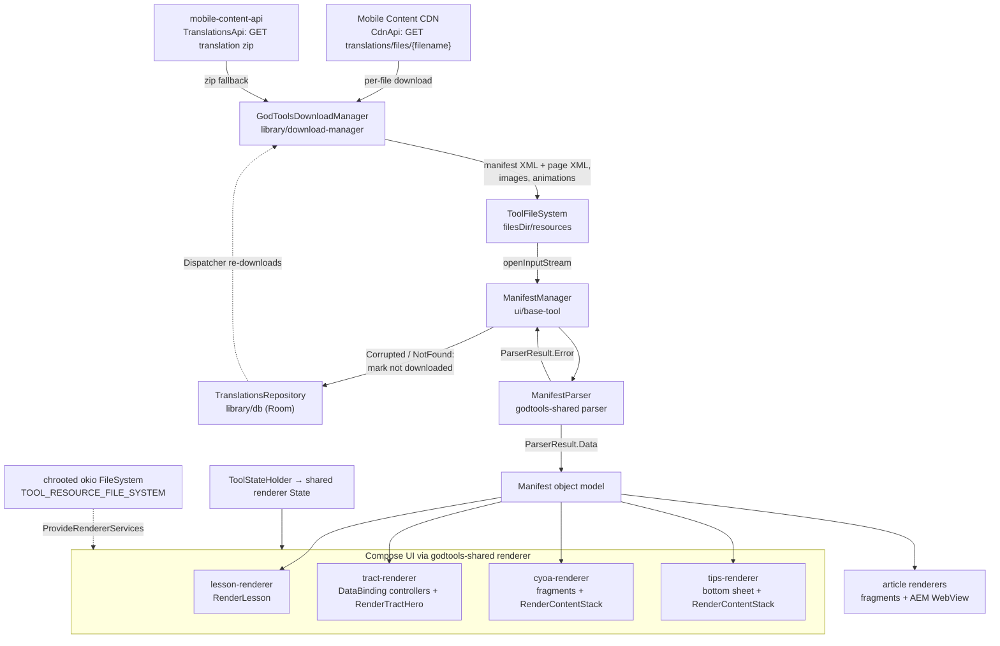
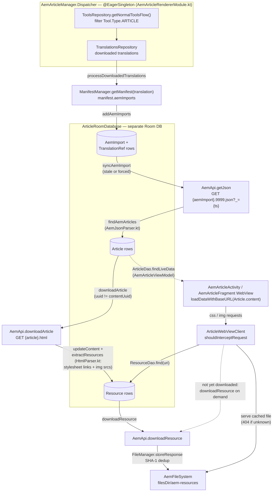

# Tool Renderers

This page explains how GodTools turns downloaded tool content (XML manifests plus resource files) into on-screen UI. It covers what a "tool" is, the shared `godtools-shared` parser/renderer dependency, the common infrastructure in `ui/base-tool`, and each of the seven renderer modules, plus the small `shortcuts` and `qr-code` feature modules. For how content gets onto the device in the first place, see [Sync & Downloads](Sync-and-Downloads.md); for the app-level navigation that launches these renderers, see [UI Architecture](UI-Architecture.md).

## What a "tool" is

A **tool** is a piece of ministry content published by the mobile-content-api backend (see [API Layer](API-Layer.md)). The client-side model is `Tool` in `library/model/src/main/kotlin/org/cru/godtools/model/Tool.kt`, with a `Tool.Type` enum that determines which renderer opens it:

| `Tool.Type` | JSON:API `resource-type` | Rendered by | Notes |
|---|---|---|---|
| `TRACT` | `tract` | `ui/tract-renderer` | Paged gospel presentations; supports parallel language and live share |
| `LESSON` | `lesson` | `ui/lesson-renderer` | Swipeable lessons with progress/resume and feedback |
| `CYOA` | `cyoa` | `ui/cyoa-renderer` | "Choose your own adventure" branching page navigation; supports parallel language |
| `ARTICLE` | `article` | `ui/article-renderer` + `ui/article-aem-renderer` | Category/article lists backed by AEM-hosted HTML |
| `META` | `metatool` | — | Groups tool variants; never rendered directly |
| `UNKNOWN` | — | — | Fallback for unrecognized types |

`Tool.Type.supportsParallelLanguage` is `true` only for `TRACT` and `CYOA` (`Tool.kt` line 154).

Each tool has per-language `Translation`s (`library/model/src/main/kotlin/org/cru/godtools/model/Translation.kt`); a downloaded translation consists of a **manifest XML file** (`Translation.manifestFileName`) plus the resource files (images, Lottie animations, page XML) the manifest references.

## The godtools-shared dependency

Parsing and (increasingly) rendering are not implemented in this repo. They come from the Kotlin Multiplatform **godtools-shared** artifacts, declared in `gradle/libs.versions.toml`:

| Catalog alias | Maven module | Purpose |
|---|---|---|
| `godtoolsShared-parser` | `org.cru.godtools.kotlin:parser` | Parses manifest/page XML into a `Manifest` object model (`org.cru.godtools.shared.tool.parser.*`) |
| `godtoolsShared-renderer` | `org.cru.godtools.kotlin:renderer` | Multiplatform Compose renderer (`RenderLesson`, `RenderTractHero`, `RenderContentStack`, `State`, `ProvideRendererServices`) |
| `godtoolsShared-common` | `org.cru.godtools.kotlin:common` | Shared common code |
| `godtoolsShared-analytics` | `org.cru.godtools.kotlin:analytics` | Shared analytics constants |
| `godtoolsShared-user-activity` | `org.cru.godtools.kotlin:user-activity` | User activity tracking |

The version is pinned by the `godtoolsShared` entry in `gradle/libs.versions.toml` (currently `1.4.0-SNAPSHOT`), resolved from `https://cruglobal.jfrog.io/artifactory/maven-mobile/` (configured in `settings.gradle.kts`, which also adds a repo scoped to the transitive `deezer.kustomexport` annotation dependency).

`ui/base-tool/build.gradle.kts` exposes the parser and renderer as `api(...)` dependencies, so every renderer module that depends on `:ui:base-tool` gets them transitively.

### Working on the shared libraries

Both first-party `-SNAPSHOT` dependency families are developed in separate CruGlobal repositories and published to `https://cruglobal.jfrog.io/artifactory/maven-mobile/`:

| Artifacts | Source repository | Notes |
|---|---|---|
| `org.cru.godtools.kotlin:*` (godtools-shared, `1.4.0-SNAPSHOT`) | [CruGlobal/kotlin-mpp-godtools-tool-parser](https://github.com/CruGlobal/kotlin-mpp-godtools-tool-parser) | Kotlin Multiplatform; its `module:parser`, `module:renderer`, `module:common`, `module:analytics`, and `module:user-activity` Gradle modules publish the artifacts in the table above (root `build.gradle.kts` sets `group = "org.cru.godtools.kotlin"`) |
| `org.ccci.gto.android:*` (gto-support, `4.6.0-SNAPSHOT`) | [CruGlobal/android-gto-support](https://github.com/CruGlobal/android-gto-support) | One Gradle module per artifact (`gto-support-db`, `gto-support-jsonapi`, `gto-support-circuit`, …); used far beyond the renderers — the session interceptor and JSON:API converter ([API Layer](API-Layer.md)), Room type converters ([Data Layer](Data-Layer.md)), and test utilities ([Testing](Testing.md)) all come from it |

Non-release builds of each repo's default branch publish under the fixed `-SNAPSHOT` version, so the code behind `RenderLesson`, `ManifestParser`, `SessionInterceptor`, etc. can change without any commit in this repo. So a bug in shared code is fixed upstream: clone the source repo above, fix it there, and iterate against this app with the local loop below.

**Which snapshot build am I actually on?** Each `-SNAPSHOT` resolves to a timestamped unique build. The currently-published build is listed in Artifactory's metadata, e.g. `https://cruglobal.jfrog.io/artifactory/maven-mobile/org/cru/godtools/kotlin/parser/1.4.0-SNAPSHOT/maven-metadata.xml` — the `<snapshot>` block gives the `<timestamp>` and `<buildNumber>` (unique versions look like `1.4.0-20260810.234026-48`), which tells you when it was published and therefore which upstream default-branch commits it contains. Gradle caches changing modules for 24 hours by default; `./gradlew --refresh-dependencies` forces re-resolution (see [Getting Started](Getting-Started.md#troubleshooting-first-builds)).

**Local development loop** — to run this app against a local build of a shared library:

1. Clone the upstream repo and make your change there.
2. Publish it locally with the same coordinates: `./gradlew publishToMavenLocal` (both repos publish via `maven-publish`; non-release builds get the `-SNAPSHOT` version automatically, and their base versions in `gradle.properties` — `1.4.0` / `4.6.0` — match what this repo consumes).
3. In this repo, add `mavenLocal()` **before** the Artifactory repo in the `dependencyResolutionManagement.repositories` block of `settings.gradle.kts`, scoped so only the shared groups resolve locally — and do not commit this change:

   ```kotlin
   mavenLocal {
       content {
           includeGroup("org.ccci.gto.android")
           includeGroup("org.cru.godtools.kotlin")
       }
   }
   ```

4. Rebuild. Gradle searches repositories in declaration order and never caches local repositories, so each `publishToMavenLocal` is picked up by the next build. Repeat step 2 after every upstream change; remove the `mavenLocal()` block when done. (A Gradle composite build — `includeBuild(...)` with dependency substitutions — is an alternative, but the `publishToMavenLocal` loop matches how the artifacts are actually consumed.)

A change spanning this repo and a shared library must land upstream first: merge the shared-library PR, wait for its CI to publish the new snapshot to Artifactory (confirm via the `maven-metadata.xml` above), then build here with `--refresh-dependencies` before merging the dependent change.

## Render pipeline

The pipeline from network to pixels:



Step by step:

1. **Download** — `GodToolsDownloadManager` (`library/download-manager/src/main/kotlin/org/cru/godtools/downloadmanager/GodToolsDownloadManager.kt`) downloads a translation either file-by-file (manifest first, then every `manifest.relatedFiles` entry, preferring the CDN via `CdnApi.downloadPublishedFile` with `TranslationsApi.downloadFile` as fallback) or as a single zip (`TranslationsApi.download(translation.id)`, extracted in `extractZipFor`). Files land in `ToolFileSystem` (`library/base/src/main/kotlin/org/cru/godtools/base/ToolFileSystem.kt`), a wrapper around `filesDir/resources`. Successful downloads are recorded per file and the translation is marked downloaded. See [Sync & Downloads](Sync-and-Downloads.md) for the triggering flows (favorite tools, language changes, etc.).
2. **Parse** — `ManifestManager` (`ui/base-tool/src/main/kotlin/org/cru/godtools/base/tool/service/ManifestManager.kt`) asks the shared `ManifestParser` to parse the manifest file. Parsing runs on `Dispatchers.IO.limitedParallelism(8)`, is deduplicated with a per-file `MutexMap`, and results are cached in a `WeakLruCache` of size 6. The parser reads files through an `AndroidXmlPullParserFactory` whose `openFile` delegates to `ToolFileSystem.openInputStream` (`BaseToolRendererModule.kt`).
3. **Self-heal** — if parsing returns `ParserResult.Error.Corrupted` or `NotFound`, `ManifestManager.getManifest` calls `translationsRepository.markBrokenManifestNotDownloaded(...)`, and the download pipeline re-downloads the broken translation instead of surfacing an error: the `GodToolsDownloadManager.Dispatcher` observes not-downloaded translations and re-fetches them in the background, and `BaseToolActivity` calls `downloadLatestPublishedTranslationAsync` while the tool is open. (Sync only fetches JSON:API metadata — it never downloads translation files.)
4. **State** — `ToolStateHolder` (`ui/base-tool/src/main/kotlin/org/cru/godtools/base/tool/viewmodel/ToolStateHolder.kt`) is a `@HiltViewModel` that keeps the shared renderer `org.cru.godtools.shared.renderer.state.State` in `SavedStateHandle` and (temporarily, per the TODO in the file) pipes `State.contentEvents` into greenrobot EventBus `Event`s so legacy controllers can react to content events.
5. **Render** — each renderer wraps shared-renderer composables in `ProvideRendererServices(resources = resourceFileSystem, tipsRepository = tipsRepository)`, where `resourceFileSystem` is the `@Named(TOOL_RESOURCE_FILE_SYSTEM)` read-only okio `FileSystem` chrooted to `ToolFileSystem.rootDir()` (`BaseToolRendererModule.kt`). That is how shared composables resolve image and animation files by name.

### ParserConfig features

`BaseToolRendererModule` (`ui/base-tool/src/main/kotlin/org/cru/godtools/base/tool/BaseToolRendererModule.kt`) provides the `ParserConfig` with the app version (`DeviceType.ANDROID`) and the supported content features `FEATURE_ANIMATION`, `FEATURE_CONTENT_CARD`, `FEATURE_FLOW`, and `FEATURE_MULTISELECT`. `FEATURE_PAGE_COLLECTION` is added only when the Firebase Remote Config boolean `CONFIG_TOOL_CONTENT_FEATURE_PAGE_COLLECTION` is enabled — content using page collections will not render on devices where that flag is off.

## Shared infrastructure: `ui/base-tool`

`ui/base-tool` (namespace `org.cru.godtools.tool`) is the module every renderer builds on. Besides the DI providers above, it contains:

### Activity hierarchy

```
BaseBindingActivity                              "ui/base"
└── BaseToolActivity<B>                          "ui/base-tool/.../activity/BaseToolActivity.kt"
    ├── BaseSingleToolActivity                   single locale: lesson, article
    │   └── BaseArticleActivity                  article-specific base
    └── MultiLanguageToolActivity                primary + parallel locales: tract, cyoa
```

`BaseToolActivity` (`ui/base-tool/src/main/kotlin/org/cru/godtools/base/tool/activity/BaseToolActivity.kt`):

- Injects `GodToolsDownloadManager`, `ToolsRepository`, a `@Named(IS_CONNECTED_LIVE_DATA)` connectivity `LiveData`, and `FollowupService` (injected solely so the followup-form capture service is running).
- Calls `processIntent(...)` in `onCreate` and immediately `finish()`es when `isValidStartState` is false — subclasses must check `isFinishing` after `super.onCreate(...)`.
- Computes a `LoadingState` per tool/locale: `LOADING`, `LOADED`, `NOT_FOUND`, `INVALID_TYPE`, `OFFLINE` (enum at `BaseToolActivity.kt` line 225) — every renderer shows distinct UI for these.
- Handles tool sync, the share menu, status-bar coloring from the manifest's `navBarColor`, and feature discovery (the `TapTargetView` share-menu call-out — see [UI Architecture](UI-Architecture.md#settings-and-feature-discovery-librarybase)).

`MultiLanguageToolActivity` (`ui/base-tool/src/main/kotlin/org/cru/godtools/base/tool/activity/MultiLanguageToolActivity.kt`) adds the primary/parallel language handling for tract and CYOA: locales come from the `EXTRA_LANGUAGES` intent extra, a `TabLayout` language toggle is driven by `LanguageToggleController`, and tool settings appear in `SettingsBottomSheetDialogFragment` (`ui/base-tool/src/main/kotlin/org/cru/godtools/base/tool/ui/settings/`).

### Cross-module activity launches

Renderer modules do not depend on each other, so activities are started by **string class name**. `ui/base-tool/src/main/kotlin/org/cru/godtools/base/tool/Activities.kt` defines `ACTIVITY_CLASS_LESSON = "org.cru.godtools.tool.lesson.ui.LessonActivity"`, and `ui/base/src/main/kotlin/org/cru/godtools/base/ui/Activities.kt` defines the class-name constants and `create*Intent`/`start*Activity` helpers for the dashboard, articles, CYOA, tract, and QR-code activities. Renaming or moving any of these activities silently breaks launches — the compiler cannot catch it.

### Legacy controller tree

`BaseController<T : Base>` (`ui/base-tool/src/main/kotlin/org/cru/godtools/base/tool/ui/controller/BaseController.kt`) is the View/DataBinding-era rendering abstraction still used by tract, CYOA, and tips: a tree of controllers bound to parser model nodes, resolving `EventBus`, `LifecycleOwner`, and tool `State` up the parent chain, and handling delayed analytics events, RTL layout, and tip completion.

## Renderer modules

| Module | Entry point | Rendering approach |
|---|---|---|
| `ui/lesson-renderer` | `LessonActivity` | Fully Compose via shared `RenderLesson` |
| `ui/tract-renderer` | `TractActivity` | ViewPager + DataBinding controllers with embedded Compose (`RenderTractHero`, `ModalOverlay`) |
| `ui/cyoa-renderer` | `CyoaActivity` | Fragment backstack + DataBinding controllers with embedded Compose (`RenderContentStack`) |
| `ui/article-renderer` | `ArticlesActivity` | Classic fragments (category/article lists), no Compose |
| `ui/article-aem-renderer` | `AemArticleActivity` | WebView serving cached AEM HTML |
| `ui/tips-renderer` | `TipBottomSheetDialogFragment` | Bottom sheet + `RenderContentStack` |
| `ui/tutorial-renderer` | `TutorialScreen` (Circuit) | Pure Compose + Circuit; renders app tutorials, not tool content |

The asymmetry is intentional and transitional: lessons are the fully-migrated shared-Compose path, tract/CYOA/tips embed shared composables inside legacy DataBinding controllers, and AEM articles are WebView-based. Do not copy the tract controller pattern for new work.

### Lesson (`ui/lesson-renderer`)

`LessonActivity` (`ui/lesson-renderer/src/main/kotlin/org/cru/godtools/tool/lesson/ui/LessonActivity.kt`) extends `BaseSingleToolActivity` with `supportedType = Manifest.Type.LESSON`. It maps the base `LoadingState` to a `LessonScreen.UiState` (`Offline` / `Missing` / `Loading` with download progress / `Loaded`) and renders everything with the shared `RenderLesson` composable inside `ProvideRendererServices(...)`, `GodToolsTheme(darkTheme = false)`, and Circuit's `ContentWithOverlays`. Circuit overlays provide:

- **Resume progress** — `LessonResumeDialogOverlay`, driven by the `EXTRA_RESUME_PAGE` extra; page progress is persisted via `ToolsRepository.updateToolProgress`.
- **Swipe tutorial** — `LessonSwipeTutorialAnimatedModalOverlay`, gated by remote config `CONFIG_TUTORIAL_LESSON_PAGE_SWIPE` and the `FEATURE_LESSON_PAGE_SWIPED` feature-discovery flag.
- **Feedback** — `LessonFeedbackDialogOverlay`, shown on close once the user has passed page 3 (see `LessonActivityDataModel.showFeedback`).

Share links are built on `URI_SHARE_BASE` (`https://knowgod.com/`, defined in `library/base/src/main/kotlin/org/cru/godtools/base/Constants.kt`) as `/{locale}/lesson/{tool}[/{page}]`.

### Tract (`ui/tract-renderer`)

`TractActivity` (`ui/tract-renderer/src/main/kotlin/org/cru/godtools/tract/activity/TractActivity.kt`) extends `MultiLanguageToolActivity<TractActivityBinding>`. Pages render through `ManifestPagerAdapter` (`ui/tract-renderer/src/main/kotlin/org/cru/godtools/tract/adapter/ManifestPagerAdapter.kt`, a `DataBindingPagerAdapter<TractPageBinding>`) and the `PageController`/`CardController` tree in `ui/tract-renderer/src/main/kotlin/org/cru/godtools/tract/ui/controller/`. Compose is embedded at two points:

- `PageController` renders the page hero with the shared `RenderTractHero` composable inside the binding.
- `TractActivity.setupComposeOverlay()` hosts tract modals via the Circuit overlay `ModalOverlay` (`ui/tract-renderer/src/main/kotlin/org/cru/godtools/tool/tract/ui/ModalOverlay.kt`).

Tract also supports:

- **Live share** — `TractPublisherController`/`TractSubscriberController` (`ui/tract-renderer/src/main/kotlin/org/cru/godtools/tract/liveshare/`) mirror navigation between devices over a Scarlet ActionCable WebSocket. The `TractShareService` interface lives in `library/api/src/main/kotlin/org/cru/godtools/api/TractShareService.kt` (channels `PublishChannel`/`SubscribeChannel`, param `channelId`); Scarlet connects to `"${apiConfig.mobileContentApiUrl}cable"` (`library/api/src/main/kotlin/org/cru/godtools/api/ApiModule.kt`). Subscriber deep links carry the `liveShareStream` parameter. The live-share tutorial is launched via `TutorialScreenResultContract`. The full publisher/subscriber handshake — including the `PublisherInfo` → share-link exchange and the re-subscribe-on-reconnect loop — is diagrammed in [API Layer](API-Layer.md#scarlet-websocket-tract-live-share).
- **Google Instant Apps** — `TractActivity` shows an install menu item and adjusted navigation when running as an instant app (`InstantApps.isInstantApp`).
- **Tips** — implements `TipBottomSheetDialogFragment.Callbacks` (see below).

### CYOA (`ui/cyoa-renderer`)

`CyoaActivity` (`ui/cyoa-renderer/src/main/kotlin/org/cru/godtools/tool/cyoa/ui/CyoaActivity.kt`) extends `MultiLanguageToolActivity` and manages a fragment backstack of page fragments: `CyoaContentPageFragment`, `CyoaCardCollectionPageFragment`, and `CyoaPageCollectionPageFragment`. Navigation between pages is driven by content events (`showPage(...)`), with handling for dismissed/invalid pages and parent-page up-navigation. Page content is rendered by controllers in `ui/cyoa-renderer/src/main/kotlin/org/cru/godtools/tool/cyoa/ui/controller/` — `ContentPageController` and `CardCollectionPageController` call the shared `RenderContentStack` composable inside `binding.compose.setContent { ProvideRendererServices(...) }`.

### Article (`ui/article-renderer`)

`ArticlesActivity` (`ui/article-renderer/src/main/kotlin/org/cru/godtools/article/ui/ArticlesActivity.kt`) extends `BaseArticleActivity` and reuses the generic `tool_generic_fragment_activity.xml` layout from `ui/base-tool`. It hosts `CategoriesFragment` (manifest categories) and `ArticlesFragment` (articles in a category); selecting an article starts `AemArticleActivity` from the AEM module. No Compose is involved here.

### Article AEM (`ui/article-aem-renderer`)

This module handles the actual article content, which lives in Adobe Experience Manager (AEM) rather than in tool XML — it is a parallel content pipeline:

- **Own Room database** — `ui/article-aem-renderer/src/main/kotlin/org/cru/godtools/article/aem/db/ArticleRoomDatabase.kt` with models `AemImport`, `Article`, `Resource`, `TranslationRef` (separate from the main app DB described in [Data Layer](Data-Layer.md)).
- **Sync** — `AemArticleManager` (`ui/article-aem-renderer/src/main/kotlin/org/cru/godtools/article/aem/service/AemArticleManager.kt`) watches downloaded article translations, reads `manifest.aemImports` URIs, fetches AEM JSON, then downloads each article's HTML (`api.downloadArticle(article.uri.addExtension("html"))`) and its referenced resources into `AemFileSystem` (`filesDir/aem-resources`, `ui/article-aem-renderer/src/main/kotlin/org/cru/godtools/article/aem/util/AemFileSystem.kt`). Its inner `Dispatcher` is started eagerly via the module's `@EagerSingleton` wiring in `AemArticleRendererModule.kt`.
- **API** — `AemApi` (`ui/article-aem-renderer/src/main/kotlin/org/cru/godtools/article/aem/api/AemApi.kt`) is a Retrofit interface using per-call `@Url` parameters; the Retrofit `baseUrl` is the literal placeholder `"https://unused.example.com"` (`AemArticleRendererModule.kt`) because real hosts come from the AEM import URIs in each manifest.
- **Rendering** — `AemArticleActivity`/`AemArticleFragment` display a WebView; `ArticleWebViewClient` (`ui/article-aem-renderer/src/main/kotlin/org/cru/godtools/article/aem/ui/ArticleWebViewClient.kt`) overrides `shouldInterceptRequest` to serve cached resources from disk, so previously-synced articles work offline.

The full pipeline, from tool manifest to WebView:



Not shown: the `Dispatcher` also re-syncs stale `AemImport`s at startup and runs a conflated cleanup actor that deletes orphaned cache files whenever the `Resource` table changes, and article deep links bypass the manifest path via `AemArticleManager.downloadDeeplinkedArticle(uri)`. The prose version of this flow lives in [Services & Integrations](Services-and-Integrations.md#adobe-experience-manager-aem--article-content).

### Tips (`ui/tips-renderer`)

Training tips are supplemental teaching content attached to tract/CYOA pages. `TipBottomSheetDialogFragment` (`ui/tips-renderer/src/main/kotlin/org/cru/godtools/tool/tips/ui/TipBottomSheetDialogFragment.kt`) shows a tip in a bottom sheet, paging through tip pages with `TipPageAdapter`; `TipPageController` renders each page's content with the shared `RenderContentStack` composable. Tip completion is persisted through the `TipsRepository` bridge that `BaseToolRendererModule` builds over the Room-backed `TrainingTipsRepository`. `ToggleTipsSettingsAction` (`ui/tips-renderer/src/main/kotlin/org/cru/godtools/tool/tips/ui/settings/ToggleTipsSettingsAction.kt`) plugs the tips on/off toggle into the tool settings bottom sheet.

### Tutorial (`ui/tutorial-renderer`)

Unlike the others, this module renders **app tutorials**, not downloaded tool content. It is pure Compose + Circuit (it is one of only three modules with Circuit codegen enabled — see [UI Architecture](UI-Architecture.md)):

- `TutorialScreen(pageSet: PageSet)` (`ui/tutorial-renderer/src/main/kotlin/org/cru/godtools/tutorial/layout/TutorialScreen.kt`) with `PopResult`s `Canceled`, `Finished`, and `ShowQrCode`.
- `PageSet` (`ui/tutorial-renderer/src/main/kotlin/org/cru/godtools/tutorial/PageSet.kt`): `FEATURES`, `LIVE_SHARE`, `LIVE_SHARE_START_PAGE_ONLY`, `TIPS`.
- `TutorialScreenResultContract` (`ui/tutorial-renderer/src/main/kotlin/org/cru/godtools/tutorial/TutorialScreenResultContract.kt`) wraps `CircuitActivity` as an `ActivityResultContract<PageSet, TutorialScreen.Result?>` — the standard pattern for getting a Circuit result back into a non-Circuit activity (used by `TractActivity` for the live-share tutorial).

## Feature modules

### Shortcuts (`ui/shortcuts`)

No UI of its own. `GodToolsShortcutManager` (`ui/shortcuts/src/main/kotlin/org/cru/godtools/shortcuts/GodToolsShortcutManager.kt`) maintains dynamic and pinned launcher shortcuts for tools of type `ARTICLE`, `CYOA`, and `TRACT` only (`SUPPORTED_TOOL_TYPES` at line 62), building intents with the `create*Intent` helpers plus a `SHORTCUT_LAUNCH` extra. It is disabled in instant apps and reports shortcut usage when a `ToolUsedEvent` fires. `UpdateShortcutsWorker` (a `@HiltWorker`) refreshes shortcuts as unique WorkManager work, and `LocaleUpdateBroadcastReceiver` refreshes them when the device locale changes.

### QR code (`ui/qr-code`)

A single pure-Compose screen: `QRCodeActivity` (`ui/qr-code/src/main/kotlin/org/cru/godtools/qrcode/activity/QRCodeActivity.kt`) is a plain `ComponentActivity` that reads `EXTRA_SHARE_URL`, generates a 250×250 QR bitmap with ZXing's `QRCodeWriter`, and finishes on any tap. It is launched from the tract share flow and from the tutorial's `ShowQrCode` result. This module has Paparazzi snapshot tests (`ui/qr-code/src/test`) — see [Testing](Testing.md).

## Working on renderer modules

```bash
# Run unit tests for a specific renderer module
./gradlew :ui:base-tool:test
./gradlew :ui:tract-renderer:test
./gradlew :ui:lesson-renderer:test

# Code style checks (required before committing)
./gradlew :build-logic:ktlintCheck ktlintCheck

# Verify Paparazzi snapshots (requires Git LFS)
./gradlew verifyPaparazzi
```

## Gotchas

- **Tool activities `finish()` in `onCreate` on invalid intents.** Any code after `super.onCreate(...)` in a renderer activity must bail out when `isFinishing` is true (see `TractActivity.kt`, `LessonActivity.kt`, `ArticlesActivity.kt`).
- **Manifest parse failures self-heal silently.** A corrupted manifest marks the translation not-downloaded (`ManifestManager.kt`), and the `GodToolsDownloadManager` download pipeline — not sync — re-downloads it; you will not see a visible error.
- **`@Named(TOOL_RESOURCE_FILE_SYSTEM)` does disk I/O at injection time** — the provider calls `runBlocking { fileSystem.rootDir() }` (`BaseToolRendererModule.kt` line 87).
- **EventBus is still load-bearing.** Content events, analytics, and controller communication flow through greenrobot EventBus; `ui/base-tool` and `ui/tract-renderer` generate EventBus subscriber indexes via `createEventBusIndex(...)` in their `build.gradle.kts`, and `ToolStateHolder` bridges shared-renderer content events into it.
- **`EXTRA_LANGUAGES` must stay in single-string locale-array mode** (`ui/base/src/main/kotlin/org/cru/godtools/base/ui/Activities.kt`) or legacy pinned shortcuts with primary+parallel languages break.
- **Dark theme is intentionally disabled inside tool renderers** — `LessonActivity` and `TractActivity` wrap shared-renderer content in `GodToolsTheme(darkTheme = false)` because tool content defines its own colors.
- **`FEATURE_PAGE_COLLECTION` is remote-config gated** — page-collection content silently fails to render when `CONFIG_TOOL_CONTENT_FEATURE_PAGE_COLLECTION` is off.

## Related pages

- [Architecture Overview](Architecture-Overview.md) — where these modules sit in the overall module graph
- [UI Architecture](UI-Architecture.md) — Circuit, `GodToolsTheme`, dashboard navigation into renderers
- [Sync & Downloads](Sync-and-Downloads.md) — how translations get downloaded and pruned
- [Data Layer](Data-Layer.md) — `Translation`/`Tool` persistence and repositories
- [API Layer](API-Layer.md) — `TranslationsApi`, `CdnApi`, and the live-share WebSocket
- [Testing](Testing.md) — unit tests and Paparazzi snapshots for UI modules
