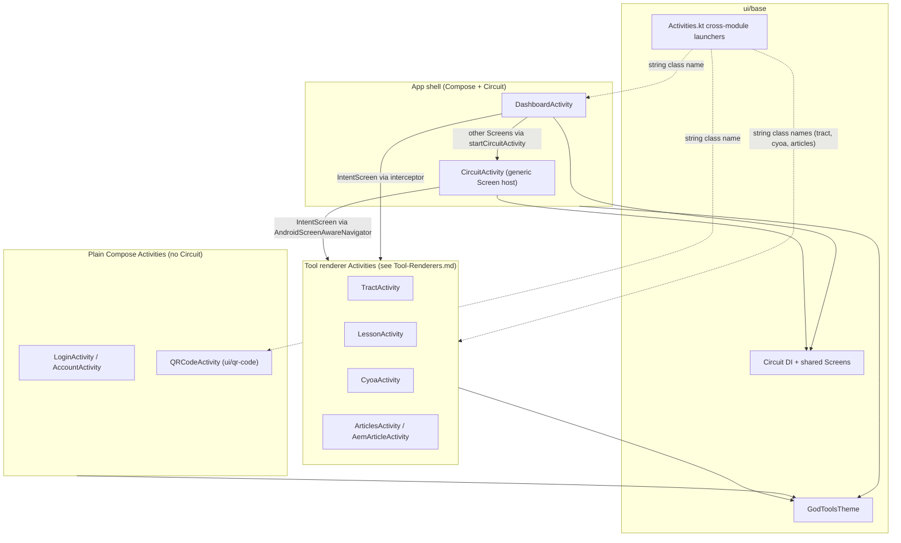
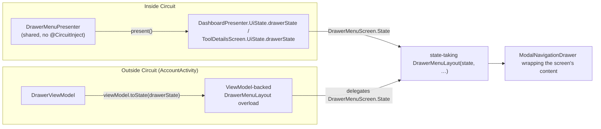
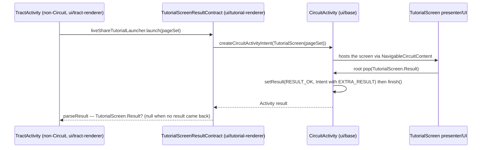
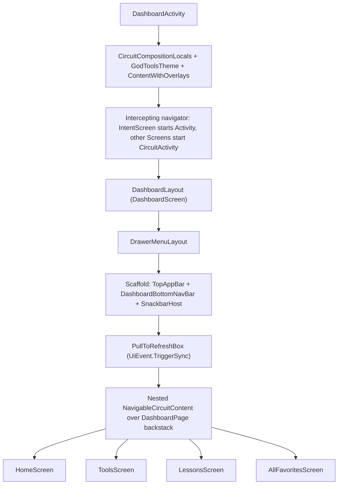
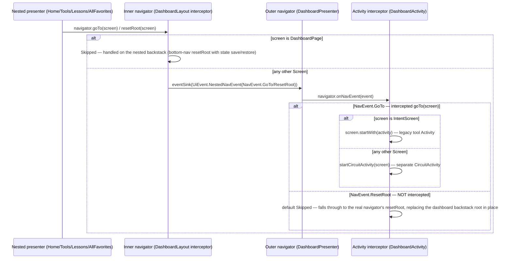

# UI Architecture

This page explains how the GodTools Android UI is built: the Jetpack Compose + Material 3 theme (`GodToolsTheme`) and its design tokens, the shared infrastructure in `ui/base`, the Slack Circuit presenter/UI pattern used for app screens, how navigation works across the app's two Circuit hosts and its legacy Activities, and where DataBinding/ViewBinding views still remain. It covers the *app shell* (dashboard, settings, onboarding, tool details, login/account); the rendering of actual tool content (tracts, lessons, CYOA, articles, tips) is covered in [Tool Renderers](Tool-Renderers.md).

For the overall module layout and data flow, see [Architecture Overview](Architecture-Overview.md). For how UI state gets its data, see [Data Layer](Data-Layer.md).

## Big picture

The UI is in a deliberate, incremental migration from classic Activities/Fragments/DataBinding toward Compose + Circuit. Today five styles coexist:

| Style | Where | Examples |
|---|---|---|
| Pure Compose + Circuit | most `app` screens, `ui/tutorial-renderer` | `DashboardLayout`, `ToolDetailsLayout`, `TutorialLayout` |
| Compose in a plain Activity, **no Circuit** (ViewModels where state is needed) | `app` login/account screens (see [Login and Account screens](#login-and-account-screens-compose-without-circuit)), `ui/qr-code` | `LoginActivity`, `AccountActivity`, `QRCodeActivity` |
| Legacy Activity/Fragment shell + fully-Compose content | `ui/lesson-renderer`, `ui/article-renderer` | `LessonActivity` inflates `LessonActivityBinding`, but everything it shows is Compose via `RenderLesson`; `ArticlesActivity`'s category/article list fragments are `ComposeView`-rooted (categories use the shared renderer's `RenderArticleCategory`) |
| Legacy Activity + DataBinding with embedded Compose "islands" | `ui/base-tool`, `ui/tract-renderer`, `ui/cyoa-renderer`, `ui/tips-renderer` | `TractActivity` pages render heroes via shared-renderer composables inside binding layouts |
| Legacy Activity + Fragments, no Compose | `ui/article-aem-renderer` | `AemArticleActivity` shows AEM articles in a WebView |

`ui/qr-code` is pure Compose but uses **no Circuit**: `QRCodeActivity` is a plain `ComponentActivity` that calls `setContent { GodToolsTheme { QRCodeScreen(...) } }` directly — no `Screen`/Presenter/`@CircuitInject` (Circuit codegen is not enabled in that module; see the [gotchas checklist](#gotchas-checklist-for-new-ui-work)). Don't model new qr-code work on the Circuit pattern.



## GodToolsTheme and design tokens

The theme lives in `ui/base/src/main/kotlin/org/cru/godtools/base/ui/theme/GodToolsTheme.kt` (generated color values in `Color.kt` next to it). The full conventions are codified in `.claude/rules/design_system_rules.md` — read that file before writing any new Compose UI. The essentials:

### The theme composable

```kotlin
@Composable
fun GodToolsTheme(
    darkTheme: Boolean = isSystemInDarkTheme() && BuildConfig.DEBUG,
    dynamicColor: Boolean = false,
    content: @Composable () -> Unit,
)
```

- Applied **once per Activity root** (`DashboardActivity`, `CircuitActivity`, and each tool Activity wrap their content in it). Feature composables never call `MaterialTheme(...)` or `GodToolsTheme(...)` themselves.
- **Dark mode is debug-only**: the `BuildConfig.DEBUG` check means production builds always use the light scheme. Don't assume dark mode is user-reachable in production.
- `dynamicColor` (Android 12+ Material You) exists but defaults off.
- The theme also installs `CompositionLocals` (`ui/base/src/main/kotlin/org/cru/godtools/base/ui/compose/CompositionLocals.kt`), which replaces `LocalUriHandler` with one that delegates to the app's `openUrl` handling. Separately, `GodToolsTheme` itself sets `LocalContentColor` to `contentColorFor(MaterialTheme.colorScheme.background)` in its own `CompositionLocalProvider` block in `GodToolsTheme.kt`.

### Color tokens

- Brand constants on the `GodToolsTheme` object: `GT_BLUE` (`#3BA4DB`), `GT_RED` (`#E55B36`), `GRAY_E6`. Prefer semantic `MaterialTheme.colorScheme.*` tokens for UI chrome; the raw constants are for logo/illustration contexts.
- The light scheme overrides `primary = GT_BLUE` and `onBackground`/`onSurface`; everything else comes from Material 3 theme-builder generated values in `Color.kt`. Tertiary colors are intentionally not defined.
- **`surfaceTint` is set to `Color.White` as a documented HACK** — tonal elevation produces no visible color shift anywhere in the app. Use explicit `surfaceContainer*` tokens for visual hierarchy, not elevation.
- Brand colors with no M3 equivalent live in `GodToolsTheme.extendedColorScheme` (an `ExtendedColorScheme` of `green` and `red` `ColorFamily`s, each with `color`/`onColor`/`colorContainer`/`onColorContainer`) — use these for success/warning states.
- **Never** put a `Color(0xFF…)` literal in a feature composable (only `Color.Transparent`/`Color.Unspecified` sentinels are acceptable).

### Typography, shape, spacing

- Typography is Material 3 defaults with exactly one override: `titleMedium.lineHeight = 22.sp`. Use `MaterialTheme.typography.*` tokens instead of raw `fontSize`/`fontWeight`.
- Shapes come from `MaterialTheme.shapes.*`; spacing follows the 4dp grid, preferring `Arrangement.spacedBy(N.dp)` over per-child padding.

### Component color helpers

Two helpers on the `GodToolsTheme` object encode "primary-colored chrome in light mode, default chrome in dark mode":

- `GodToolsTheme.topAppBarColors` — primary container + `onPrimary` content when the light scheme is active, `TopAppBarDefaults.topAppBarColors()` otherwise.
- `GodToolsTheme.searchBarColors` — `surfaceVariant` container in light mode.

The active-scheme flag is exposed as `GodToolsTheme.isLightColorSchemeActive` (a `staticCompositionLocalOf`). Branch on it only for *non-color* decisions like choosing these helpers; color decisions should use `MaterialTheme.colorScheme.*` tokens, which already carry dark variants.

### Icons, strings, accessibility (quick rules)

- Icons are vector drawables `res/drawable/ic_<name>.xml` with `@color/tintable` fill (never hardcoded fills), passed via `painterResource`. Every `Icon`/`Image` needs a `contentDescription` (or a justified `null`).
- User-visible strings always come from `stringResource(R.string.*)`; keys follow `<screen>_<section>_<purpose>`.
- Touch targets ≥ 48dp; business state lives in Presenter `UiState`, not layout-local `remember`.

## `ui/base` — shared UI infrastructure

`ui/base` is the module every other UI module depends on. Its contents:

| Package (`org.cru.godtools.base.ui.*`) | Contents |
|---|---|
| `theme` | `GodToolsTheme.kt`, generated `Color.kt`, preview helpers |
| `compose` | `CompositionLocals.kt`, `LocalEventBus.kt` (resolves the greenrobot `EventBus` from a Hilt `@EntryPoint`, with an `EventBus()` fallback for previews) |
| `activity` | `BaseActivity` (feature-discovery framework, up-navigation handling, injected `EventBus` + `Settings`), `BaseBindingActivity<B : ViewBinding>` (DataBinding-based base for legacy tool Activities, inflates via `DataBindingUtil.inflate`) |
| `circuit` | `CircuitModule` (DI), `CircuitActivity` (generic screen host), `CircuitDeepLinkParser`, shared `Screen` definitions under `circuit/screen/` |
| top level | `Activities.kt` — cross-module Activity launch helpers (see [Navigation](#navigation)) |
| `util`, `view`, `languages`, `databinding`, `fragment`, `firebase`, `youtubeplayer` | Misc shared helpers: `WebUrlLauncher.kt`, `ProvideLayoutDirectionFromLocale.kt`, `DrawableUtils.kt`, `DaggerPicassoImageView.kt`, `LanguagesDropdownAdapter.kt`, `DynamicLinksSpringboardActivity.kt`, etc. |

Shared Circuit screens live in `ui/base/src/main/kotlin/org/cru/godtools/base/ui/circuit/screen/` so *any* module can navigate to them without depending on `app`:

- `AppLanguageScreen` — with a `Result : PopResult` (`LanguageSelected` / `Dismissed`)
- `dashboard/DashboardScreen(initialPage: DashboardPage = HomeScreen)`
- `dashboard/page/DashboardPage` — abstract `Screen` with `@Parcelize` objects `HomeScreen`, `ToolsScreen`, `LessonsScreen`, `AllFavoritesScreen`

Reusable dashboard tool-card composables (`ToolCard`, `SquareToolCard`, `VariantToolCard`, `LessonToolCard`) and their shared `ToolCardPresenter` live in `app/src/main/kotlin/org/cru/godtools/ui/tools/`.

## Circuit: presenters and UIs

The app uses [Slack Circuit](https://slackhq.github.io/circuit/) — pinned at **0.36.0** in `gradle/libs.versions.toml` — with Hilt codegen (`@CircuitInject`). A screen is three pieces:

1. A `Screen` (a `@Parcelize` Parcelable, often carrying arguments).
2. A **Presenter**: a class implementing `Presenter<UiState>` whose `present()` is a `@Composable` function returning the current `UiState`.
3. A **UI**: a `@Composable` layout function taking that `UiState`.

Circuit codegen is enabled per-module via `configureCompose(project, enableCircuit = true)` in `build-logic/src/main/kotlin/AndroidConfiguration.kt` (applies KSP + parcelize, sets `circuit.codegen.mode=hilt`). **Only `ui/base`, `ui/tutorial-renderer`, and `app` enable it** — an `@CircuitInject` annotation in any other module silently generates nothing into the DI graph. `CircuitModule` (`ui/base/src/main/kotlin/org/cru/godtools/base/ui/circuit/CircuitModule.kt`) multibinds `Set<Presenter.Factory>` / `Set<Ui.Factory>` and builds the singleton `Circuit` instance from them.

### A real example: the All Favorites screen

Presenter — `app/src/main/kotlin/org/cru/godtools/ui/dashboard/home/AllFavoritesPresenter.kt` (abridged):

```kotlin
class AllFavoritesPresenter @AssistedInject constructor(
    @param:ApplicationContext private val context: Context,
    private val eventBus: EventBus,
    private val toolCardPresenter: ToolCardPresenter,
    private val toolsRepository: ToolsRepository,
    @Assisted private val navigator: Navigator,
) : Presenter<UiState> {
    data class UiState internal constructor(
        val tools: List<ToolCardPresenter.UiState> = emptyList(),
        internal val eventSink: (UiEvent) -> Unit = {},
    ) : CircuitUiState

    internal sealed interface UiEvent : CircuitUiEvent {
        data class MoveTool(val from: Int, val to: Int) : UiEvent
        data object CommitToolOrder : UiEvent
    }

    @Composable
    override fun present(): UiState { /* observes toolsRepository, maps tools to
        ToolCardPresenter states, handles UiEvents, navigates via navigator.goTo(...) */ }

    @AssistedFactory
    @CircuitInject(AllFavoritesScreen::class, SingletonComponent::class)
    interface Factory {
        fun create(navigator: Navigator): AllFavoritesPresenter
    }
}
```

UI — `app/src/main/kotlin/org/cru/godtools/ui/dashboard/home/AllFavoritesLayout.kt`:

```kotlin
@Composable
@CircuitInject(AllFavoritesScreen::class, SingletonComponent::class)
internal fun AllFavoritesLayout(state: UiState, modifier: Modifier = Modifier) {
    // LazyColumn of reorderable ToolCards driven entirely by state.tools,
    // dispatching UiEvent.MoveTool / UiEvent.CommitToolOrder into state.eventSink
}
```

Patterns worth copying from this example:

- **State down, events up**: the `UiState` carries an `eventSink` lambda; the layout never touches repositories or the navigator directly.
- **Assisted injection** for the `Navigator`; `@CircuitInject` goes on the `@AssistedFactory` when the presenter has assisted parameters, or directly on the composable for UIs.
- **Presenter composition**: `AllFavoritesPresenter` delegates each row's state to the shared `ToolCardPresenter` (`app/src/main/kotlin/org/cru/godtools/ui/tools/ToolCardPresenter.kt`).
- **Non-cancellable commits**: persisting user actions uses `scope.launch(start = CoroutineStart.UNDISPATCHED) { withContext(NonCancellable) { … } }` — the required pattern per `CLAUDE.md` (a plain `launch(NonCancellable)` does not guarantee execution if the scope is already cancelling).
- In presenters, opening a legacy Activity is expressed as `navigator.goTo(IntentScreen(intent))` (from `circuitx-android`) — the navigation layer decides how to launch it.

### All `@CircuitInject` screen pairs

| Screen | Presenter / UI location |
|---|---|
| `DashboardScreen` | `app/src/main/kotlin/org/cru/godtools/ui/dashboard/` (`DashboardPresenter`, `DashboardLayout`) |
| `HomeScreen` | `app/.../ui/dashboard/home/` (`HomePresenter`, `HomeLayout`) |
| `AllFavoritesScreen` | `app/.../ui/dashboard/home/` (`AllFavoritesPresenter`, `AllFavoritesLayout`) |
| `ToolsScreen` | `app/.../ui/dashboard/tools/` (`ToolsPresenter`, `ToolsLayout`) |
| `LessonsScreen` | `app/.../ui/dashboard/lessons/` (`LessonsPresenter`, `LessonsLayout`) |
| `ToolDetailsScreen` | `app/.../ui/tooldetails/` (`ToolDetailsPresenter`, `ToolDetailsLayout`) |
| `OnboardingScreen` | `app/.../ui/onboarding/` (`OnboardingPresenter`, `OnboardingLayout`) |
| `LanguageSettingsScreen` | `app/.../ui/settings/language/` |
| `AppLanguageScreen` | `app/.../ui/settings/language/app/` |
| `DownloadableLanguagesScreen` | `app/.../ui/settings/language/downloadable/` |
| `CountrySettingsScreen` | `app/.../ui/settings/country/` |
| `DeleteAccountScreen` | `app/.../ui/account/delete/` |
| `TutorialScreen(pageSet)` | `ui/tutorial-renderer/src/main/kotlin/org/cru/godtools/tutorial/layout/` |

`DrawerMenuScreen` (`app/src/main/kotlin/org/cru/godtools/ui/drawer/DrawerMenuScreen.kt`) is a special case: it defines a `State` but is never navigated to, and its `State` is produced two different ways. Inside Circuit, the shared (non-`@CircuitInject`) `DrawerMenuPresenter` embeds it into `DashboardPresenter.UiState.drawerState` and `ToolDetailsScreen.UiState.drawerState`, rendered by the state-taking `DrawerMenuLayout(state, …)` overload wrapping the dashboard and tool-details content. Outside Circuit, `DrawerMenuLayout` has a standalone ViewModel-backed overload (default `viewModel: DrawerViewModel = viewModel()` parameter in `app/src/main/kotlin/org/cru/godtools/ui/drawer/DrawerMenuLayout.kt`) that builds the same `State` itself — that overload wraps `AccountActivity`'s content (see [Login and Account screens](#login-and-account-screens-compose-without-circuit)).

Both production paths converge on the same state-taking overload (the ViewModel-backed overload just builds a `State` and delegates):



## Navigation

Navigation is the most surprising part of this codebase for newcomers: there is no single nav graph. Three mechanisms coexist.

### 1. Two Circuit hosts

- **`DashboardActivity`** hosts a Circuit backstack rooted at `DashboardScreen` — and *only* dashboard screens. A `NavigationInterceptor` in `app/src/main/kotlin/org/cru/godtools/ui/dashboard/DashboardActivity.kt` intercepts every `goTo`: an `IntentScreen` is started as an Activity intent (`screen.startWith(activity)`), and any other `Screen` is launched into a **separate** `CircuitActivity` via `startCircuitActivity(screen)`. Calling `navigator.goTo(ToolDetailsScreen(...))` from a dashboard presenter therefore starts a new Activity — it never pushes onto the dashboard's own backstack.
- **`CircuitActivity`** (`ui/base/src/main/kotlin/org/cru/godtools/base/ui/circuit/CircuitActivity.kt`) is a generic host for any `Screen`, launched with `Context.startCircuitActivity(screen)` / `createCircuitActivityIntent(screen)` (the screen travels as a Parcelable extra). It resolves its initial screen from (1) an intent data URI matched against the injected `Set<CircuitDeepLinkParser>`, then (2) the `EXTRA_SCREEN` extra — and **crashes on a `TODO(...)` if neither matches**. It uses `rememberAndroidScreenAwareNavigator` + `NavigableCircuitContent` with `GestureNavigationDecorationFactory()` (note: no `onBackInvoked` parameter in this Circuit version). When the root screen pops with a `PopResult`, the Activity calls `setResult(RESULT_OK, ...)` with the result under `CircuitActivity.EXTRA_RESULT` and finishes — this is how Circuit results cross the Activity boundary. `TutorialScreenResultContract` (`ui/tutorial-renderer/src/main/kotlin/org/cru/godtools/tutorial/TutorialScreenResultContract.kt`) wraps this as an `ActivityResultContract<PageSet, TutorialScreen.Result?>`, the pattern for consuming Circuit results from non-Circuit Activities.

The full result round-trip, as `TractActivity` uses it for the live-share tutorial (see [Tool Renderers](Tool-Renderers.md)):



`TractActivity` (`ui/tract-renderer/src/main/kotlin/org/cru/godtools/tract/activity/TractActivity.kt`) treats a `null` parse the same as `TutorialScreen.Result.Canceled` — the contract returns `null` whenever the Activity finishes without a `PopResult` under `EXTRA_RESULT`.

### 2. Stringly-typed cross-module Activity launches

Renderer modules don't depend on each other, so legacy Activities are started by string class name in `ui/base/src/main/kotlin/org/cru/godtools/base/ui/Activities.kt`: `startDashboardActivity()`, `createArticlesIntent(...)`, `createCyoaActivityIntent(...)`, `createTractActivityIntent(...)`, `createQrCodeActivityIntent(...)`. Common extras (`EXTRA_TOOL`, `EXTRA_LANGUAGES`, `EXTRA_PAGE`, `EXTRA_ACTIVE_LOCALE`) are defined in `library/base/src/main/kotlin/org/cru/godtools/base/Constants.kt`.

Two gotchas, both documented in the code:

- Renaming/moving `DashboardActivity`, `ArticlesActivity`, `CyoaActivity`, `TractActivity`, or `QRCodeActivity` silently breaks these launches — the class names are string constants.
- `EXTRA_LANGUAGES` is written with `putLocaleArray(..., singleString = true)`; the comment in `Activities.kt` explains this is required so legacy pinned shortcuts with primary+parallel languages keep working. Do not "clean it up".

### 3. Deep links

- `CircuitDeepLinkParser` (`ui/base/src/main/kotlin/org/cru/godtools/base/ui/circuit/CircuitDeepLinkParser.kt`) is a simple `isDeepLinkSupported(uri)` / `parseDeepLink(uri): List<Screen>` interface. Only `LanguageSettingsDeepLinkParser` is multibound into the DI set (via `app/src/main/kotlin/org/cru/godtools/ui/settings/language/LanguageSettingsModule.kt`), for `CircuitActivity` to consume.
- `DashboardDeepLinkParser` (`app/src/main/kotlin/org/cru/godtools/ui/dashboard/DashboardDeepLinkParser.kt`) is *not* in that set — `DashboardActivity` calls it statically. It maps `godtools://<HOST_GODTOOLS_CUSTOM_URI>/dashboard/{lessons|tools|home}`, `https://godtools.dynalinks.app/deeplink/dashboard/...`, `https://godtoolsapp.com/deeplink/dashboard/...`, and `https://godtoolsapp.com/lessons` to `DashboardScreen` instances. The custom-URI host varies per build type (`org.cru.godtools.debug` / `org.cru.godtools.qa` / `org.cru.godtools`), injected by `build-logic/src/main/kotlin/GodToolsCustomUriConfiguration.kt` — see [Build System & CI](Build-System-and-CI.md).

## DashboardActivity structure

`DashboardActivity` (`app/src/main/kotlin/org/cru/godtools/ui/dashboard/DashboardActivity.kt`, `@AndroidEntryPoint`, extends `BaseActivity`) is the app's main entry point.



Key responsibilities, all verifiable in the file:

- **Onboarding**: if the `FEATURE_TUTORIAL_ONBOARDING` feature flag isn't yet "discovered" in `Settings`, it immediately launches `CircuitActivity(OnboardingScreen)` — see [Settings and feature discovery](#settings-and-feature-discovery-librarybase).
- **Deep links**: `processIntent` handles `ACTION_VIEW` URIs via `DashboardDeepLinkParser`; `onNewIntent` funnels a `NavEvent.ResetRoot(screen)` through an unlimited `Channel<NavEvent>` consumed in a `LaunchedEffect`.
- **Notification opt-in**: `OptInNotificationController` + `OptInNotificationModalOverlay` shown through Circuit's `OverlayEffect`, with the runtime permission request bridged to a `Continuation<Boolean>` via `ActivityResultContracts.RequestPermission`.
- **Analytics**: a `LaunchTrackingViewModel` tracks launches in `onResume`; `DashboardLayout` records per-page screen events via `RecordAnalyticsScreen` and posts Firebase in-app-messaging events on the shared `EventBus`.

Inside `DashboardLayout` (`app/src/main/kotlin/org/cru/godtools/ui/dashboard/DashboardLayout.kt`), a **second, nested** intercepting navigator manages the `DashboardPage` backstack: `DashboardPage` screens are handled locally (bottom-nav `resetRoot` with state save/restore), while anything else is forwarded to the outer navigator as a `UiEvent.NestedNavEvent` — which the Activity-level interceptor then converts into an Activity start (for `goTo` events; see the `resetRoot` caveat below the diagram).

The full two-navigator event flow for a `goTo`/`resetRoot` from a nested dashboard presenter:



**`resetRoot` caveat:** `DashboardActivity`'s interceptor overrides **only `goTo`**. A forwarded `NavEvent.ResetRoot` hits the interceptor's non-consuming default (`InterceptedResult.Skipped`) and passes through to the real outer navigator, which would replace the dashboard backstack's root *in place* with the foreign screen — it does **not** become an Activity start. No current nested presenter exercises that leg: the only `resetRoot` callers (`DashboardBottomNavBar`'s `onSelectPage` and `HomePresenter`'s `ViewAllTools` → `resetRoot(ToolsScreen, …)`) pass `DashboardPage` screens, which the inner interceptor skips and handles on the nested backstack. The un-intercepted outer `resetRoot` is exercised deliberately only by the deep-link path (`onNewIntent` → `NavEvent.ResetRoot(DashboardScreen)`). From a nested presenter, use `goTo` for non-dashboard screens — a `resetRoot` with a non-`DashboardPage` screen would corrupt the dashboard backstack rather than open a new Activity.

## Login and Account screens (Compose without Circuit)

The login/account surface lives in `app` but predates the Circuit migration: each screen is a plain `BaseActivity` calling `setContent { GodToolsTheme { … } }`, with Jetpack `ViewModel`s where state is needed — there are **no** `Screen`/Presenter/`@CircuitInject` pairs to find here.

- **`LoginActivity`** (`app/src/main/kotlin/org/cru/godtools/ui/login/LoginActivity.kt`) — started via `Context.startLoginActivity(createAccount)` (the drawer's Login/Sign Up items use it). It renders `LoginLayout`, which drives the actual auth flow through `rememberLoginLauncher` from `library/account` and reports back via `LoginLayoutEvent`. The Activity observes `accountManager.isAuthenticatedFlow` (at `RESUMED`) and simply `finish()`es itself once it turns true — there is no explicit "login succeeded" navigation.
- **`AccountActivity`** (`app/src/main/kotlin/org/cru/godtools/ui/account/AccountActivity.kt`) — started via `Context.startAccountActivity()` (the drawer's Profile item). It wraps `AccountLayout` in the ViewModel-backed `DrawerMenuLayout` overload. `AccountLayout` (backed by `AccountViewModel`: user flow, page list, pull-to-refresh sync) is a `HorizontalPager` over `AccountPage` entries: `ACTIVITY` (`AccountActivityLayout` + `AccountActivityViewModel`, the personal-activity badges grid) always, and `GLOBAL_ACTIVITY` (`GlobalActivityLayout`) only when the `CONFIG_UI_GLOBAL_ACTIVITY_ENABLED` Firebase remote-config flag is enabled.
- **Naming trap:** `GlobalActivityScreen` (`app/src/main/kotlin/org/cru/godtools/ui/account/globalactivity/GlobalActivityScreen.kt`) implements Circuit's `Screen` interface and defines a `UiState`, but it is **not wired into Circuit** — no `@CircuitInject` presenter/UI exists and nothing navigates to it. `GlobalActivityLayout` constructs the `UiState` directly from `GlobalActivityViewModel`. Don't hunt for a Circuit presenter here.

The one Circuit piece in the account area is `DeleteAccountScreen` (`app/src/main/kotlin/org/cru/godtools/ui/account/delete/`, in the [screen table](#all-circuitinject-screen-pairs) above), which the drawer launches via `startCircuitActivity(DeleteAccountScreen)`.

## Settings and feature discovery (`library/base`)

Several flows on this page — the onboarding launch, dashboard banners, the notification opt-in prompt, `BaseActivity`'s feature-discovery plumbing — are gated by `Settings` (`library/base/src/main/kotlin/org/cru/godtools/base/Settings.kt`), a `@Singleton` that lives in `library/base` (not `ui/base`) so data-layer modules can inject it too. Everything in it is **device-local and never synced** to mobile-content-api (see [Sync & Downloads](Sync-and-Downloads.md)). It is not one storage mechanism but three:

| Concern | Backing store | Key API |
|---|---|---|
| Feature discovery flags + counts, notification opt-in prompt tracking, campaign registration, launch tracking | `SharedPreferences` named `GodTools` | `isFeatureDiscovered*` / `setFeatureDiscovered`, `getFeatureDiscoveredCount*`, `recordOptInNotificationPrompt`, `launches` |
| Dashboard filter category/locale, personalization country | Preferences DataStore `GodToolsSettings` | `getDashboardFilterCategoryFlow` / `updateDashboardFilterCategory`, `getCountrySettingFlow` / `updateCountrySetting` |
| App language | Neither — AndroidX per-app locales (`AppCompatDelegate`) | `appLanguage`, `appLanguageFlow`, `produceAppLocaleState()` |

### App language

- Setting `Settings.appLanguage` just calls `AppCompatDelegate.setApplicationLocales(...)` — AndroidX persists the choice and recreates activities. That is the entire "save" path behind `AppLanguagePresenter` (`app/src/main/kotlin/org/cru/godtools/ui/settings/language/app/AppLanguagePresenter.kt`), which assigns `settings.appLanguage = it.language` when the user confirms a selection on `AppLanguageScreen`.
- Reading goes through `Context.appLanguage` (`library/base/src/main/kotlin/org/cru/godtools/base/AppLanguage.kt`), which normalizes the applied locale via the `R.string.normalized_app_language` resource — the value is always a language the app actually has resources for, not the raw device locale.
- `Settings.appLanguageFlow` is the observable form consumed across the app — for example, it is one axis of the translation auto-download policy in [Sync & Downloads](Sync-and-Downloads.md#auto-download-policy-godtoolsdownloadmanagerdispatcher). **Gotcha:** the underlying `Context.getAppLanguageFlow()` is a ~60Hz polling loop (a `TODO` in the file notes there is no change listener), made cheap by `distinctUntilChanged()` and `stateIn(WhileSubscribed(5_000))` — always collect the shared `Settings.appLanguageFlow`, never the `Context` extension directly.

### Feature discovery

"Feature discovery" is the app's seen-it-already tracking for one-time UX: onboarding, tutorials, banners, and call-outs. A feature is a string key; `setFeatureDiscovered(feature)` sets the boolean pref `feature_discovered.<feature>` **and** increments `feature_discovered_count.<feature>`; readers use `isFeatureDiscovered` / `isFeatureDiscoveredFlow` / `isFeatureDiscoveredLiveData` / `getFeatureDiscoveredCount`. Constants ending in `.` (`FEATURE_TUTORIAL_TIPS`, `FEATURE_TUTORIAL_LIVE_SHARE`, `FEATURE_LESSON_FEEDBACK`) are prefixes that callers suffix with a tool code, making those flags per-tool.

Who gates what (all constants on `Settings.Companion`):

| Flag | Gates | Discovered when |
|---|---|---|
| `FEATURE_TUTORIAL_ONBOARDING` | `DashboardActivity` launching `CircuitActivity(OnboardingScreen)` on first run | `OnboardingPresenter` marks it in a `LaunchedEffect` |
| `FEATURE_TUTORIAL_FEATURES` | `TutorialFeaturesBannerPresenter` dashboard banner | banner dismissed or tutorial opened |
| `FEATURE_TOOL_FAVORITE` | `FavoriteToolsBannerPresenter` banner; favorite handling in `ToolDetailsPresenter` | first favorite / banner dismissed |
| `FEATURE_OPT_IN_NOTIFICATION` | `OptInNotificationController` modal (alongside `LAST_PROMPTED_OPT_IN_NOTIFICATION` + prompt count in the same prefs) | prompt handled |
| `FEATURE_TOOL_OPENED` | the "first tool opened" flag on `ToolOpenedAnalyticsActionEvent` in `BaseToolActivity.trackToolOpen` | first tool open |
| `FEATURE_TOOL_SHARE` | `BaseToolActivity`'s `TapTargetView` call-out on the share menu item | share used or call-out tapped |
| `FEATURE_TRACT_CARD_SWIPED` / `FEATURE_TRACT_CARD_CLICKED` | the tract card-peek hint (`cardsDiscovered` in `PageController`) | first card swipe (`PageContentLayout`) / click (`PageController`) |
| `FEATURE_LESSON_PAGE_SWIPED` | the lesson swipe-tutorial overlay (see [Tool Renderers](Tool-Renderers.md)) | first lesson page swipe |
| `FEATURE_LESSON_FEEDBACK.<tool>` | the per-lesson feedback dialog in `LessonActivity` | feedback shown |
| `FEATURE_TUTORIAL_TIPS.<tool>` | the tips tutorial before opening a tool with training tips (`ToolDetailsPresenter`) | tutorial completed |
| `FEATURE_TUTORIAL_LIVE_SHARE.<tool>` | the live-share tutorial in `TractActivity`, shown while `getFeatureDiscoveredCount(...) < 3` | each tutorial completion (count-based, not boolean) |
| `FEATURE_LANGUAGE_SETTINGS` | nothing currently — kept as a placeholder pre-condition hook inside `Settings.isFeatureDiscovered` | `LanguageSettingsPresenter`'s `ImpressionEffect` |

Two generic pieces round the framework out:

- `TutorialPresenter` (`ui/tutorial-renderer/src/main/kotlin/org/cru/godtools/tutorial/layout/TutorialPresenter.kt`) marks `pageSet.feature` when a tutorial's `PageSet` declares one — completing any tutorial records its flag without per-tutorial wiring.
- The Activity-side arm referenced in the [`ui/base` table](#uibase--shared-ui-infrastructure) above: `BaseActivity` (`ui/base/src/main/kotlin/org/cru/godtools/base/ui/activity/BaseActivity.kt`) provides a `Handler`-based queue (`dispatchDelayedFeatureDiscovery` / `showNextFeatureDiscovery` / `canShowFeatureDiscovery`, with the active feature saved across recreation) that `BaseToolActivity` uses to pop `TapTargetView` call-outs like the `FEATURE_TOOL_SHARE` hint.

## Where legacy DataBinding/ViewBinding remains

`enableDatabinding(project)` (defined in `build-logic/src/main/kotlin/AndroidConfiguration.kt`, which also applies the `com.android.legacy-kapt` plugin) is active in exactly these modules: `app`, `ui/base`, `ui/base-tool`, `ui/article-renderer`, `ui/cyoa-renderer`, `ui/tips-renderer`, `ui/tract-renderer`.

| Module | Legacy view usage |
|---|---|
| `ui/base` | `BaseBindingActivity<B : ViewBinding>` base class; `databinding` helper package |
| `ui/base-tool` | Tool Activity hierarchy (`BaseToolActivity` etc.) built on binding layouts in `ui/base-tool/src/main/res/layout/` (generic fragment activity, loading/missing/offline states, settings sheet); DataBinding adapters under `.../databinding/adapters/` |
| `ui/tract-renderer` | `tract_activity.xml`, `tract_page.xml`, card layouts; `PageController`/`CardController` controller tree with embedded shared-renderer Compose (`RenderTractHero` in `ui/tract-renderer/src/main/kotlin/org/cru/godtools/tract/ui/controller/PageController.kt`) |
| `ui/cyoa-renderer` | `cyoa_activity.xml` + per-page-type layouts; controllers embed `RenderContentStack` via `binding.compose.setContent { ... }` |
| `ui/tips-renderer` | Bottom-sheet + pager controllers; `TipPageController` embeds `RenderContentStack` |
| `ui/article-renderer` | Only the `ArticlesActivity` shell, which inflates `ui/base-tool`'s `tool_generic_fragment_activity` binding layout; the category/article list fragments it hosts are fully Compose (`ComposeView` roots — categories via the shared renderer's `RenderArticleCategory`) |
| `ui/lesson-renderer`, `ui/article-aem-renderer` | ViewBinding-style generated bindings (`LessonActivityBinding.inflate`, `AemArticleFragmentBinding`) — no DataBinding expressions; the lesson *content* itself is fully Compose via `RenderLesson` |

`ui/qr-code`, `ui/tutorial-renderer`, and all Circuit screens in `app` are pure Compose. **Do not use the tract/cyoa controller pattern for new work** — the renderer asymmetry is transitional, and the lesson renderer (fully Compose content inside a legacy Activity shell — see the [Big picture](#big-picture) table) is the direction of travel. Details in [Tool Renderers](Tool-Renderers.md).

The greenrobot `EventBus` is still load-bearing across the legacy layers: content events, analytics, and controller communication flow through it (Compose code reaches it via `LocalEventBus`).

## Gotchas checklist for new UI work

1. `@CircuitInject` only works in `ui/base`, `ui/tutorial-renderer`, and `app` (Circuit codegen is off elsewhere).
2. Not every Compose screen in `app` is a Circuit screen: `LoginActivity`, `AccountActivity` (including the misleadingly-named `GlobalActivityScreen`), and `ui/qr-code` are plain-Activity Compose with ViewModels — see [Login and Account screens](#login-and-account-screens-compose-without-circuit).
3. `navigator.goTo(...)` from a dashboard presenter starts a *new Activity*; it does not push in-place.
4. `CircuitActivity` crashes if launched without a `Screen` extra or matching deep-link parser.
5. Dark theme only activates in debug builds; surface tint (tonal elevation color) is disabled everywhere.
6. Cross-module Activity launches use string class names in `ui/base/src/main/kotlin/org/cru/godtools/base/ui/Activities.kt` — refactors won't be caught by the compiler.
7. Compose screens have Paparazzi snapshot tests (`app/src/testDebug`, `ui/qr-code/src/test`, shared fixtures in `ui/base/src/testFixtures`); snapshots require Git LFS and are recorded by a manual GitHub Actions workflow, never locally — see [Testing](Testing.md) and [Build System & CI](Build-System-and-CI.md).

Before committing UI changes, run:

```bash
./gradlew :build-logic:ktlintCheck ktlintCheck
```

## Related pages

- [Tool Renderers](Tool-Renderers.md) — how tract/lesson/CYOA/article/tips content is parsed and rendered
- [Architecture Overview](Architecture-Overview.md) — module map and layering
- [Data Layer](Data-Layer.md) — the repositories presenters observe
- [Testing](Testing.md) — Paparazzi snapshots, Compose UI tests
- [Contributing](Contributing.md) — code style and PR conventions
